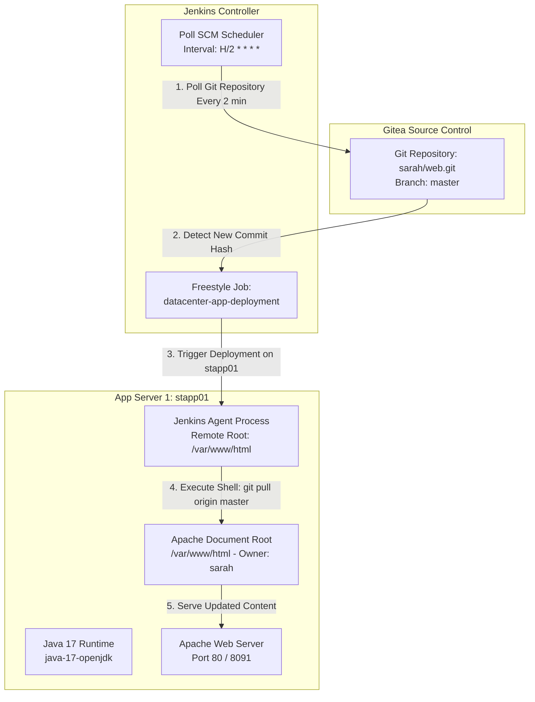

# Jenkins Deployment Job

## Technical Overview

Continuous Deployment (CD) pipelines serve as the backbone of modern DevOps workflows by automatically building, testing, and deploying application code to target environments as soon as changes are committed to source control. In environments where external webhooks are restricted or unavailable, **Jenkins SCM Polling (Poll SCM)** periodically queries Git repositories for new commits and automatically triggers deployment tasks on designated target nodes.

In this challenge, we construct an automated Jenkins deployment job named `datacenter-app-deployment` that targets **App Server 1** (`stapp01`). The job monitors a Git repository hosted on **Gitea**, automatically detects changes pushed to the `master` branch, and synchronizes the application files directly into Apache's web document root (`/var/www/html`).

Key tasks accomplished:
1. **Prerequisite & Plugin Setup:** Installing and validating essential Jenkins plugins: **SSH Build Agents** and **Git**.
2. **Java 17 Upgrade & SSH Agent Node Registration:** SSHing into `App Server 1` (`stapp01`), upgrading the Java runtime environment from OpenJDK 11 to **Java 17** (`java-17-openjdk`) to meet Jenkins Remoting requirements, and configuring `stapp01` as an SSH Build Agent with remote root `/var/www/html`.
3. **Freestyle Job Creation & Poll SCM:** Creating a Freestyle project named `datacenter-app-deployment`, restricting build execution to label `stapp01`, configuring SCM with the Gitea repository (`http://gitea:3000/sarah/web.git`), and setting up Poll SCM (`H/2 * * * *`).
4. **Automated Shell Deployment Script:** Writing shell build commands to pull latest code changes directly into `/var/www/html`.
5. **Ownership Fix & End-to-End Verification:** Ensuring user `sarah` owns `/var/www/html`, pushing a code update (`Welcome to the xFusionCorp Industries`) to the remote `master` branch, observing automated trigger execution, and confirming the updated app response.



---

## CD Deployment Architecture & Polling Strategy

### 1. Jenkins Remoting & Java 17 Requirement
Modern Jenkins agent remoting libraries (`remoting.jar`) require Java 17+ on agent nodes. When configuring an SSH Build Agent node:
*   **Version Mismatch Risks:** If the remote agent node runs Java 11 or older, Jenkins agent launch fails during remoting handshake.
*   **System Java Update:** Installing `java-17-openjdk` and `java-17-openjdk-headless` via `yum` provides the compatible runtime required for `stapp01`.

### 2. SCM Polling (Poll SCM) vs Webhooks
While webhooks push event notifications from Git servers to Jenkins instantaneously, **Poll SCM** operates on a pull model:
*   **Schedule Expression (`H/2 * * * *`):** Uses cron syntax with Jenkins hash distribution (`H`) to poll the Git repository every 2 minutes.
*   **State Tracking:** Jenkins records the commit hash of the last successful build. When Poll SCM detects a different commit hash on `master`, it schedules a new build execution automatically.

### 3. Document Root Deployment & File Ownership
Deploying straight to Apache's document root `/var/www/html` requires proper POSIX permissions:
*   **SSH User Context:** Jenkins connects to `stapp01` as SSH user `sarah`.
*   **Directory Ownership:** If `/var/www/html` is owned by `root` or `apache`, user `sarah` cannot pull files or update working tree files. Setting ownership (`sudo chown -R sarah:sarah /var/www/html`) grants Jenkins necessary write permissions.

---

## Infrastructure & Configuration Requirements

*   **Jenkins Controller Access:** Web Browser on port `8080`
*   **Jenkins Admin Credentials:** `admin` / `Adm!n321`
*   **Target Application Server:** `App Server 1` (`stapp01`)
*   **SSH Credentials:** `sarah` (username & password)
*   **Git Repository URL:** `http://gitea:3000/sarah/web.git`
*   **Required Plugins:** `SSH Build Agents`, `Git`

### Agent Node & Job Configuration Matrix

| Setting | Value |
| :--- | :--- |
| **Node Name** | `App Server 1` |
| **Node Label** | `stapp01` |
| **Remote Root Directory** | `/var/www/html` |
| **Agent Launch Method** | Launch agents via SSH |
| **Host** | `stapp01` |
| **Credentials** | `sarah` |
| **Jenkins Job Name** | `datacenter-app-deployment` |
| **Job Type** | Freestyle Project |
| **Restrict Where Project Runs** | `stapp01` |
| **Repository URL** | `http://gitea:3000/sarah/web.git` |
| **Branch Specifier** | `*/master` |
| **Build Trigger** | Poll SCM (`H/2 * * * *`) |
| **Build Action** | Execute shell (`cd /var/www/html && git pull origin master`) |

---

## Step-by-Step Walkthrough

### Step 1: Log in to Jenkins & Verify Installed Plugins

1. Access the Jenkins web console in your browser.
2. Log in using the administrative credentials:
   * **Username:** `admin`
   * **Password:** `Adm!n321`


3. Navigate to **Manage Jenkins** -> **Plugins** -> **Installed plugins**.
4. Verify that the following required plugins are installed:
   * **SSH Build Agents**
   * **Git plugin**


---

### Step 2: Upgrade Java to Version 17 on `App Server 1`

1. Open a terminal on `jumphost` and SSH into `stapp01` as user `sarah`:

```bash
ssh sarah@stapp01
```

2. Check the currently installed Java version:

```bash
java --version
```

*Output:*
```text
openjdk 11.0.20.1 2023-08-24 LTS
OpenJDK Runtime Environment (Red_Hat-11.0.20.1.1-2) (build 11.0.20.1+1-LTS)
```

3. Upgrade OpenJDK to version 17 using `yum`:

```bash
sudo yum install java-17-openjdk -y
```

4. Verify that Java 17 is now the default active version:

```bash
java --version
```

*Output:*
```text
openjdk 17.0.18 2026-01-20 LTS
OpenJDK Runtime Environment (Red_Hat-17.0.18.0.8-2) (build 17.0.18+8-LTS)
OpenJDK 64-Bit Server VM (Red_Hat-17.0.18.0.8-2) (build 17.0.18+8-LTS, mixed mode, sharing)
```

---

### Step 3: Register `App Server 1` as an SSH Build Agent Node

1. In the Jenkins dashboard, navigate to **Manage Jenkins** -> **Nodes** -> **New Node**.
2. Configure node parameters:
   * **Node Name:** `App Server 1`
   * **Type:** Permanent Agent
3. On the configuration page, set:
   * **Number of executors:** `1` or `2`
   * **Remote root directory:** `/var/www/html`
   * **Labels:** `stapp01`
   * **Usage:** Use this node as much as possible
   * **Launch method:** Launch agents via SSH
   * **Host:** `stapp01`
   * **Credentials:** Select or add `sarah` SSH credentials
   * **Host Key Verification Strategy:** Non-verifying Verification Strategy (or Known hosts)


4. Click **Save**, select **App Server 1**, and click **Relaunch Agent**.
5. Check the agent log to ensure the node completes initialization and status changes to **In service / Online**.


---

### Step 4: Create & Configure the Jenkins Deployment Job

1. From the Jenkins home dashboard, click **New Item**.
2. Enter the job name: `datacenter-app-deployment`.
3. Select **Freestyle project** and click **OK**.


4. Under **General**:
   * Check **Restrict where this project can be run**.
   * Set **Label Expression:** `stapp01`.


5. Under **Source Code Management**:
   * Select **Git**.
   * Set **Repository URL:** `http://gitea:3000/sarah/web.git` (or configured Git URL).
   * Set **Branch Specifier:** `*/master`.


6. Under **Build Triggers**:
   * Check **Poll SCM**.
   * Set **Schedule:** `H/2 * * * *` (polls repository every 2 minutes).


7. Under **Build Steps**:
   * Click **Add build step** -> **Execute shell**.
   * Enter the deployment commands:

```bash
cd /var/www/html
git pull origin master
```


8. Click **Save**.

---

### Step 5: Verify Permissions and Test Automated Deployment

1. SSH into `stapp01` and verify ownership of `/var/www/html`:

```bash
ls -ld /var/www/html
```

2. If ownership is not set to user `sarah`, update permissions recursively:

```bash
sudo chown -R sarah:sarah /var/www/html
```


3. On `stapp01`, navigate to the local repository workspace `/home/sarah/web` and modify `index.html`:

```bash
cd /home/sarah/web
echo "Welcome to the xFusionCorp Industries" > index.html
```

4. Commit and push the changes to remote `master`:

```bash
git add index.html
git commit -m "Testing jenkins deployment job"
git push origin master
```

*Output:*
```text
[master 6ff653e] Testing jenkins deployment job
 1 file changed, 1 insertion(+), 1 deletion(-)
To http://gitea:3000/sarah/web.git
   4d0f926..6ff653e  master -> master
```


5. Wait up to 2 minutes for Jenkins Poll SCM to detect the push.
6. Observe Jenkins automatically triggering build **#1** (or next build number) for `datacenter-app-deployment`.


7. Open the **Console Output** for the build and confirm execution:

```text
Started by SCM change
Building remotely on App Server 1 (stapp01) in workspace /var/www/html
[html] $ /bin/sh -xe /tmp/jenkins123456.sh
+ cd /var/www/html
+ git pull origin master
From http://gitea:3000/sarah/web
 * branch            master     -> FETCH_HEAD
Updating 4d0f926..6ff653e
Fast-forward
 index.html | 2 +-
 1 file changed, 1 insertion(+), 1 deletion(-)
Finished: SUCCESS
```

8. Verify document root file contents and HTTP service response:

```bash
cat /var/www/html/index.html
curl http://localhost
```

*Response:*
```text
Welcome to the xFusionCorp Industries
```


---

## Verification & Troubleshooting Checklist

| Checkpoint | Expected Result | Status |
| :--- | :--- | :---: |
| **Java 17 Version** | `java -version` returns OpenJDK 17 on `stapp01` | PASS |
| **SSH Agent Status** | Node `App Server 1` with label `stapp01` is Online | PASS |
| **Directory Ownership** | `/var/www/html` is owned by `sarah:sarah` | PASS |
| **Freestyle Node Binding** | Job restricted to label `stapp01` | PASS |
| **Poll SCM Trigger** | Scheduled with `H/2 * * * *` and detects new commit | PASS |
| **Build Execution** | `git pull origin master` completes with status SUCCESS | PASS |
| **Web App Verification** | `curl` or browser returns updated `index.html` string | PASS |

---

## Summary

In this challenge, we successfully implemented an automated Continuous Deployment pipeline using Jenkins **Poll SCM** and an **SSH Build Agent Node**:

1. **Upgraded Agent Runtime:** Configured `App Server 1` (`stapp01`) with Java 17 to meet Jenkins Remoting prerequisites.
2. **Configured SSH Build Agent:** Bound `stapp01` as an agent with remote root directory set to `/var/www/html`.
3. **Automated Continuous Deployment:** Built Freestyle job `datacenter-app-deployment` with Poll SCM (`H/2 * * * *`) to automatically detect Git updates on `master` branch and pull latest code straight to Apache's document root.
4. **Validated End-to-End Execution:** Updated `index.html` in Gitea repository and verified seamless automated deployment and immediate application availability.
