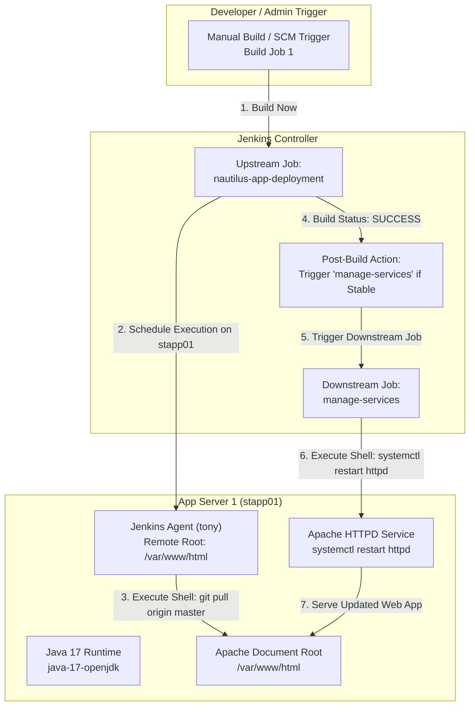

# Jenkins Chained Builds

## Technical Overview

In enterprise Continuous Integration and Continuous Deployment (CI/CD) pipelines, complex application lifecycles are decoupled into discrete, modular build jobs. **Jenkins Chained Builds** (also known as Upstream/Downstream build triggers) allow DevOps engineers to chain sequential pipeline tasks together—such as pulling latest application code, running tests, restarting web server daemons, and publishing artifacts—ensuring that downstream tasks execute strictly upon successful completion of upstream dependencies.

In this challenge, we configure a multi-job automated build chain on **App Server 1** (`stapp01`) consisting of two Freestyle projects:
1. **Upstream Job (`nautilus-app-deployment`):** Connects to the Gitea Git repository (`http://gitea:3000/sarah/web.git`), pulls the latest application code from the `master` branch, and updates the web server document root (`/var/www/html`).
2. **Downstream Job (`manage-services`):** Triggered automatically upon successful completion of `nautilus-app-deployment` to restart the Apache HTTP Web Server (`httpd`) daemon on `stapp01` via `systemctl restart httpd`.

Key tasks accomplished:
1. **Prerequisite & Plugin Verification:** Installing required plugins: **SSH Build Agents**, **Git**, and **Publish Over SSH**.
2. **Java 17 Upgrade & SSH Agent Configuration:** SSHing into `stapp01` as SSH user `tony`, upgrading OpenJDK from version 11 to **Java 17** (`java-17-openjdk`), and registering `stapp01` as an SSH agent node with remote root `/var/www/html`.
3. **Upstream Job Setup (`nautilus-app-deployment`):** Creating a Freestyle project bound to node `stapp01` that pulls Git updates into `/var/www/html` with `sudo` safe directory configuration.
4. **Downstream Job Setup (`manage-services`):** Creating a Freestyle project bound to `stapp01` that executes `sudo systemctl restart httpd`.
5. **Chained Trigger Configuration:** Linking `nautilus-app-deployment` to trigger `manage-services` post-build when the upstream build status is stable.
6. **Execution & Verification:** Triggering `nautilus-app-deployment`, verifying the automated trigger of `manage-services`, and confirming Apache service restart and updated web application content.



---

## Chained Build Architecture & Upstream/Downstream Strategy

### 1. Modular Job Decoupling
Decoupling application code retrieval from service management improves pipeline maintenance:
*   **Single Responsibility Principle:** Job 1 (`nautilus-app-deployment`) focuses exclusively on SCM code synchronization. Job 2 (`manage-services`) focuses exclusively on service lifecycle management.
*   **Fail-Safe Execution:** The downstream job runs only if the upstream job completes with a **SUCCESS** (Stable) status. If code retrieval fails, service restart is aborted to prevent serving incomplete states.

### 2. Sudo Privileges & Git Safe Directory Security
Executing Git commands and `systemctl` actions under non-root SSH user `tony` requires privilege elevation:
*   **Git Safe Directory Exception:** Git 2.35.2+ enforces repository ownership checks. When Jenkins runs as user `tony` inside root-owned or shared directories like `/var/www/html`, Git throws `fatal: detected dubious ownership in repository`. Running `git config --global --add safe.directory /var/www/html` resolves this security check.
*   **Non-Interactive Sudo Execution:** Commands using `sudo` inside Jenkins shell build steps pass credentials non-interactively via `echo 'password' | sudo -S <command>`.

---

## Infrastructure & Configuration Requirements

*   **Jenkins Controller Access:** Web Browser on port `8080`
*   **Jenkins Admin Credentials:** `admin` / `Adm!n321`
*   **Target Application Server:** `App Server 1` (`stapp01`)
*   **Target SSH User:** `tony` (Password: `Ir0nM@n`)
*   **Git Repository URL:** `http://gitea:3000/sarah/web.git`
*   **Required Plugins:** `SSH Build Agents`, `Git`, `Publish Over SSH`

### Agent Node & Jobs Configuration Matrix

| Setting | Value |
| :--- | :--- |
| **Node Name** | `App Server 1` |
| **Node Label** | `stapp01` |
| **Remote Root Directory** | `/var/www/html` |
| **Launch Method** | Launch agents via SSH |
| **Host** | `stapp01` |
| **Credentials** | `tony` (SSH Username & Password) |
| **Upstream Job Name** | `nautilus-app-deployment` |
| **Upstream Build Step** | `echo 'Ir0nM@n' \| sudo -S git config --global --add safe.directory /var/www/html`<br/>`cd /var/www/html`<br/>`echo 'Ir0nM@n' \| sudo -S git -C /var/www/html pull origin master` |
| **Upstream Post-Build Action** | Build other projects: `manage-services` |
| **Downstream Job Name** | `manage-services` |
| **Downstream Build Step** | `echo 'Ir0nM@n' \| sudo -S systemctl restart httpd` |
| **Downstream Trigger** | Build after other projects are built (`nautilus-app-deployment`) |

---

## Step-by-Step Walkthrough

### Step 1: Log in to Jenkins & Install Prerequisites

1. Open your browser and navigate to the Jenkins interface.
2. Sign in with administrative credentials:
   * **Username:** `admin`
   * **Password:** `Adm!n321`


3. Navigate to **Manage Jenkins** -> **Plugins** -> **Available plugins** (or Installed plugins).
4. Install and enable the required plugins:
   * **SSH Build Agents**
   * **Git plugin**
   * **Publish Over SSH**


---

### Step 2: Upgrade Java to Version 17 on `stapp01` & Add Agent Node

1. SSH into `stapp01` server as user `tony` from `jumphost`:

```bash
ssh tony@stapp01
```

2. Check the currently installed OpenJDK version:

```bash
java --version
```

*Output:*
```text
openjdk 11.0.20.1 2023-08-24 LTS
OpenJDK Runtime Environment (Red_Hat-11.0.20.1.1-2) (build 11.0.20.1+1-LTS)
```

3. Upgrade OpenJDK to version 17 using `yum`:

```bash
sudo yum install java-17-openjdk -y
```

4. Verify Java 17 installation:

```bash
java --version
```

*Output:*
```text
openjdk 17.0.18 2026-01-20 LTS
OpenJDK Runtime Environment (Red_Hat-17.0.18.0.8-2) (build 17.0.18+8-LTS)
```

5. In the Jenkins dashboard, navigate to **Manage Jenkins** -> **Nodes** -> **New Node**.
6. Set:
   * **Node Name:** `App Server 1`
   * **Type:** Permanent Agent
7. On the configuration page, specify:
   * **Remote root directory:** `/var/www/html`
   * **Labels:** `stapp01`
   * **Launch method:** Launch agents via SSH
   * **Host:** `stapp01`
   * **Credentials:** Add/Select `tony` credentials
   * **Host Key Verification Strategy:** Non-verifying Verification Strategy


8. Save and relaunch the agent. Confirm that `App Server 1` status changes to **In service / Online**.


---

### Step 3: Create Upstream Job (`nautilus-app-deployment`)

1. From the Jenkins dashboard, click **New Item**.
2. Enter item name: `nautilus-app-deployment` and select **Freestyle project**.
3. Under **General**:
   * Check **Restrict where this project can be run**.
   * Set **Label Expression:** `stapp01`.
4. Under **Source Code Management**:
   * Select **Git**.
   * Set **Repository URL:** `http://gitea:3000/sarah/web.git`
   * Set **Branch Specifier:** `*/master`


5. Under **Build Steps**:
   * Add **Execute shell** and enter:

```bash
echo 'Ir0nM@n' | sudo -S git config --global --add safe.directory /var/www/html
cd /var/www/html
echo 'Ir0nM@n' | sudo -S git -C /var/www/html pull origin master
```


6. Save the job configuration.

---

### Step 4: Create Downstream Job (`manage-services`)

1. Click **New Item** on the Jenkins home page.
2. Enter item name: `manage-services` and select **Freestyle project**.
3. Under **General**:
   * Check **Restrict where this project can be run**.
   * Set **Label Expression:** `stapp01`.
4. Under **Build Steps**:
   * Add **Execute shell** and enter:

```bash
echo 'Ir0nM@n' | sudo -S systemctl restart httpd
```


5. Save the job configuration.

---

### Step 5: Configure Chained Build Trigger Relationship

1. Open the configuration for `nautilus-app-deployment`.
2. Scroll to **Post-build Actions**.
3. Click **Add post-build action** -> **Build other projects**.
4. Set **Projects to build:** `manage-services`.
5. Check **Trigger only if build is stable**.


6. Save the configuration.

---

### Step 6: Test Chained Build Trigger & Verify Service Restart

1. Navigate to `nautilus-app-deployment` and click **Build Now**.


2. Inspect the **Console Output** of `nautilus-app-deployment` (Build #1):

```text
Started by user admin
Building remotely on App Server 1 (stapp01) in workspace /var/www/html
[html] $ /bin/sh -xe /tmp/jenkins123456.sh
+ echo Ir0nM@n
+ sudo -S git config --global --add safe.directory /var/www/html
+ cd /var/www/html
+ echo Ir0nM@n
+ sudo -S git -C /var/www/html pull origin master
Already up to date.
Triggering a new build of manage-services
Finished: SUCCESS
```

3. Verify that `manage-services` was triggered automatically and executed Build #1:

```text
Started by upstream project "nautilus-app-deployment" build number 1
originally caused by:
 Started by user admin
Building remotely on App Server 1 (stapp01) in workspace /var/www/html
[html] $ /bin/sh -xe /tmp/jenkins654321.sh
+ echo Ir0nM@n
+ sudo -S systemctl restart httpd
Finished: SUCCESS
```


4. On `stapp01`, verify Apache HTTPD service uptime and test web content:

```bash
systemctl status httpd
curl http://localhost
```


---

## Troubleshooting & Sudo Privileges Tip

> [!TIP]
> If build execution fails with `sudo: a password is required` or `permission denied`, verify:
> 1. User `tony` is configured in `/etc/sudoers` or `/etc/sudoers.d/` with passwordless sudo access or valid password injection (`echo 'password' | sudo -S <cmd>`).
> 2. The target web directory `/var/www/html` allows write access to user `tony` or git operations are run with `sudo`.

---

## Verification & Troubleshooting Checklist

| Checkpoint | Expected Result | Status |
| :--- | :--- | :---: |
| **Java 17 Runtime** | `java --version` returns OpenJDK 17 on `stapp01` | PASS |
| **SSH Build Agent** | Node `App Server 1` with label `stapp01` is Online | PASS |
| **Upstream Job Setup** | `nautilus-app-deployment` runs git pull successfully | PASS |
| **Chained Trigger Action** | Post-build action configured to trigger `manage-services` | PASS |
| **Downstream Execution** | `manage-services` triggers automatically on upstream success | PASS |
| **Service Lifecycle** | `systemctl restart httpd` executes clean with status SUCCESS | PASS |
| **Application Integrity** | `curl http://localhost` returns valid active response | PASS |

---

## Summary

In this challenge, we successfully established an automated **Jenkins Chained Build** pipeline across multiple Freestyle jobs:

1. **Prepared Node Infrastructure:** Upgraded Java runtime to Java 17 on `stapp01` and registered the server as an SSH Build Agent using credentials for user `tony`.
2. **Configured Upstream Deployment Job:** Built `nautilus-app-deployment` to pull the latest application code from Gitea into Apache's document root `/var/www/html`.
3. **Configured Downstream Service Job:** Built `manage-services` to restart Apache (`httpd`) via non-interactive `sudo systemctl restart httpd`.
4. **Established Pipeline Trigger:** Connected upstream job post-build actions to automatically invoke downstream service management upon stable build completion.
5. **Verified End-to-End Execution:** Tested manual build trigger and confirmed automatic cascading execution, web service restart, and live app response.
