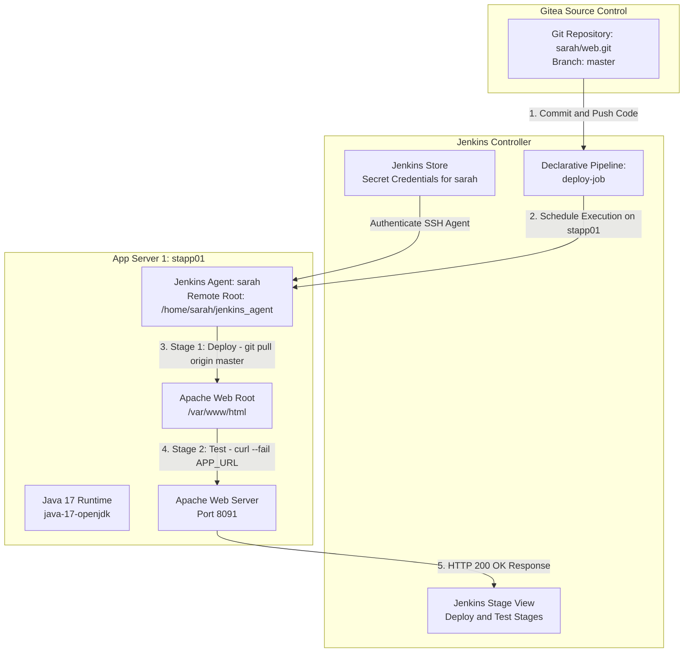

# Jenkins Multistage Pipeline

## Technical Overview

Modern Continuous Integration and Continuous Deployment (CI/CD) pipelines enforce software quality by structuring build workflows into distinct, sequential stages. **Jenkins Multistage Declarative Pipelines** allow DevOps engineers to define end-to-end delivery pipelines as code, separating deployment logic from automated health check testing. If a failure occurs in an early stage (such as deployment), execution is halted immediately, preventing downstream tests from running on an unstable release.

In this challenge, we build a multi-stage Declarative Pipeline job named `deploy-job` targeting **App Server 1** (`stapp01`). The pipeline incorporates two core stages:
1. **Deploy Stage:** Connects to the target node (`stapp01`), navigates to Apache's web document root (`/var/www/html`), and pulls the latest application code from the Gitea Git repository (`master` branch).
2. **Test Stage:** Performs an automated HTTP health check against the application URL using `curl --fail --silent --show-error`. If the web server returns an HTTP error or is unreachable, the stage throws an error and fails the pipeline.

Key tasks accomplished:
1. **Plugin Prerequisite Verification:** Installing required plugins: **SSH Build Agents** and **Pipeline**.
2. **Secret & Credentials Setup:** Adding SSH credentials for user `sarah` under Jenkins Global Credentials management to enable secure agent authentication.
3. **Java 17 Upgrade & SSH Agent Setup:** SSHing into `stapp01` as SSH user `sarah`, upgrading OpenJDK 11 to **Java 17** (`java-17-openjdk`), and registering `stapp01` as an SSH agent node with remote root `/home/sarah/jenkins_agent`.
4. **Multistage Declarative Pipeline Scripting:** Writing a Groovy pipeline script (`deploy-job`) bound to label `stapp01` with explicit `Deploy` and `Test` stages.
5. **Automated Health Check Integration:** Incorporating a fail-fast health test via `curl` in the `Test` stage.
6. **End-to-End Execution & Validation:** Updating application content (`Welcome to xFusionCorp Industries`) in Gitea, triggering `deploy-job`, and verifying stage completion in Jenkins Stage View.



---

## Multistage Pipeline Architecture & Testing Strategy

### 1. Declarative Pipeline DSL Structure
Declarative Pipelines organize execution blocks clearly:
*   `pipeline { ... }`: Root wrapper for the pipeline workflow.
*   `agent { label 'stapp01' }`: Restricts execution of all pipeline stages to agent nodes carrying label `stapp01`.
*   `environment { ... }`: Defines global pipeline variables (e.g., `APP_URL`, `REPO_URL`, `DEPLOY_DIR`).
*   `stages { ... }`: Encloses sequential `stage` blocks (`Deploy`, `Test`).

```groovy
pipeline {
    agent {
        label 'stapp01'
    }
    environment {
        APP_URL     = 'http://stapp01:8091/'
        REPO_URL    = 'http://gitea:3000/sarah/web.git'
        DEPLOY_DIR  = '/var/www/html'
    }
    stages {
        stage ('Deploy') {
            steps {
                sh """
                    cd ${DEPLOY_DIR}
                    git pull origin master
                """
            }
        }
        
        stage ('Test') {
            steps {
                sh """
                    echo 'Testing ${APP_URL}...'
                    sleep 5
                    curl --fail --silent --show-error ${APP_URL} || (echo 'APPLICATION IS DOWN' && exit 1)
                """
            }
        }
    }
}
```

### 2. Fail-Fast Health Check Mechanisms
The `Test` stage uses specific `curl` flags to guarantee deployment verification:
*   `--fail` (`-f`): Causes `curl` to return exit code `22` on HTTP error status codes (4xx/5xx).
*   `--silent` (`-s`): Suppresses transfer progress bars while preserving error messages when paired with `--show-error` (`-S`).
*   `|| (echo 'APPLICATION IS DOWN' && exit 1)`: Catches network timeouts or HTTP errors, prints a failure message to the console log, and explicitly exits with code `1` to fail the build.

---

## Infrastructure & Configuration Requirements

*   **Jenkins Controller Access:** Web Browser on port `8080`
*   **Jenkins Admin Credentials:** `admin` / `Adm!n321`
*   **Target Application Server:** `App Server 1` (`stapp01`)
*   **SSH Credentials:** `sarah` (username & password)
*   **Git Repository URL:** `http://gitea:3000/sarah/web.git`
*   **Required Plugins:** `SSH Build Agents`, `Pipeline`

### Pipeline & Node Matrix

| Setting | Value |
| :--- | :--- |
| **Node Name** | `App Server 1` |
| **Node Label** | `stapp01` |
| **Remote Root Directory** | `/home/sarah/jenkins_agent` |
| **Agent Launch Method** | Launch agents via SSH |
| **Host** | `stapp01` |
| **Credentials** | `sarah` (SSH Username & Password) |
| **Pipeline Job Name** | `deploy-job` |
| **Pipeline Stages** | `Deploy`, `Test` |
| **Deploy Target Directory** | `/var/www/html` |
| **Test Endpoint** | Application HTTP Web URL |

---

## Step-by-Step Walkthrough

### Step 1: Log in to Jenkins & Verify Installed Plugins

1. Access the Jenkins dashboard in your browser.
2. Sign in with administrative credentials:
   * **Username:** `admin`
   * **Password:** `Adm!n321`


3. Navigate to **Manage Jenkins** -> **Plugins** -> **Installed plugins**.
4. Verify that the following plugins are installed and active:
   * **SSH Build Agents**
   * **Pipeline**


---

### Step 2: Configure Jenkins Credentials / Secret for Agent Node

1. In the Jenkins left sidebar, navigate to **Manage Jenkins** -> **Credentials**.
2. Select the **System** domain and click **Global credentials (unrestricted)**.
3. Click **Add Credentials** in the top-right corner.
4. Configure the credential fields:
   * **Kind:** Username with password (or Secret text / SSH Username with private key)
   * **Scope:** Global (Jenkins, nodes, items, all child items)
   * **Username:** `sarah`
   * **Password:** Enter password for user `sarah`
   * **ID:** `sarah`
   * **Description:** `SSH Credentials for sarah on App Server 1`
5. Click **Create** to store the secret credentials.


---

### Step 3: Upgrade Java to Version 17 on `stapp01` & Configure Agent Node

1. SSH into `stapp01` as user `sarah` from `jumphost`:

```bash
ssh sarah@stapp01
```

2. Check installed OpenJDK version:

```bash
java --version
```

*Output:*
```text
openjdk 11.0.20.1 2023-08-24 LTS
OpenJDK Runtime Environment (Red_Hat-11.0.20.1.1-2) (build 11.0.20.1+1-LTS)
```

3. Install OpenJDK 17 via `yum`:

```bash
sudo yum install java-17-openjdk -y
```

4. Verify Java 17 installation:

```bash
java --version
```

*Output:*
```text
openjdk 17.0.18 2026-01-20 LTS
OpenJDK Runtime Environment (Red_Hat-17.0.18.0.8-2) (build 17.0.18+8-LTS)
```


5. In the Jenkins dashboard, navigate to **Manage Jenkins** -> **Nodes** -> **New Node**.
6. Configure node settings:
   * **Node Name:** `App Server 1`
   * **Type:** Permanent Agent
   * **Remote root directory:** `/home/sarah/jenkins_agent`
   * **Labels:** `stapp01`
   * **Launch method:** Launch agents via SSH
   * **Host:** `stapp01`
   * **Credentials:** Select the `sarah` secret credential created in Step 2
   * **Host Key Verification Strategy:** Non-verifying Verification Strategy

7. Click **Save**, relaunch the agent, and confirm that status displays **In service / Online**.


---

### Step 4: Create & Configure Multistage Pipeline (`deploy-job`)

1. From the Jenkins home dashboard, click **New Item**.
2. Enter item name: `deploy-job`.
3. Select **Pipeline** and click **OK**.


4. Scroll down to the **Pipeline** section.
5. Set **Definition:** `Pipeline script`.
6. Enter the Declarative Jenkinsfile script:

```groovy
pipeline {
    agent {
        label 'stapp01'
    }
    environment {
        APP_URL     = 'http://stapp01:8091/'
        REPO_URL    = 'http://gitea:3000/sarah/web.git'
        DEPLOY_DIR  = '/var/www/html'
    }
    stages {
        stage ('Deploy') {
            steps {
                sh """
                    cd ${DEPLOY_DIR}
                    git pull origin master
                """
            }
        }
        
        stage ('Test') {
            steps {
                sh """
                    echo 'Testing ${APP_URL}...'
                    sleep 5
                    curl --fail --silent --show-error ${APP_URL} || (echo 'APPLICATION IS DOWN' && exit 1)
                """
            }
        }
    }
}
```


7. Click **Save**.
8. Click **Build Now** to execute an initial pipeline run and verify environment configuration.


---

### Step 5: Update Application Content & Validate Pipeline Execution

1. Access the Gitea web interface or SSH into `stapp01` local workspace.
2. Edit `index.html` in the `master` branch of the `web` repository:

```bash
cd /home/sarah/web
echo "Welcome to xFusionCorp Industries" > index.html
git add index.html
git commit -m "Update web content for day 81 challenge"
git push origin master
```


3. Verify the web application content before triggering the pipeline (shows old content):


4. Navigate to Jenkins dashboard -> `deploy-job` and click **Build Now**.
5. Monitor the **Stage View** to confirm both **Deploy** and **Test** stages pass with green status indicator.


6. Refresh the application URL in browser or via `curl`:

```bash
curl http://stapp01:8091
```

*Response:*
```text
Welcome to xFusionCorp Industries
```

---

## Verification & Troubleshooting Checklist

| Checkpoint | Expected Result | Status |
| :--- | :--- | :---: |
| **Java 17 Runtime** | `java --version` returns OpenJDK 17 on `stapp01` | PASS |
| **Secret Credentials** | Credential `sarah` created under Global credentials | PASS |
| **SSH Build Agent** | Node `App Server 1` with label `stapp01` is Online | PASS |
| **Pipeline Definition** | Job `deploy-job` configured with Declarative Groovy script | PASS |
| **Deploy Stage** | Executes `git pull origin master` inside `/var/www/html` | PASS |
| **Test Stage** | `curl --fail` completes with exit code 0 | PASS |
| **Stage View Matrix** | Green execution status across `Deploy` and `Test` stages | PASS |
| **Live App Content** | Application returns `Welcome to xFusionCorp Industries` | PASS |

---

## Summary

In this challenge, we successfully designed and executed a **Jenkins Multistage Declarative Pipeline**:

1. **Configured Secret Credentials:** Created Jenkins SSH secret credentials for user `sarah`.
2. **Configured SSH Build Agent:** Configured `App Server 1` (`stapp01`) with Java 17 and bound it as a Jenkins agent.
3. **Built Declarative Pipeline:** Created pipeline `deploy-job` with `Deploy` and `Test` stages targeting label `stapp01`.
4. **Automated Health Check:** Implemented strict HTTP health validation using `curl --fail` in the `Test` stage to confirm post-deployment application health.
5. **End-to-End Verification:** Updated source code in Gitea, triggered `deploy-job`, and confirmed green Stage View status alongside updated application response.
