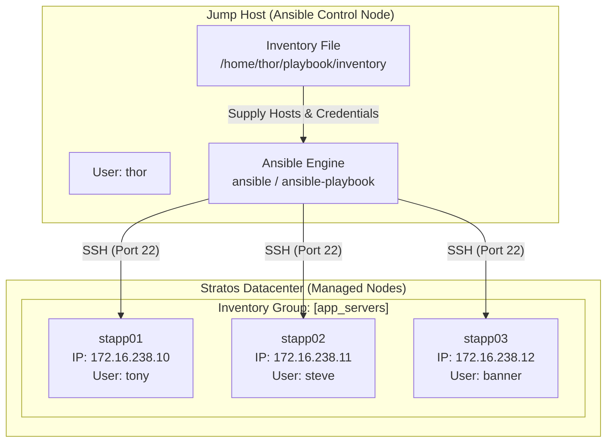

# Create Ansible Inventory for App Server Testing

## Technical Overview

In modern DevOps and infrastructure management, **Ansible** relies on an **Inventory** file to define and group the target machines (managed nodes) upon which automation tasks, ad-hoc commands, and playbooks are executed. The inventory informs Ansible about the server hostnames, IP addresses, network ports, SSH connection credentials, and custom variables required to establish secure communication.

Ansible supports two primary inventory formats: **INI** and **YAML**. The **INI format** is widely favored for its simplicity, human-readability, and straightforward syntax when mapping host-level variables such as `ansible_host`, `ansible_user`, and `ansible_ssh_pass`.

In this challenge, we configure a static INI-style Ansible inventory file on the **Jump Host** (`jump_host`) under `/home/thor/playbook/inventory`. This inventory targets all three Application Servers in the Stratos Datacenter (`stapp01`, `stapp02`, `stapp03`) to allow the DevOps team to perform automated application deployment testing without passing inline credentials or connection flags during playbook execution.



---

## Core Ansible Inventory Concepts

### 1. INI Inventory Structure
An INI inventory organizes hosts under group headers enclosed in square brackets `[group_name]`. Single hosts can belong to multiple groups, and variables can be defined inline per host or globally for an entire group.

### 2. Standard Connection Variables
When password authentication or custom SSH users are required, Ansible uses specific behavioral inventory parameters:
*   `ansible_host`: The IP address or domain name of the target host to connect to (if different from the inventory alias).
*   `ansible_user`: The SSH username to use when connecting to the target host.
*   `ansible_ssh_pass`: The SSH password to use for authentication (requires `sshpass` installed on the control node).
*   `ansible_port`: The SSH port number on the target host (defaults to `22`).
*   `ansible_become_pass`: The `sudo` password used for privilege escalation on the target host.

---

## Infrastructure & Configuration Requirements

### Server Inventory Matrix

| Hostname | Domain / Alias | IP Address | SSH User | Password | Role |
| :--- | :--- | :--- | :--- | :--- | :--- |
| **Jump Host** | `jump_host` | `172.16.238.2` | `thor` | Native / Passwordless | Ansible Control Node |
| **App Server 1** | `stapp01` | `172.16.238.10` | `tony` | `Ir0nM@n` | Application Server 1 |
| **App Server 2** | `stapp02` | `172.16.238.11` | `steve` | `Am3ric@` | Application Server 2 |
| **App Server 3** | `stapp03` | `172.16.238.12` | `banner` | `BigGr33n` | Application Server 3 |

### Requirements Checklist
*   **Inventory File Location:** `/home/thor/playbook/inventory`
*   **Inventory Format:** INI format
*   **Target Hosts:** `stapp01`, `stapp02`, `stapp03` grouped under `[app_servers]` (or individual host entries)
*   **Connection Attributes:** Explicit `ansible_host`, `ansible_user`, and `ansible_ssh_pass` configured per host

---

## Step-by-Step Implementation

### Step 1: Connect to the Jump Host
Log in to the Jump Host as user `thor`:
```bash
ssh thor@jump_host
```

---

### Step 2: Navigate to the Playbook Directory
Ensure the target directory `/home/thor/playbook` exists and navigate into it:
```bash
mkdir -p /home/thor/playbook
cd /home/thor/playbook
```

---

### Step 3: Create and Configure the INI Inventory File
Create or edit the inventory file named `inventory`:
```bash
vi /home/thor/playbook/inventory
```

Add the host definitions, group names, and SSH connection parameters in standard INI format:

```ini
[app_servers]
stapp01 ansible_host=stapp01 ansible_user=tony ansible_ssh_pass=******
stapp02 ansible_host=stapp02 ansible_user=steve ansible_ssh_pass=******
stapp03 ansible_host=stapp03 ansible_user=banner ansible_ssh_pass=******
```

> [!TIP]
> You can also define group-level variables using a `[group_name:vars]` section if all target nodes share common properties (e.g., SSH port or privilege escalation settings).

---

### Step 4: Verify Ansible Ad-Hoc Connectivity
Test that Ansible can read the inventory file and successfully authenticate with all target App Servers using the `ping` module:

```bash
ansible all -i /home/thor/playbook/inventory -m ping
```

*Expected Output:*
```json
stapp01 | SUCCESS => {
    "ansible_facts": {
        "discovered_interpreter_python": "/usr/bin/python3"
    },
    "changed": false,
    "ping": "pong"
}
stapp02 | SUCCESS => {
    "ansible_facts": {
        "discovered_interpreter_python": "/usr/bin/python3"
    },
    "changed": false,
    "ping": "pong"
}
stapp03 | SUCCESS => {
    "ansible_facts": {
        "discovered_interpreter_python": "/usr/bin/python3"
    },
    "changed": false,
    "ping": "pong"
}
```

---

### Step 5: Test Playbook Execution with Inventory
To confirm that playbooks can execute seamlessly using the newly created inventory, run a test playbook (e.g., `playbook.yml` located in `/home/thor/playbook/`):

```bash
ansible-playbook -i /home/thor/playbook/inventory /home/thor/playbook/playbook.yml
```
Output:
```bash
PLAY [all] ****************************************************************************************

TASK [Gathering Facts] ****************************************************************************
ok: [stapp01]

TASK [Install httpd package] **********************************************************************
changed: [stapp01]

TASK [Start service httpd] ************************************************************************
changed: [stapp01]

PLAY RECAP ****************************************************************************************
stapp01                    : ok=3    changed=2    unreachable=0    failed=0    skipped=0    rescued=0    ignored=0   
```

---

## Post-Deployment Verification

### 1. Verify Inventory File Content & Permissions
Check that the inventory file exists in the exact specified path with correct read permissions:
```bash
ls -l /home/thor/playbook/inventory
```
*Expected Output:*
```text
-rw-r--r-- 1 thor thor 265 Aug  5 18:00 /home/thor/playbook/inventory
```

### 2. Verify Host Listing via Ansible Inventory CLI
List all hosts recognized by Ansible from the inventory file:
```bash
ansible-inventory -i /home/thor/playbook/inventory --list
```

---

## Best Practices & Security Considerations

> [!WARNING]
> Storing plain-text SSH passwords inside inventory files (`ansible_ssh_pass`) poses a security risk in production environments.

*   **Ansible Vault:** Encrypt sensitive inventory files or variable files using `ansible-vault encrypt inventory`.
*   **SSH Key Authentication:** Replace password authentication (`ansible_ssh_pass`) with password-less SSH keys using `ssh-copy-id` for enterprise deployments.
*   **Group Variables Directory (`group_vars/`):** For larger deployments, store host and group variables in separate YAML files under `group_vars/app_servers.yml` rather than inline within the inventory file.
