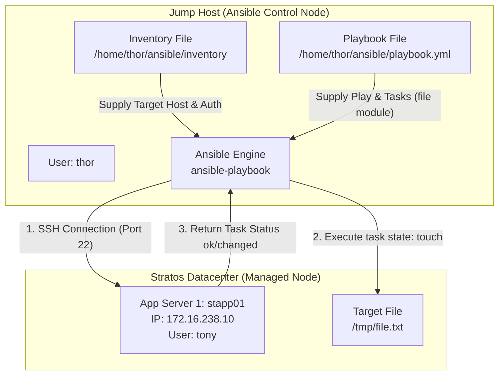

# Troubleshoot and Create Ansible Playbook

## Technical Overview

### What is an Ansible Playbook?

An **Ansible Playbook** is a human-readable, declarative configuration file written in **YAML** (Yet Another Markup Language) that defines automation workflows across managed infrastructure nodes. While Ansible **ad-hoc commands** are ideal for quick, single-task execution (such as checking system uptime or pinging hosts), **Playbooks** serve as reusable, version-controlled blueprints for orchestrating multi-step server setups, package installations, file deployments, and service configurations.

A playbook maps target servers (defined in an **Inventory**) to an ordered sequence of actions called **Tasks**. Each task invokes an Ansible **Module** (such as `file`, `yum`, `systemd`, or `copy`) to enforce a desired end-state on the target machine.



---

### Anatomy & Components of an Ansible Playbook

An Ansible playbook consists of one or more **Plays** in a YAML list. Each play contains specific configuration directives:

1. **Play Declaration (`- name: ...`, `hosts: ...`):**
   * `name`: A descriptive label summarizing the purpose of the play.
   * `hosts`: Specifies the target hosts or group names from the inventory (e.g., `stapp01`, `app_servers`, or `all`).
   * `become: yes`: Enables privilege escalation (`sudo`) to execute tasks with root permissions when modifying system files or directories.
   * `gather_facts: yes/no`: Controls whether Ansible automatically collects remote system information (IP addresses, OS distributions, disk space) before executing tasks.

2. **Tasks (`tasks:`):**
   A list of individual actions executed sequentially top-to-bottom on each target host. If a task fails on a host, Ansible halts execution for that host while continuing for remaining nodes.

3. **Modules:**
   Discrete units of code that perform specific system modifications:
   * `file`: Manages files, directories, and symlinks (creating, deleting, changing permissions or ownership).
   * `yum` / `apt`: Manages package installation and updates.
   * `service` / `systemd`: Manages service states (`started`, `stopped`, `restarted`, `enabled`).
   * `copy`: Transfers files from the control node to remote hosts.

4. **Variables (`vars:`):**
   Key-value pairs used to parameterize playbooks, making them flexible across staging and production environments.

5. **Handlers (`handlers:`, `notify:`):**
   Special tasks triggered only when a preceding task reports a `changed` state (e.g., restarting Apache `httpd` only when its configuration file is updated).

```yaml
---
- name: Example Ansible Playbook Structure
  hosts: stapp01
  become: yes
  vars:
    file_path: /tmp/file.txt
  tasks:
    - name: Ensure target file exists
      ansible.builtin.file:
        path: "{{ file_path }}"
        state: touch
        mode: '0644'
```

---

### Ansible Playbook Troubleshooting & Debugging Techniques

When playbooks fail or behave unexpectedly, DevOps engineers rely on several core diagnostic strategies:

1. **Syntax Checking (`--syntax-check`):**
   Validates YAML syntax and playbook structure without executing any tasks on target hosts:
   ```bash
   ansible-playbook -i inventory playbook.yml --syntax-check
   ```

2. **Dry-Run / Check Mode (`--check`):**
   Simulates playbook execution to predict changes without modifying remote target systems:
   ```bash
   ansible-playbook -i inventory playbook.yml --check
   ```

3. **Increasing Verbosity (`-v`, `-vv`, `-vvv`, `-vvvv`):**
   Appends detailed execution logs to stdout:
   * `-v`: Prints task results.
   * `-vv`: Prints task arguments and module inputs.
   * `-vvv`: Prints connection parameters and SSH details.
   * `-vvvv`: Enables full SSH connection debugging (useful for troubleshooting authentication or key failures).

4. **Using the `debug` Module:**
   Prints variable values, registered task outputs, or custom messages during execution:
   ```yaml
   - name: Print registered task result
     ansible.builtin.debug:
       var: result_output
   ```

5. **Error Handling Directives:**
   * `ignore_errors: yes`: Instructs Ansible to continue executing subsequent tasks even if the current task fails.
   * `failed_when`: Overrides standard failure criteria based on custom return conditions.
   * `block / rescue / always`: Groups tasks into exception-handling blocks similar to try/catch blocks in programming languages.

---

## Infrastructure & Configuration Requirements

### Host Environment Matrix

| Host Role | Hostname / Alias | IP Address | SSH User | Inventory Directory | Target File |
| :--- | :--- | :--- | :--- | :--- | :--- |
| **Control Node** | `jump_host` | `172.16.238.2` | `thor` | `/home/thor/ansible` | N/A |
| **App Server 1** | `stapp01` | `172.16.238.10` | `tony` | Configured in `inventory` | `/tmp/file.txt` |

### Requirements Checklist
*   **Inventory File Location:** `/home/thor/ansible/inventory`
*   **Playbook File Location:** `/home/thor/ansible/playbook.yml`
*   **Target Server:** App Server 1 (`stapp01`)
*   **Module Required:** `file` module
*   **Action:** Create an empty file named `file.txt` under `/tmp/` (`state: touch`)
*   **Execution Command:** `ansible-playbook -i inventory playbook.yml`

---

## Step-by-Step Implementation

### Step 1: Connect to the Jump Host
SSH into the Jump Host as user `thor`:
```bash
ssh thor@jump_host
```

---

### Step 2: Troubleshoot and Verify Inventory Configuration
Navigate to the Ansible project directory:
```bash
cd /home/thor/ansible
```

Inspect the existing inventory file to ensure the target host `stapp01` is correctly defined with its connection parameters (`ansible_host`, `ansible_user`, `ansible_ssh_pass`):

```bash
cat /home/thor/ansible/inventory
```

*Corrected INI Inventory (`/home/thor/ansible/inventory`):*
```ini
[app_servers]
stapp01 ansible_host=stapp01 ansible_user=tony ansible_ssh_pass=******
```

Test basic connectivity using an ad-hoc Ansible ping:
```bash
ansible stapp01 -i inventory -m ping
```

*Expected Output:*
```json
stapp01 | SUCCESS => {
    "ansible_facts": {
        "discovered_interpreter_python": "/usr/bin/python3"
    },
    "changed": false,
    "ping": "pong"
}
```

---

### Step 3: Create the Ansible Playbook
Create and open `/home/thor/ansible/playbook.yml` using `vi` or `nano`:
```bash
vi /home/thor/ansible/playbook.yml
```

Add the following play definition to create `/tmp/file.txt` on `stapp01` using the `file` module:

```yaml
---
- name: Create an empty file on App Server 1
  hosts: stapp01
  become: yes
  tasks:
    - name: Create /tmp/file.txt
      ansible.builtin.file:
        path: /tmp/file.txt
        state: touch
```

> [!NOTE]
> `state: touch` creates an empty file if it does not exist, or updates its access/modification timestamp if it already exists, ensuring idempotency.

---

### Step 4: Perform Syntax Validation
Run the Ansible playbook syntax check to verify YAML formatting and directive structure:

```bash
ansible-playbook -i inventory playbook.yml --syntax-check
```

*Expected Output:*
```text
playbook: playbook.yml
```

---

### Step 5: Execute the Playbook
Run the playbook against the inventory file:

```bash
ansible-playbook -i inventory playbook.yml
```

*Expected Terminal Output:*
```text
PLAY [Create an empty file on App Server 1] ******************************************************

TASK [Gathering Facts] ****************************************************************************
ok: [stapp01]

TASK [Create /tmp/file.txt] ***********************************************************************
changed: [stapp01]

PLAY RECAP ****************************************************************************************
stapp01                    : ok=2    changed=1    unreachable=0    failed=0    skipped=0    rescued=0    ignored=0   
```

---

## Post-Deployment Verification

### 1. Verify File Creation on Remote Host
Execute an ad-hoc command to confirm that `/tmp/file.txt` exists on `stapp01`:

```bash
ansible stapp01 -i inventory -m shell -a "ls -l /tmp/file.txt"
```

*Expected Output:*
```text
stapp01 | CHANGED | rc=0 >>
-rw-r--r-- 1 root root 0 Aug  5 18:30 /tmp/file.txt
```

### 2. Verify Idempotence
Re-run the playbook execution command to confirm idempotency. On the second execution, Ansible should report `changed=0`:

```bash
ansible-playbook -i inventory playbook.yml
```

*Expected Output:*
```text
PLAY RECAP ****************************************************************************************
stapp01                    : ok=2    changed=0    unreachable=0    failed=0    skipped=0    rescued=0    ignored=0   
```

---

## Best Practices & Key Takeaways

* **Strict YAML Indentation:** Always use 2 spaces per indentation level. Avoid mixing spaces and hard tab characters in `.yml` files.
* **Fully Qualified Collection Names (FQCN):** Use standard FQCN notation for built-in modules (e.g., `ansible.builtin.file` instead of `file`) for clarity and compatibility with newer Ansible versions.
* **Idempotency Standards:** Choose modules (`file`, `copy`, `template`) over raw `command` or `shell` modules whenever possible to guarantee reproducible state.
* **Always Run Syntax Checks:** Run `ansible-playbook --syntax-check` before running playbooks in production to catch indentation or missing key errors early.
