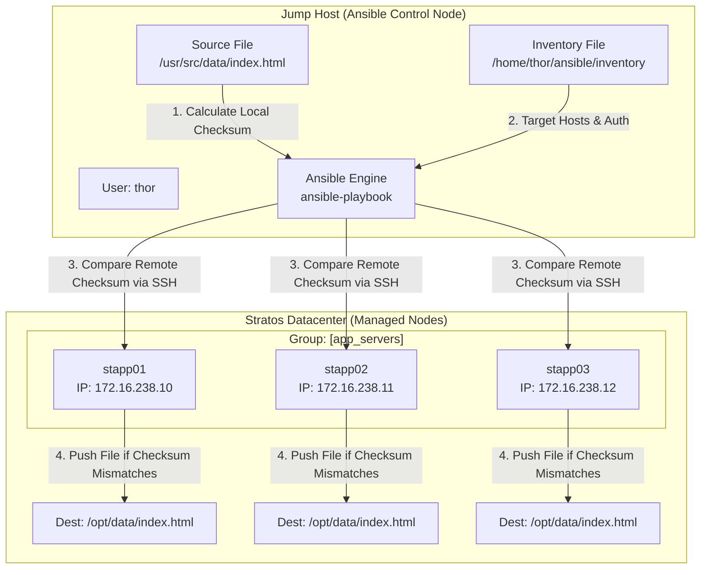

# Copy Data to App Servers Using Ansible

## Technical Overview

### File Distribution in Ansible: The `copy` Module

In multi-node infrastructure management, distributing static files, application artifacts, and configuration scripts from an Ansible Control Node to target managed nodes is a core operational requirement. Ansible provides the built-in **`ansible.builtin.copy`** module to manage file transfers seamlessly over existing SSH connections.

Unlike traditional file transfer utilities like `scp` or `rsync` which re-transfer files regardless of state, the Ansible `copy` module operates on the principle of **Idempotency**. Before transferring data, Ansible calculates cryptographic SHA-1 / MD5 checksums of the source file on the control node and compares them against the destination file on each remote node. If the remote file exists and its checksum matches the source file, Ansible skips the transfer (`changed: false`), saving bandwidth and preventing unnecessary disk I/O.



---

### Key Attributes of the `copy` Module

The `ansible.builtin.copy` module accepts key parameters to control transfer behavior, file permissions, and ownership:

1. **`src` (Source Path):**
   * Path to the file or directory on the Ansible Control Node.
   * *Trailing Slash Nuance:* If `src` is a directory ending with `/` (e.g., `/src/dir/`), Ansible copies the *contents* of the directory into the destination. If `src` has no trailing slash (e.g., `/src/dir`), Ansible copies the directory itself into the destination.

2. **`dest` (Destination Path):**
   * Absolute path on the remote target host where the file or directory should be copied.
   * If `dest` ends with a trailing slash `/`, the file retains its source filename inside the target directory.

3. **`mode` (Permissions):**
   * Sets file permission mode (e.g., `'0644'`, `'0755'`). Always quote octal mode strings to prevent YAML parser misinterpretation.

4. **`owner` & `group` (Ownership):**
   * Sets user and group ownership of the remote file (requires `become: yes` if target user differs from execution user).

5. **`backup` (Backup Creation):**
   * When set to `yes`, Ansible creates a timestamped backup copy of the remote file before overwriting it.

6. **`content` (Inline String Creation):**
   * Alternate directive to `src`. Allows passing inline string literals directly into a remote file without storing a local source file.

---

### Copy Module vs Template Module

| Feature | `ansible.builtin.copy` | `ansible.builtin.template` |
| :--- | :--- | :--- |
| **Primary Use Case** | Distributing static files, binaries, images, compiled artifacts | Generating dynamic configuration files (`nginx.conf`, `httpd.conf`) |
| **Processing Engine** | Raw file byte transfer (SHA-1 checksum validation) | Jinja2 templating engine (`{{ variable }}`) |
| **Variable Substitution** | No variable evaluation inside the file | Evaluates dynamic facts, inventory variables, and loops |

---

## Infrastructure & Configuration Requirements

### Host Environment Matrix

| Host Role | Hostname / Alias | IP Address | SSH User | Source File Path | Target File Path |
| :--- | :--- | :--- | :--- | :--- | :--- |
| **Control Node** | `jump_host` | `172.16.238.2` | `thor` | `/usr/src/data/index.html` | N/A |
| **App Server 1** | `stapp01` | `172.16.238.10` | `tony` | N/A | `/opt/data/index.html` |
| **App Server 2** | `stapp02` | `172.16.238.11` | `steve` | N/A | `/opt/data/index.html` |
| **App Server 3** | `stapp03` | `172.16.238.12` | `banner` | N/A | `/opt/data/index.html` |

### Requirements Checklist
*   **Inventory Path:** `/home/thor/ansible/inventory`
*   **Playbook Path:** `/home/thor/ansible/playbook.yml`
*   **Source File:** `/usr/src/data/index.html` on `jump_host`
*   **Destination Directory:** `/opt/data/` on all target App Servers (`stapp01`, `stapp02`, `stapp03`)
*   **Module:** `ansible.builtin.copy`
*   **Execution Command:** `ansible-playbook -i inventory playbook.yml`

---

## Step-by-Step Implementation

### Step 1: Connect to the Jump Host
SSH into the Jump Host as user `thor`:
```bash
ssh thor@jump_host
```

---

### Step 2: Inspect the Source File
Verify that the source file exists on the Jump Host:
```bash
ls -l /usr/src/data/index.html
```

---

### Step 3: Verify Inventory Configuration
Navigate to the Ansible project directory:
```bash
cd /home/thor/ansible
```

Ensure `/home/thor/ansible/inventory` contains all target application servers under group `[app_servers]`:

```ini
[app_servers]
stapp01 ansible_host=stapp01 ansible_user=tony ansible_ssh_pass=******
stapp02 ansible_host=stapp02 ansible_user=steve ansible_ssh_pass=******
stapp03 ansible_host=stapp03 ansible_user=banner ansible_ssh_pass=******
```

Verify SSH connectivity using an ad-hoc ping:
```bash
ansible app_servers -i inventory -m ping
```

---

### Step 4: Create the Ansible Playbook
Create `/home/thor/ansible/playbook.yml` using `vi` or `nano`:
```bash
vi /home/thor/ansible/playbook.yml
```

Add the following YAML declaration:

```yaml
---
- name: Copy data file to all App Servers
  hosts: app_servers
  become: yes
  tasks:
    - name: Copy /usr/src/data/index.html to /opt/data/
      ansible.builtin.copy:
        src: /usr/src/data/index.html
        dest: /opt/data/index.html
        mode: '0644'
```

---

### Step 5: Perform Syntax Checking
Validate the playbook syntax before running:
```bash
ansible-playbook -i inventory playbook.yml --syntax-check
```

*Expected Output:*
```text
playbook: playbook.yml
```

---

### Step 6: Execute the Playbook
Run the playbook against the inventory file:
```bash
ansible-playbook -i inventory playbook.yml
```

*Expected Output:*
```text
PLAY [Copy data file to all App Servers] *********************************************************

TASK [Gathering Facts] ****************************************************************************
ok: [stapp01]
ok: [stapp02]
ok: [stapp03]

TASK [Copy /usr/src/data/index.html to /opt/data/] ************************************************
changed: [stapp01]
changed: [stapp02]
changed: [stapp03]

PLAY RECAP ****************************************************************************************
stapp01                    : ok=2    changed=1    unreachable=0    failed=0    skipped=0    rescued=0    ignored=0   
stapp02                    : ok=2    changed=1    unreachable=0    failed=0    skipped=0    rescued=0    ignored=0   
stapp03                    : ok=2    changed=1    unreachable=0    failed=0    skipped=0    rescued=0    ignored=0   
```

---

## Post-Deployment Verification

### 1. Confirm File Transfer across Target Servers
Run an ad-hoc shell command to verify that `index.html` exists in `/opt/data/` across all three app servers:

```bash
ansible app_servers -i inventory -m shell -a "ls -l /opt/data/index.html"
```

*Expected Output:*
```text
stapp01 | CHANGED | rc=0 >>
-rw-r--r-- 1 root root 120 Aug  6 18:49 /opt/data/index.html
stapp02 | CHANGED | rc=0 >>
-rw-r--r-- 1 root root 120 Aug  6 18:49 /opt/data/index.html
stapp03 | CHANGED | rc=0 >>
-rw-r--r-- 1 root root 120 Aug  6 18:49 /opt/data/index.html
```

### 2. Verify Idempotence
Re-run the playbook execution command to verify that Ansible reports `changed=0` on all hosts:

```bash
ansible-playbook -i inventory playbook.yml
```

*Expected Output:*
```text
PLAY RECAP ****************************************************************************************
stapp01                    : ok=2    changed=0    unreachable=0    failed=0    skipped=0    rescued=0    ignored=0   
stapp02                    : ok=2    changed=0    unreachable=0    failed=0    skipped=0    rescued=0    ignored=0   
stapp03                    : ok=2    changed=0    unreachable=0    failed=0    skipped=0    rescued=0    ignored=0   
```

---

## Best Practices & Key Takeaways

* **Idempotency Validation:** Always rely on `ansible.builtin.copy` checksum comparison instead of running shell scripts (`scp`/`rsync`).
* **Explicit Permission Modes:** Always set the `mode` parameter explicitly (e.g. `mode: '0644'`) to avoid inheriting unwanted execution bits from the control node.
* **Directory Creation:** If the destination parent directory does not exist, use `ansible.builtin.file` with `state: directory` in a preceding task or ensure privileges allow directory creation.
* **Sensitive File Safety:** Use `backup: yes` when overwriting existing production files to allow instant rollback if needed.
