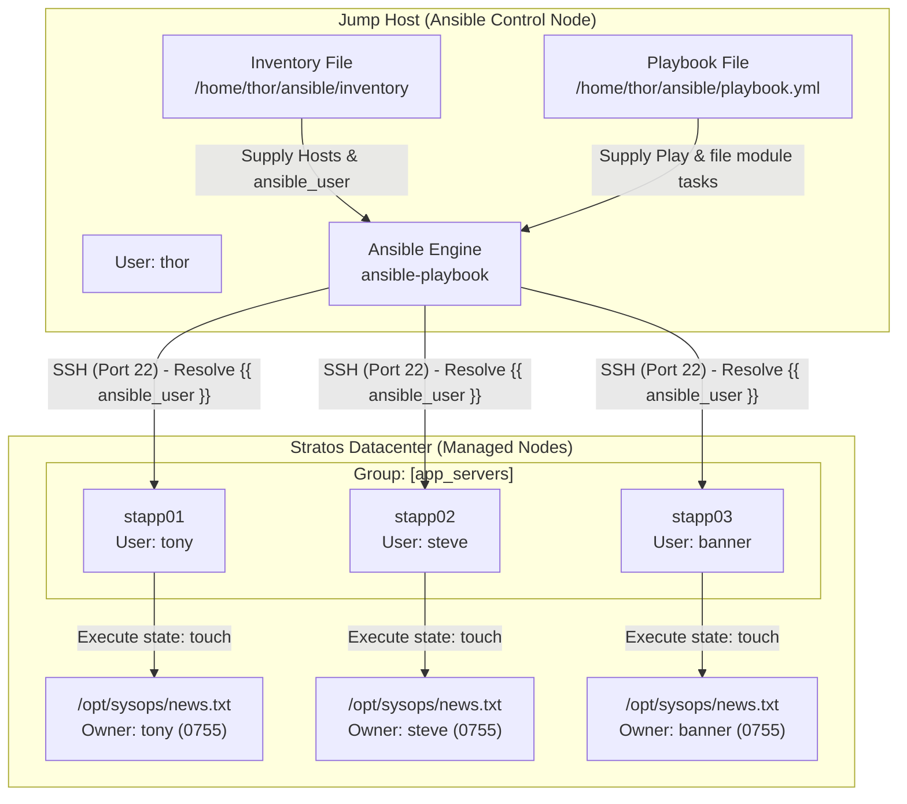

# Create Files on App Servers Using Ansible

## Technical Overview

### Managing Files and Attributes: The `file` Module

In automated systems administration and infrastructure engineering, managing files, directories, symbolic links, and access control permissions is a fundamental operational task. Ansible provides the built-in **`ansible.builtin.file`** module to create, modify, and delete filesystem objects across remote managed nodes.

Unlike executing raw Linux shell commands (`touch`, `mkdir`, `chmod`, `chown`), the `ansible.builtin.file` module guarantees **Idempotency**. It inspects the target host's filesystem before taking action:
* If a file or directory already exists with the specified owner, group, and permissions, Ansible leaves it unchanged (`changed: false`).
* If attributes differ, Ansible updates only the necessary metadata parameters.



---

### Supported File States (`state` Parameter)

The `ansible.builtin.file` module operates according to the value assigned to its `state` parameter:

1. **`state: touch`:**
   * Creates an empty file if it does not exist at the target `path`.
   * If the file already exists, it updates the access and modification timestamps (similar to UNIX `touch`).

2. **`state: directory`:**
   * Recursively creates directories along the specified `path` if they do not exist (equivalent to `mkdir -p`).

3. **`state: absent`:**
   * Recursively deletes the file, directory, or symlink at `path` (equivalent to `rm -rf`).

4. **`state: link` & `state: hard`:**
   * Creates symbolic links (`state: link`) or hard links (`state: hard`) pointing from `src` to `dest`.

5. **`state: file` (Default):**
   * Modifies file permissions (`mode`), owner (`owner`), or group (`group`) on an existing file without modifying content or creating new files.

---

### Dynamic Ownership via Inventory Variables

When managing multi-tier server clusters where each server has a distinct administrative user (e.g., user `tony` on `stapp01`, `steve` on `stapp02`, `banner` on `stapp03`), hardcoding ownership in playbooks causes failures. 

Ansible allows dynamic variable substitution using inventory variables:
* **`owner: "{{ ansible_user }}"`**: Resolves to the specific SSH username configured for each host in the inventory file.
* **`group: "{{ ansible_user }}"`**: Dynamically assigns group ownership matching the host user.

---

## Infrastructure & Configuration Requirements

### Host Environment Matrix

| Host Role | Hostname / Alias | IP Address | SSH User | Target File Path | Target Owner | Mode |
| :--- | :--- | :--- | :--- | :--- | :--- | :--- |
| **Control Node** | `jump_host` | `172.16.238.2` | `thor` | N/A | N/A | N/A |
| **App Server 1** | `stapp01` | `172.16.238.10` | `tony` | `/opt/sysops/news.txt` | `tony` | `0755` |
| **App Server 2** | `stapp02` | `172.16.238.11` | `steve` | `/opt/sysops/news.txt` | `steve` | `0755` |
| **App Server 3** | `stapp03` | `172.16.238.12` | `banner` | `/opt/sysops/news.txt` | `banner` | `0755` |

### Requirements Checklist
*   **Inventory Path:** `/home/thor/ansible/inventory`
*   **Playbook Path:** `/home/thor/ansible/playbook.yml`
*   **Target Target File Path:** `/opt/sysops/news.txt` on all App Servers
*   **File Permissions (`mode`):** `0755`
*   **Owner & Group:** Set dynamically to match each host's SSH user (`tony`, `steve`, `banner`)
*   **Privilege Escalation:** `become: yes` enabled
*   **Execution Command:** `ansible-playbook -i inventory playbook.yml`

---

## Step-by-Step Implementation

### Step 1: Connect to the Jump Host
SSH into the Jump Host as user `thor`:
```bash
ssh thor@jump_host
```

---

### Step 2: Verify Inventory Configuration
Navigate to the Ansible project workspace directory:
```bash
cd /home/thor/ansible
```

Inspect `/home/thor/ansible/inventory` to ensure target hosts and connection variables are configured:

```ini
[app_servers]
stapp01 ansible_host=stapp01 ansible_user=tony ansible_ssh_pass=******
stapp02 ansible_host=stapp02 ansible_user=steve ansible_ssh_pass=******
stapp03 ansible_host=stapp03 ansible_user=banner ansible_ssh_pass=******
```

Test SSH connectivity across all application servers using an ad-hoc ping:
```bash
ansible app_servers -i inventory -m ping
```

---

### Step 3: Create the Ansible Playbook
Create `/home/thor/ansible/playbook.yml` using `vi` or `nano`:
```bash
vi /home/thor/ansible/playbook.yml
```

Add the following playbook code to ensure `/opt/sysops/news.txt` is created with proper ownership and permissions:

```yaml
---
- name: Create news.txt file on all App Servers
  hosts: app_servers
  become: yes
  tasks:
    - name: Ensure target directory /opt/sysops exists
      ansible.builtin.file:
        path: /opt/sysops
        state: directory
        mode: '0755'

    - name: Create empty file /opt/sysops/news.txt with host-specific ownership
      ansible.builtin.file:
        path: /opt/sysops/news.txt
        state: touch
        owner: "{{ ansible_user }}"
        group: "{{ ansible_user }}"
        mode: '0755'
```

> [!TIP]
> Creating the parent directory `/opt/sysops` using `state: directory` in a preliminary task ensures that the playbook does not fail if the directory is missing on a newly provisioned server.

---

### Step 4: Perform Syntax Validation
Run syntax validation before running the playbook:
```bash
ansible-playbook -i inventory playbook.yml --syntax-check
```

*Expected Output:*
```text
playbook: playbook.yml
```

---

### Step 5: Execute the Playbook
Run the playbook against the inventory file:
```bash
ansible-playbook -i inventory playbook.yml
```

*Expected Output:*
```text
PLAY [Create news.txt file on all App Servers] ***************************************************

TASK [Gathering Facts] ****************************************************************************
ok: [stapp01]
ok: [stapp02]
ok: [stapp03]

TASK [Ensure target directory /opt/sysops exists] *************************************************
ok: [stapp01]
ok: [stapp02]
ok: [stapp03]

TASK [Create empty file /opt/sysops/news.txt with host-specific ownership] ***********************
changed: [stapp01]
changed: [stapp02]
changed: [stapp03]

PLAY RECAP ****************************************************************************************
stapp01                    : ok=3    changed=1    unreachable=0    failed=0    skipped=0    rescued=0    ignored=0   
stapp02                    : ok=3    changed=1    unreachable=0    failed=0    skipped=0    rescued=0    ignored=0   
stapp03                    : ok=3    changed=1    unreachable=0    failed=0    skipped=0    rescued=0    ignored=0   
```

---

## Post-Deployment Verification

### 1. Verify File Creation & Ownership across App Servers
Run an ad-hoc shell command to confirm file path, permissions (`0755`), and owner/group resolution across all target nodes:

```bash
ansible app_servers -i inventory -m shell -a "ls -l /opt/sysops/news.txt"
```

*Expected Output:*
```text
stapp01 | CHANGED | rc=0 >>
-rwxr-xr-x 1 tony tony 0 Aug  6 18:56 /opt/sysops/news.txt
stapp02 | CHANGED | rc=0 >>
-rwxr-xr-x 1 steve steve 0 Aug  6 18:56 /opt/sysops/news.txt
stapp03 | CHANGED | rc=0 >>
-rwxr-xr-x 1 banner banner 0 Aug  6 18:56 /opt/sysops/news.txt
```

### 2. Verify Playbook Idempotence
Re-run the playbook to confirm idempotence (`changed=0`):

```bash
ansible-playbook -i inventory playbook.yml
```

*Expected Output:*
```text
PLAY RECAP ****************************************************************************************
stapp01                    : ok=3    changed=0    unreachable=0    failed=0    skipped=0    rescued=0    ignored=0   
stapp02                    : ok=3    changed=0    unreachable=0    failed=0    skipped=0    rescued=0    ignored=0   
stapp03                    : ok=3    changed=0    unreachable=0    failed=0    skipped=0    rescued=0    ignored=0   
```

---

## Best Practices & Key Takeaways

* **Dynamic Host Variable Usage:** Use `{{ ansible_user }}` or `{{ inventory_hostname }}` to dynamically assign host-specific users and groups without hardcoding logic.
* **Parent Directory Enforcement:** Ensure parent directories exist using `state: directory` before creating nested files to avoid missing path failures.
* **Quote Octal Mode Strings:** Always enclose permission modes in single quotes (e.g. `mode: '0755'`) to prevent YAML parsers from converting octal numbers to decimal integers.
* **Module Selection:** Use `ansible.builtin.file` for file creation and metadata changes, and `ansible.builtin.copy` or `ansible.builtin.template` when writing actual file content.
