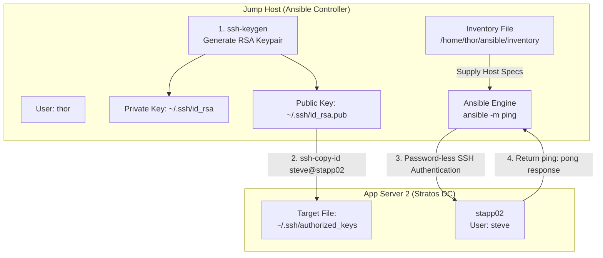

# Set Up Password-Less SSH for Ansible

## Technical Overview

### What is Password-Less SSH Authentication?

**Secure Shell (SSH)** public-key authentication is an asymmetric cryptographic mechanism that allows a user on a control node to authenticate securely with remote target machines without interactively transmitting passwords across the network. It relies on a key pair consisting of:

1. **Private Key (`id_rsa`):** Stored securely on the client machine (Jump Host / Control Node) with strictly restricted permissions (`0600`). The private key must never be shared or exposed.
2. **Public Key (`id_rsa.pub`):** Transferred to and appended to the `~/.ssh/authorized_keys` file on remote target hosts (Managed Nodes).

When an SSH connection or Ansible playbook is initiated, the control node proves possession of the private key via a cryptographic challenge-response mechanism. If the public key on the remote target matches, access is granted instantly without requiring user password prompts.

### Why Password-Less SSH is Mandatory for Ansible

Ansible uses an **agentless architecture**, meaning no specialized agent daemons run on remote managed nodes. Instead, Ansible relies entirely on standard **SSH connections** (via Python's `paramiko` or OpenSSH) to execute playbooks and ad-hoc commands.

Without password-less SSH key authentication:
* Ansible playbooks require interactive password prompts (`--ask-pass` or `-k`), preventing automated scheduled runs (e.g., via Jenkins, Cron, or CI/CD pipelines).
* Automated multi-node orchestrations fail due to unauthenticated session drops or password prompt timeouts.
* Passing plain-text passwords inside inventory files (`ansible_ssh_pass`) creates significant security vulnerabilities and violates credential management best practices.



---

## Core Concepts & Key Commands

### 1. Key Generation (`ssh-keygen`)
The `ssh-keygen` utility creates public and private authentication key pairs. Passing `-t rsa -b 4096` specifies 4096-bit RSA encryption, while `-N ""` creates a key without a passphrase to allow non-interactive authentication.

```bash
ssh-keygen -t rsa -b 4096 -N "" -f ~/.ssh/id_rsa
```

### 2. Key Distribution (`ssh-copy-id`)
The `ssh-copy-id` script automates installing a local public key into a remote machine's `~/.ssh/authorized_keys` file. It automatically creates the `~/.ssh` directory if missing and sets recommended permissions (`0700` for `.ssh` and `0600` for `authorized_keys`).

```bash
ssh-copy-id steve@stapp02
```

### 3. Ansible Ad-Hoc Ping Module (`ansible -m ping`)
Unlike the ICMP `ping` network command, Ansible's **`ping` module** validates end-to-end SSH connectivity, remote execution rights, and Python availability on managed nodes.

```bash
ansible -i /home/thor/ansible/inventory stapp02 -m ping
```

---

## Infrastructure & Configuration Requirements

### Server Inventory Matrix

| Host Role | Hostname / Alias | SSH User | User Password | Function |
| :--- | :--- | :--- | :--- | :--- |
| **Ansible Controller** | `jump_host` | `thor` | Native | Ansible Control Node |
| **App Server 1** | `stapp01` | `tony` | `Ir0nM@n` | Managed Node 1 |
| **App Server 2** | `stapp02` | `steve` | `Am3ric@` | Managed Node 2 (Target) |
| **App Server 3** | `stapp03` | `banner` | `BigGr33n` | Managed Node 3 |

### Requirements Checklist

* **Ansible Controller:** Jump Host (`thor` user session)
* **Target Server:** App Server 2 (`stapp02`)
* **Target SSH User:** `steve`
* **Inventory Path:** `/home/thor/ansible/inventory`
* **Validation Standard:** Password-less SSH connection established and verified via `ansible -i /home/thor/ansible/inventory stapp02 -m ping` returning `ping: pong`.

---

## Step-by-Step Implementation

### Step 1: Connect to Jump Host

Log in to the Jump Host as user `thor`:

```bash
ssh thor@jump_host
```

---

### Step 2: Inspect the Ansible Inventory File

Verify that the inventory file exists at `/home/thor/ansible/inventory` and check the target host definition:

```bash
cat /home/thor/ansible/inventory
```

*Sample Inventory Content:*
```ini
[app_servers]
stapp01 ansible_host=stapp01 ansible_user=tony
stapp02 ansible_host=stapp02 ansible_user=steve
stapp03 ansible_host=stapp03 ansible_user=banner
```

---

### Step 3: Generate SSH Keypair on Jump Host

Generate a pair of RSA keys for the `thor` user on the Jump Host without a passphrase:

```bash
ssh-keygen -t rsa -b 4096 -N "" -f ~/.ssh/id_rsa
```

*Verification:* Confirm the generated key pair in `~/.ssh/`:
```bash
ls -la ~/.ssh/
```
Output should contain:
* `id_rsa` (Private Key)
* `id_rsa.pub` (Public Key)

---

### Step 4: Copy SSH Public Key to App Server 2

Transfer the public key from the Jump Host to App Server 2 (`stapp02`) for target user `steve`:

```bash
ssh-copy-id steve@stapp02
```

*(Alternatively, use IP address `ssh-copy-id steve@stapp02` if hostname resolution is not in `/etc/hosts`)*

When prompted:
1. Type `yes` to accept the SSH host authenticity fingerprint (if connecting for the first time).
2. Enter the password for user `steve` on App Server 2: `Am3ric@`.

```text
/usr/bin/ssh-copy-id: INFO: attempting to log in with the new key(s), to filter out any that are already installed
/usr/bin/ssh-copy-id: INFO: 1 key(s) remain to be installed -- if you are prompted now it is to install the new keys
steve@stapp02's password: 

Number of key(s) added: 1

Now try logging into the machine, with:   "ssh 'steve@stapp02'"
and check to make sure that only the key(s) you wanted were added.
```

---

### Step 5: Test Password-Less SSH Connection Direct to App Server 2

Verify that `thor` can log in to `stapp02` as user `steve` directly via SSH without entering a password:

```bash
ssh steve@stapp02 "hostname; id"
```

*Expected Output:*
```text
stapp02
uid=1001(steve) gid=1001(steve) groups=1001(steve)
```

---

### Step 6: Test Ansible Ping Module via Inventory File

Execute Ansible `ping` module from the Jump Host targeting `stapp02` using the inventory located at `/home/thor/ansible/inventory`:

```bash
ansible -i /home/thor/ansible/inventory stapp02 -m ping
```

*Or ping all host entries defined under `app_servers` if keys were distributed across all app servers:*

```bash
ansible -i /home/thor/ansible/inventory app_servers -m ping
```

---

## Verification & Validation

Execute the ping verification command and ensure a successful JSON result is returned:

```bash
ansible -i /home/thor/ansible/inventory stapp02 -m ping
```

### Expected Successful Output

```json
stapp02 | SUCCESS => {
    "ansible_facts": {
        "discovered_interpreter_python": "/usr/bin/python3"
    },
    "changed": false,
    "ping": "pong"
}
```

*Key Success Indicators:*
1. **`SUCCESS` status indicator** in green.
2. **`"ping": "pong"`** payload returned from remote Python interpreter.
3. No password prompts presented during command execution.

---

## Troubleshooting & Common Pitfalls

| Issue / Error | Cause | Resolution |
| :--- | :--- | :--- |
| **`Permission denied (publickey,password)`** | Public key not added to `~/.ssh/authorized_keys` on target server. | Re-run `ssh-copy-id steve@stapp02` or manually paste `id_rsa.pub` into `~/.ssh/authorized_keys`. |
| **`Bad permissions on .ssh directory`** | Remote `~/.ssh` directory or `authorized_keys` file has insecure permissions (`777` or group writable). | SSH into target host and fix permissions: `chmod 700 ~/.ssh && chmod 600 ~/.ssh/authorized_keys`. |
| **`Host key verification failed`** | OpenSSH strict host key checking rejects unverified target fingerprints during automated Ansible runs. | Connect manually via SSH once to accept fingerprint or configure `host_key_checking = False` in `ansible.cfg`. |
| **`UNREACHABLE! => {"changed": false, "msg": "Failed to connect to the host via ssh"}`** | Network interface issue or incorrect username specified in inventory (`ansible_user`). | Verify target host IP and ensure inventory specifies correct SSH user (`ansible_user=steve`). |

---

## Best Practices

1. **Avoid Hardcoding Plaintext Passwords:**
   Never store `ansible_ssh_pass` or plaintext user passwords inside inventory files or playbooks committed to version control repositories.
2. **Strict File Permissions:**
   Ensure private keys on the Ansible control node maintain strict permissions (`0600`).
3. **Standardized Key Generation:**
   Use modern RSA 4096-bit or Ed25519 (`ssh-keygen -t ed25519`) key pairs for optimal cryptographic security.
4. **Automate Key Deployment:**
   In large enterprise deployments, provision SSH public keys during initial VM instantiation via Cloud-Init or kickstart scripts.
