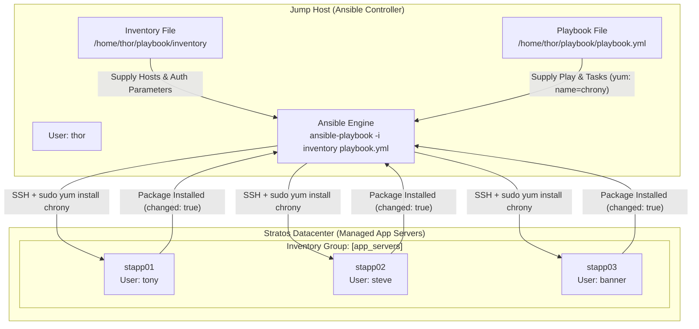

# Install Chrony Package Using Ansible

## Technical Overview

### What is Chrony?

**Chrony** is a versatile implementation of the Network Time Protocol (NTP) designed for Unix-like operating systems. It consists of two main components: `chronyd` (a background daemon) and `chronyc` (a command-line interface for monitoring and performance tuning). 

In enterprise server fleets and cloud infrastructures, accurate system time synchronization across distributed nodes is critical for:
* **Log Correlation:** Ensuring log timestamps across web servers, application servers, and databases match precisely during incident investigations.
* **Distributed Transactions & Consensus:** Preventing race conditions, session desynchronization, and database lock conflicts.
* **Authentication Security:** Enabling secure token validation (Kerberos, OAuth 2.0, SSL/TLS certificate validity checks).

### Package Management in Ansible: The `yum` Module

Ansible provides the built-in **`ansible.builtin.yum`** module (or `ansible.builtin.dnf` on modern RHEL/CentOS systems) to manage RPM software packages on Red Hat Enterprise Linux and derivatives.

Key advantages of using Ansible's `yum` module include:
1. **Idempotency:** If the requested package is already installed at the desired state, Ansible skips downloading and installing, returning `changed: false`.
2. **State Management:** The `state` parameter defines the target operational state:
   * `present` / `installed`: Ensures the package is installed (installs if missing; leaves existing version intact).
   * `latest`: Ensures the package is installed and upgraded to the newest version available in enabled repositories.
   * `absent` / `removed`: Ensures the package is completely uninstalled from the remote target node.
3. **Automated Dependency Resolution:** Ansible delegates dependency resolution directly to the underlying `yum` package manager, automatically installing required library dependencies.

### Non-Interactive Execution & Privilege Escalation

Installing software packages on Linux requires root privileges. In Ansible playbooks, privilege escalation is enabled at the play level via `become: yes`. When validation or CI/CD pipelines run `ansible-playbook -i inventory playbook.yml` without passing interactive password flags (`-k` or `-K`), all target host credentials (`ansible_user`, `ansible_ssh_pass`, `ansible_become_pass`) must be explicitly defined in the inventory file.



---

## Core Concepts & Playbook Syntax

### Playbook Structure (`playbook.yml`)

An Ansible playbook is written in **YAML** format. Key directives for package installation include:

```yaml
---
- name: Install Chrony Package on All App Servers
  hosts: app_servers
  become: yes
  tasks:
    - name: Install chrony package using yum module
      ansible.builtin.yum:
        name: chrony
        state: present
```

### Directive Definitions

* **`hosts: app_servers`**: Specifies the target group of managed nodes from the inventory file.
* **`become: yes`**: Instructs Ansible to execute tasks using privilege escalation (`sudo root`).
* **`ansible.builtin.yum`**: The core package management module.
* **`name: chrony`**: The exact RPM package name to be managed.
* **`state: present`**: Ensures the package is installed on the target machine.

---

## Infrastructure & Configuration Requirements

### Server Inventory Matrix

| Host Role | Hostname / Alias | SSH User | User Password | Sudo Password | Target Package |
| :--- | :--- | :--- | :--- | :--- | :--- |
| **Ansible Controller** | `jump_host` | `thor` | Native | N/A | N/A |
| **App Server 1** | `stapp01` | `tony` | `Ir0nM@n` | `Ir0nM@n` | `chrony` |
| **App Server 2** | `stapp02` | `steve` | `Am3ric@` | `Am3ric@` | `chrony` |
| **App Server 3** | `stapp03` | `banner` | `BigGr33n` | `BigGr33n` | `chrony` |

### Requirements Checklist

* **Inventory Directory & File:** `/home/thor/playbook/inventory`
* **Playbook Directory & File:** `/home/thor/playbook/playbook.yml`
* **Target Group:** `app_servers` containing `stapp01`, `stapp02`, and `stapp03`
* **Target Package:** `chrony`
* **Module:** `ansible.builtin.yum` (or `yum`)
* **Validation Compatibility:** Must execute successfully via non-interactive command:
  ```bash
  ansible-playbook -i inventory playbook.yml
  ```

---

## Step-by-Step Implementation

### Step 1: Connect to Jump Host

Log in to the Jump Host as user `thor`:

```bash
ssh thor@jump_host
```

---

### Step 2: Create the Playbook Directory

Create the target directory `/home/thor/playbook` if it does not already exist, and change your working directory:

```bash
mkdir -p /home/thor/playbook
cd /home/thor/playbook
```

---

### Step 3: Create the Inventory File

Create the inventory file `/home/thor/playbook/inventory` with all three application servers and their connection credentials:

```bash
cat << 'EOF' > /home/thor/playbook/inventory
[app_servers]
stapp01 ansible_host=stapp01 ansible_user=tony ansible_ssh_pass=Ir0nM@n ansible_become_pass=Ir0nM@n
stapp02 ansible_host=stapp02 ansible_user=steve ansible_ssh_pass=Am3ric@ ansible_become_pass=Am3ric@
stapp03 ansible_host=stapp03 ansible_user=banner ansible_ssh_pass=BigGr33n ansible_become_pass=BigGr33n
EOF
```

*(Note: If password-less SSH authentication and password-less sudo are already configured across the cluster, simple host entries `stapp01`, `stapp02`, `stapp03` under `[app_servers]` can be used).*

---

### Step 4: Verify Inventory Connectivity

Test Ansible connectivity to all app servers using the `ping` module:

```bash
ansible -i /home/thor/playbook/inventory app_servers -m ping
```

*Expected Output:* Each server returns `"ping": "pong"` with `SUCCESS`.

---

### Step 5: Create the Ansible Playbook

Create the `/home/thor/playbook/playbook.yml` file using `cat` or `vi`:

```bash
cat << 'EOF' > /home/thor/playbook/playbook.yml
---
- name: Install Chrony Package on All App Servers
  hosts: app_servers
  become: yes
  tasks:
    - name: Install chrony package using yum module
      ansible.builtin.yum:
        name: chrony
        state: present
EOF
```

---

### Step 6: Validate Playbook Syntax

Before running the playbook, verify that there are no syntax or formatting errors in the YAML file:

```bash
ansible-playbook -i inventory playbook.yml --syntax-check
```

*Expected Output:*
```text
playbook: playbook.yml
```

---

### Step 7: Execute the Ansible Playbook

Run the playbook using the standard non-interactive command required for validation:

```bash
cd /home/thor/playbook
ansible-playbook -i inventory playbook.yml
```

---

## Verification & Validation

### 1. Playbook Execution Output

Upon successful execution, the terminal will display the execution recap:

```text
PLAY [Install Chrony Package on All App Servers] *************************************************

TASK [Gathering Facts] ***************************************************************************
ok: [stapp01]
ok: [stapp02]
ok: [stapp03]

TASK [Install chrony package using yum module] ***************************************************
changed: [stapp01]
changed: [stapp02]
changed: [stapp03]

PLAY RECAP ***************************************************************************************
stapp01                    : ok=2    changed=1    unreachable=0    failed=0    skipped=0    rescued=0    ignored=0   
stapp02                    : ok=2    changed=1    unreachable=0    failed=0    skipped=0    rescued=0    ignored=0   
stapp03                    : ok=2    changed=1    unreachable=0    failed=0    skipped=0    rescued=0    ignored=0   
```

### 2. Verify Package Installation on Target Hosts

Run an ad-hoc shell command using Ansible to confirm `chrony` is installed on all target servers:

```bash
ansible -i inventory app_servers -m shell -a "rpm -q chrony"
```

*Expected Output:*
```text
stapp01 | CHANGED | rc=0 >>
chrony-3.5-3.el7.x86_64
stapp02 | CHANGED | rc=0 >>
chrony-3.5-3.el7.x86_64
stapp03 | CHANGED | rc=0 >>
chrony-3.5-3.el7.x86_64
```

---

## Troubleshooting & Common Pitfalls

| Issue / Error | Root Cause | Resolution |
| :--- | :--- | :--- |
| **`Permission denied: /var/run/yum.pid`** | The task attempted package installation without root privileges. | Add `become: yes` to the play header in `playbook.yml`. |
| **`Missing sudo password` / `sudo: a password is required`** | Ansible attempted `become: yes` but no sudo password was provided for non-passwordless sudo users. | Add `ansible_become_pass` parameter to each host entry in `inventory` or configure NOPASSWD in `/etc/sudoers`. |
| **`SyntaxError: unexpected token`** | Improper YAML indentation or tabs instead of spaces. | Use 2-space indentation and check syntax with `ansible-playbook -i inventory playbook.yml --syntax-check`. |
| **`No package chrony available`** | YUM repository cache is outdated or repository is unreachable. | Add `update_cache: yes` to the `yum` module parameters or verify network/repo connectivity. |

---

## Best Practices

1. **Use Fully Qualified Collection Names (FQCN):**
   Prefer `ansible.builtin.yum` over short `yum` module names to adhere to modern Ansible standards.
2. **Explicit Privilege Escalation:**
   Always declare `become: yes` at the play or task level when performing administrative actions like package management.
3. **Verify Idempotency:**
   Re-run `ansible-playbook -i inventory playbook.yml` a second time. The second run should return `changed=0` for all tasks, proving idempotency.
