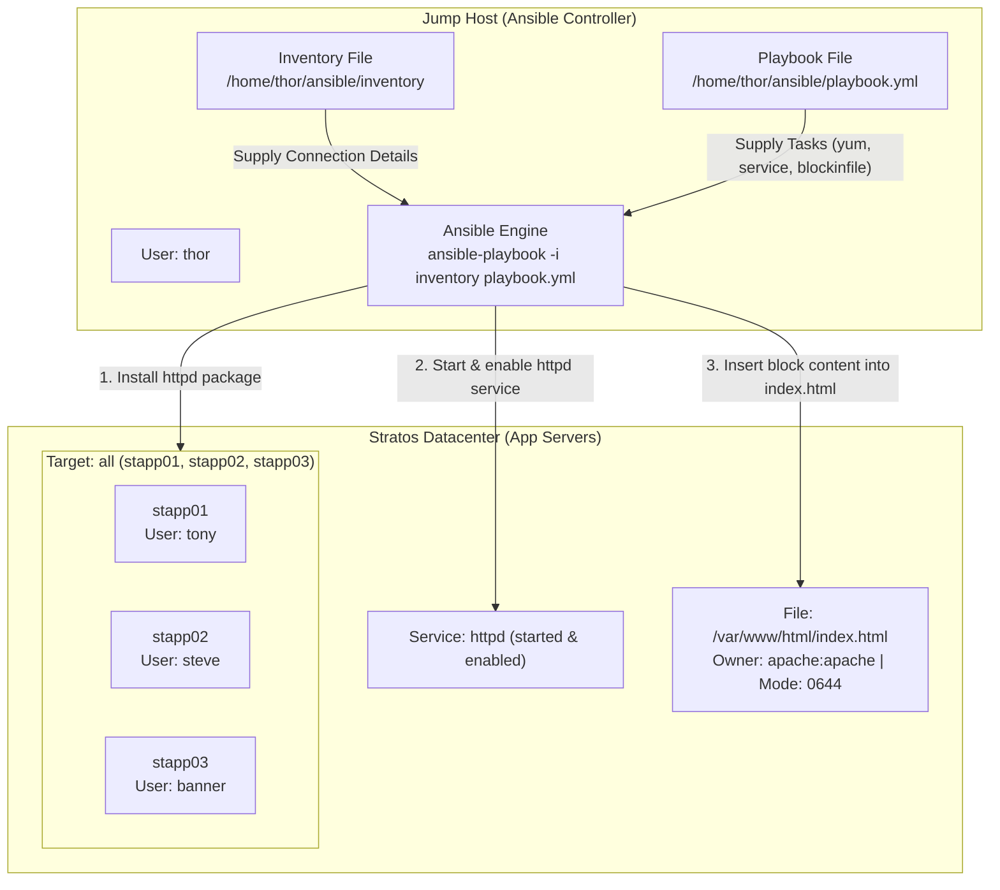

# Deploy Httpd Web Server and Configure Index Page Using Ansible

## Technical Overview

### What is Apache HTTP Server (`httpd`)?

The **Apache HTTP Server** (commonly known as `httpd` on Red Hat Enterprise Linux and CentOS systems) is one of the most widely deployed open-source web servers in modern enterprise infrastructure. It delivers high-performance HTTP web content, supports modular extensions (e.g., SSL/TLS encryption, URL rewriting, proxying), and serves as the primary front-end web server for multi-tier web applications.

### Automated Web Deployment in Ansible

Automating web application deployments across multi-node server clusters requires orchestrating three fundamental operational phases:

1. **Package Provisioning (`ansible.builtin.yum`):** Installing the `httpd` package binary on managed nodes.
2. **Service Lifecycle Management (`ansible.builtin.service`):** Enabling the `httpd` system service to start automatically on system boot and ensuring its current operational state is `started`.
3. **Configuration & Artifact Distribution (`ansible.builtin.blockinfile`):** Injecting and maintaining structured HTML/configuration content inside web root directories (`/var/www/html/index.html`) while enforcing strict file ownership and mode permissions (`apache:apache`, `0644`).

### The `ansible.builtin.blockinfile` Module

The **`ansible.builtin.blockinfile`** module inserts, updates, or removes a multi-line block of text within an existing or new file. Unlike the `copy` or `template` modules (which manage entire files), `blockinfile` manages designated text blocks demarcated by customizable marker comments (e.g., `# BEGIN ANSIBLE MANAGED BLOCK`).

Key capabilities of `blockinfile`:
* **Idempotency:** Re-running the playbook checks whether the managed block inside the markers matches the defined string. If no changes are needed, Ansible skips modification (`changed: false`).
* **Atomic File Creation (`create: yes`):** If the destination file does not exist, setting `create: yes` instructs Ansible to create a new file.
* **Inline Permission Enforcement:** Accepts `owner`, `group`, and `mode` parameters to set target file metadata in a single atomic task.



---

## Core Concepts & Directive Definitions

### Playbook Blueprint (`playbook.yml`)

```yaml
---
- name: Install and Setup Apache Web Server with Custom Index Page
  hosts: all
  become: yes
  tasks:
    - name: Install httpd package
      ansible.builtin.yum:
        name: httpd
        state: present

    - name: Start and enable httpd service
      ansible.builtin.service:
        name: httpd
        state: started
        enabled: yes

    - name: Deploy index.html content using blockinfile module
      ansible.builtin.blockinfile:
        path: /var/www/html/index.html
        create: yes
        owner: apache
        group: apache
        mode: '0644'
        block: |
          Welcome to XfusionCorp!

          This is  Nautilus sample file, created using Ansible!

          Please do not modify this file manually!
```

### Key Parameter Explanations

| Module Directive | Parameter | Function |
| :--- | :--- | :--- |
| `ansible.builtin.yum` | `name: httpd` | Specifies the RPM package name for Apache Web Server. |
| | `state: present` | Ensures `httpd` is installed without forcing unnecessary re-downloads. |
| `ansible.builtin.service` | `name: httpd` | Specifies the `systemd` unit name. |
| | `state: started` | Ensures the web server process is actively running. |
| | `enabled: yes` | Enables the service to start automatically on system boot. |
| `ansible.builtin.blockinfile` | `path: /var/www/html/index.html` | Absolute path to target file on managed servers. |
| | `create: yes` | Creates `/var/www/html/index.html` if it does not already exist. |
| | `owner: apache` | Sets user ownership of the file to `apache`. |
| | `group: apache` | Sets group ownership of the file to `apache`. |
| | `mode: '0644'` | Sets read/write for owner, read-only for group/others (`-rw-r--r--`). |
| | `block: \|` | Literal multiline block scalar holding the target text content. |

---

## Infrastructure & Configuration Requirements

### Server Inventory Matrix

| Host Role | Hostname / Alias | SSH User | SSH Password | Target Role |
| :--- | :--- | :--- | :--- | :--- |
| **Ansible Controller** | `jump_host` | `thor` | Native | Control Node |
| **App Server 1** | `stapp01` | `tony` | `Ir0nM@n` | Managed Node 1 |
| **App Server 2** | `stapp02` | `steve` | `Am3ric@` | Managed Node 2 |
| **App Server 3** | `stapp03` | `banner` | `BigGr33n` | Managed Node 3 |

### Inventory File Content (`/home/thor/ansible/inventory`)

```ini
stapp01 ansible_host=stapp01 ansible_ssh_pass=Ir0nM@n ansible_user=tony
stapp02 ansible_host=stapp02 ansible_ssh_pass=Am3ric@ ansible_user=steve
stapp03 ansible_host=stapp03 ansible_ssh_pass=BigGr33n ansible_user=banner
```

### Requirements Checklist

* **Inventory Location:** `/home/thor/ansible/inventory`
* **Playbook Location:** `/home/thor/ansible/playbook.yml`
* **Target Hosts:** `all` (all application servers in inventory)
* **Package Requirement:** `httpd` installed via `yum` module
* **Service Requirement:** `httpd` service started and enabled
* **File Requirement:** `/var/www/html/index.html` created/updated via `blockinfile`
* **File Metadata:** Owner `apache`, Group `apache`, Permissions `0644`
* **Validation Compatibility:** Must execute cleanly via:
  ```bash
  ansible-playbook -i inventory playbook.yml
  ```

---

## Step-by-Step Implementation

### Step 1: Connect to Jump Host

Log in to the Jump Host as user `thor`:

```bash
ssh thor@jump_host
```

---

### Step 2: Navigate to Ansible Working Directory

Change directory to `/home/thor/ansible`:

```bash
cd /home/thor/ansible
```

---

### Step 3: Inspect Inventory Configuration

Verify the existing inventory file content:

```bash
cat /home/thor/ansible/inventory
```

*Output:*
```ini
stapp01 ansible_host=stapp01 ansible_ssh_pass=Ir0nM@n ansible_user=tony
stapp02 ansible_host=stapp02 ansible_ssh_pass=Am3ric@ ansible_user=steve
stapp03 ansible_host=stapp03 ansible_ssh_pass=BigGr33n ansible_user=banner
```

---

### Step 4: Test SSH Connectivity Across All Nodes

Verify connectivity using the Ansible `ping` module targeting `all`:

```bash
ansible -i inventory all -m ping
```

*Expected Output:* Returns `"ping": "pong"` with status `SUCCESS` for `stapp01`, `stapp02`, and `stapp03`.

---

### Step 5: Create the Ansible Playbook

Create `/home/thor/ansible/playbook.yml` using `cat`:

```bash
cat << 'EOF' > /home/thor/ansible/playbook.yml
---
- name: Install and Setup Apache Web Server with Custom Index Page
  hosts: all
  become: yes
  tasks:
    - name: Install httpd package
      ansible.builtin.yum:
        name: httpd
        state: present

    - name: Start and enable httpd service
      ansible.builtin.service:
        name: httpd
        state: started
        enabled: yes

    - name: Deploy index.html content using blockinfile module
      ansible.builtin.blockinfile:
        path: /var/www/html/index.html
        create: yes
        owner: apache
        group: apache
        mode: '0644'
        block: |
          Welcome to XfusionCorp!

          This is  Nautilus sample file, created using Ansible!

          Please do not modify this file manually!
EOF
```

---

### Step 6: Perform Syntax Validation

Check the playbook YAML syntax for errors:

```bash
ansible-playbook -i inventory playbook.yml --syntax-check
```

*Expected Output:*
```text
playbook: playbook.yml
```

---

### Step 7: Execute the Playbook

Run the playbook using the exact validation command:

```bash
ansible-playbook -i inventory playbook.yml
```

---

## Verification & Validation

### 1. Playbook Execution Output

Verify that all tasks execute successfully with `changed` status on initial run:

```text
PLAY [Install and Setup Apache Web Server with Custom Index Page] ********************************

TASK [Gathering Facts] ***************************************************************************
ok: [stapp01]
ok: [stapp02]
ok: [stapp03]

TASK [Install httpd package] *********************************************************************
changed: [stapp01]
changed: [stapp02]
changed: [stapp03]

TASK [Start and enable httpd service] ************************************************************
changed: [stapp01]
changed: [stapp02]
changed: [stapp03]

TASK [Deploy index.html content using blockinfile module] ****************************************
changed: [stapp01]
changed: [stapp02]
changed: [stapp03]

PLAY RECAP ***************************************************************************************
stapp01                    : ok=4    changed=3    unreachable=0    failed=0    skipped=0    rescued=0    ignored=0   
stapp02                    : ok=4    changed=3    unreachable=0    failed=0    skipped=0    rescued=0    ignored=0   
stapp03                    : ok=4    changed=3    unreachable=0    failed=0    skipped=0    rescued=0    ignored=0   
```

---

### 2. Verify Web Server Content via HTTP (`curl`)

Test HTTP responses from all three application servers from the Jump Host:

```bash
curl http://stapp01
curl http://stapp02
curl http://stapp03
```

*Expected HTTP Body Output:*
```text
# BEGIN ANSIBLE MANAGED BLOCK
Welcome to XfusionCorp!

This is  Nautilus sample file, created using Ansible!

Please do not modify this file manually!
# END ANSIBLE MANAGED BLOCK
```

---

### 3. Verify File Ownership and Permissions

Run an ad-hoc shell command to verify `/var/www/html/index.html` file attributes on all managed servers:

```bash
ansible -i inventory all -m shell -a "ls -l /var/www/html/index.html"
```

*Expected Output:*
```text
stapp01 | CHANGED | rc=0 >>
-rw-r--r-- 1 apache apache 175 Aug  7 19:55 /var/www/html/index.html
stapp02 | CHANGED | rc=0 >>
-rw-r--r-- 1 apache apache 175 Aug  7 19:55 /var/www/html/index.html
stapp03 | CHANGED | rc=0 >>
-rw-r--r-- 1 apache apache 175 Aug  7 19:55 /var/www/html/index.html
```

---

## Troubleshooting & Common Pitfalls

| Issue / Error | Cause | Solution |
| :--- | :--- | :--- |
| **`Destination file /var/www/html/index.html does not exist`** | `blockinfile` defaults to editing existing files unless told to create new ones. | Include `create: yes` directive in `ansible.builtin.blockinfile` parameters. |
| **`chown failed: Group/User apache does not exist`** | `owner: apache` task executed before installing `httpd` (which creates the `apache` user account). | Ensure `yum: name=httpd` task runs *before* modifying `/var/www/html/index.html`. |
| **`Permission denied: /var/www/html/index.html`** | Missing privilege escalation (`sudo`) when writing to system web root. | Ensure `become: yes` is specified in the playbook header. |
| **`HTTP 403 Forbidden`** | Incorrect permissions on `/var/www/html/index.html` or SELinux context misconfiguration. | Ensure permissions are set to `0644` (`mode: '0644'`) and ownership is `apache:apache`. |

---

## Best Practices

1. **Sequential Task Dependencies:**
   Always place package installation tasks (`yum`) before service start (`service`) and file creation (`blockinfile`) tasks to ensure required runtime accounts (`apache`) exist.
2. **Explicit Mode String Formatting:**
   Always quote file modes (e.g., `mode: '0644'`) in Ansible playbooks so YAML interpreters do not convert octal values to decimal integers.
3. **Idempotency Verification:**
   Re-running `ansible-playbook -i inventory playbook.yml` should report `changed=0` across all tasks on subsequent runs.
