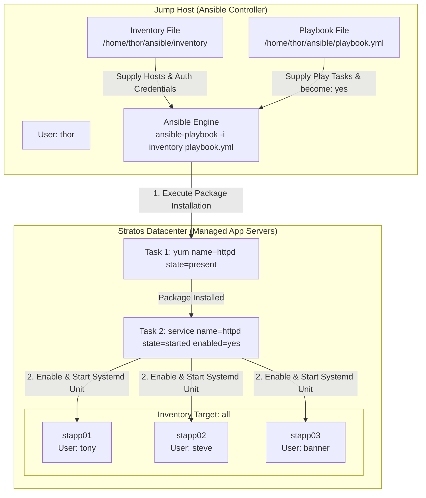

# Ansible Manage Services

## Technical Overview

### Service & Package Lifecycle Management in Ansible

In automated systems administration and DevOps workflows, managing the end-to-end operational lifecycle of system services across multi-node server clusters is a primary operational requirement. Installing software packages without starting and enabling their underlying background daemons leaves target infrastructure in an incomplete, non-functional state.

Ansible provides specialized declarative modules to handle both phases of service lifecycle management:
1. **Package Provisioning (`ansible.builtin.yum`):** Ensures that the binary package binaries (e.g., Apache HTTP Server `httpd`) are installed on target managed nodes.
2. **Service State Orchestration (`ansible.builtin.service` / `ansible.builtin.systemd`):** Controls the background process state (`started`, `stopped`, `restarted`, `reloaded`) and configures system boot behavior (`enabled: yes` / `enabled: no`).

### Systemd & Service Management Mechanics

Modern Linux distributions (such as RHEL 7/8/9, CentOS, Ubuntu, and Debian) use `systemd` as their default init system and service manager. Ansible's `service` and `systemd` modules interface directly with `systemctl` on remote hosts to enforce desired service states idempotently:

* **`state: started`**: Checks if the service process is currently active in memory. If the daemon is stopped, Ansible issues `systemctl start <service>`; if already running, Ansible takes no action (`changed: false`).
* **`enabled: yes`**: Checks systemd unit symlinks under `/etc/systemd/system/` to guarantee that the service will automatically start upon system reboot (`systemctl enable <service>`).

### Non-Interactive Execution & Privilege Escalation

Administrative tasks such as package installation and service management require root privileges. In Ansible playbooks, setting `become: yes` invokes `sudo` escalation on remote nodes. When running non-interactive validation via `ansible-playbook -i inventory playbook.yml`, the inventory file must contain the necessary connection attributes (`ansible_user`, `ansible_ssh_pass`, `ansible_become_pass`) so execution proceeds without interactive password prompts.



---

## Core Concepts & Directives

### Playbook Syntax (`playbook.yml`)

```yaml
---
- name: Install and Manage HTTPD Service on App Servers
  hosts: all
  become: yes
  tasks:
    - name: Install httpd package
      ansible.builtin.yum:
        name: httpd
        state: present

    - name: Start and enable httpd service
      ansible.builtin.service:
        name: httpd
        state: started
        enabled: yes
```

### Module Parameter Reference

| Module Directive | Parameter | Value | Purpose |
| :--- | :--- | :--- | :--- |
| **`ansible.builtin.yum`** | `name` | `httpd` | Specifies the RPM package name for Apache HTTP Server. |
| | `state` | `present` | Ensures the package is installed on the target machine. |
| **`ansible.builtin.service`** | `name` | `httpd` | Specifies the systemd service unit name. |
| | `state` | `started` | Ensures the service daemon is active and running. |
| | `enabled` | `yes` | Configures the service to launch automatically at boot time. |

---

## Infrastructure & Configuration Requirements

### Server Inventory Matrix

| Host Role | Hostname / Alias | SSH User | SSH Password | Sudo Password | Function |
| :--- | :--- | :--- | :--- | :--- | :--- |
| **Ansible Controller** | `jump_host` | `thor` | Native | N/A | Control Node |
| **App Server 1** | `stapp01` | `tony` | `Ir0nM@n` | `Ir0nM@n` | Managed App Node 1 |
| **App Server 2** | `stapp02` | `steve` | `Am3ric@` | `Am3ric@` | Managed App Node 2 |
| **App Server 3** | `stapp03` | `banner` | `BigGr33n` | `BigGr33n` | Managed App Node 3 |

### Requirements Checklist

* **Control Node Directory:** `/home/thor/ansible`
* **Inventory Path:** `/home/thor/ansible/inventory`
* **Playbook Path:** `/home/thor/ansible/playbook.yml`
* **Target Host Scope:** `all` (all application servers in inventory)
* **Target Package:** `httpd`
* **Target Service State:** `started` and `enabled: yes`
* **Execution Command:** Must execute successfully via standard validation command:
  ```bash
  ansible-playbook -i inventory playbook.yml
  ```

---

## Step-by-Step Implementation

### Step 1: Connect to Jump Host

Log in to the Jump Host as user `thor`:

```bash
ssh thor@jump_host
```

---

### Step 2: Navigate to Ansible Working Directory

Change to the project directory `/home/thor/ansible`:

```bash
cd /home/thor/ansible
```

---

### Step 3: Inspect Inventory Configuration

Verify the host and connection definitions in `/home/thor/ansible/inventory`:

```bash
cat /home/thor/ansible/inventory
```

*Sample Inventory Structure:*
```ini
stapp01 ansible_host=stapp01 ansible_ssh_pass=Ir0nM@n ansible_user=tony
stapp02 ansible_host=stapp02 ansible_ssh_pass=Am3ric@ ansible_user=steve
stapp03 ansible_host=stapp03 ansible_ssh_pass=BigGr33n ansible_user=banner
```

---

### Step 4: Verify Ansible Ad-Hoc Connectivity

Confirm connectivity to all application servers using the Ansible `ping` module:

```bash
ansible -i inventory all -m ping
```

*Expected Output:* Status `SUCCESS` with `"ping": "pong"` returned for `stapp01`, `stapp02`, and `stapp03`.

---

### Step 5: Create the Ansible Playbook

Create `/home/thor/ansible/playbook.yml` using `cat`:

```bash
cat << 'EOF' > /home/thor/ansible/playbook.yml
---
- name: Install and Manage HTTPD Service on App Servers
  hosts: all
  become: yes
  tasks:
    - name: Install httpd package
      ansible.builtin.yum:
        name: httpd
        state: present

    - name: Start and enable httpd service
      ansible.builtin.service:
        name: httpd
        state: started
        enabled: yes
EOF
```

---

### Step 6: Validate Playbook Syntax

Perform a syntax check to verify YAML layout and task structures:

```bash
ansible-playbook -i inventory playbook.yml --syntax-check
```

*Expected Output:*
```text
playbook: playbook.yml
```

---

### Step 7: Execute the Playbook

Run the playbook using the standard non-interactive command:

```bash
ansible-playbook -i inventory playbook.yml
```

---

## Verification & Validation

### 1. Terminal Execution Output

Upon successful execution, Ansible will report task completions across all managed nodes:

```text
PLAY [Install and Manage HTTPD Service on App Servers] *******************************************

TASK [Gathering Facts] ***************************************************************************
ok: [stapp01]
ok: [stapp02]
ok: [stapp03]

TASK [Install httpd package] *********************************************************************
changed: [stapp01]
changed: [stapp02]
changed: [stapp03]

TASK [Start and enable httpd service] ************************************************************
changed: [stapp01]
changed: [stapp02]
changed: [stapp03]

PLAY RECAP ***************************************************************************************
stapp01                    : ok=3    changed=2    unreachable=0    failed=0    skipped=0    rescued=0    ignored=0   
stapp02                    : ok=3    changed=2    unreachable=0    failed=0    skipped=0    rescued=0    ignored=0   
stapp03                    : ok=3    changed=2    unreachable=0    failed=0    skipped=0    rescued=0    ignored=0   
```

---

### 2. Verify Service Status Across Managed Nodes

Run an ad-hoc shell command using Ansible to check service status on all app servers:

```bash
ansible -i inventory all -m shell -a "systemctl status httpd"
```

*Expected Output Excerpt:*
```text
stapp01 | CHANGED | rc=0 >>
● httpd.service - The Apache HTTP Server
   Loaded: loaded (/usr/lib/systemd/system/httpd.service; enabled; vendor preset: disabled)
   Active: active (running) since Sun 2026-08-09 03:00:00 UTC; 1min ago
```

---

### 3. Confirm Idempotency

Re-run the playbook execution command:

```bash
ansible-playbook -i inventory playbook.yml
```

*Expected Result:* `changed=0` across all hosts in `PLAY RECAP`.

---

## Troubleshooting & Common Pitfalls

| Error / Symptom | Root Cause | Solution |
| :--- | :--- | :--- |
| **`Permission denied` / `Failed to lock yum`** | Missing root privileges for package installation. | Ensure `become: yes` is declared in the play header. |
| **`Could not find the requested service httpd`** | Service management task ran before package installation. | Ensure the `yum` package installation task precedes the `service` task in the playbook. |
| **`Failed to download metadata for repo 'appstream'`** | Remote mirrorlist connection timeout or repository configuration issue on CentOS/RHEL. | Verify network connectivity and retry, or ensure repository baseURLs are active on remote hosts. |
| **`YAML Syntax Error: expected <block end>`** | Incorrect indentation or tab characters in `playbook.yml`. | Use 2 spaces for YAML indentation and validate via `--syntax-check`. |

---

## Best Practices

1. **FQCN Task Declarations:** Use fully qualified module names (`ansible.builtin.yum`, `ansible.builtin.service`) to ensure compatibility across Ansible versions.
2. **Combine Install and Service Tasks:** Always pair package installation with service startup and boot enablement in a single atomic playbook.
3. **Check Mode Pre-Flight:** Run `ansible-playbook -i inventory playbook.yml --check` prior to production execution to simulate state changes safely.
