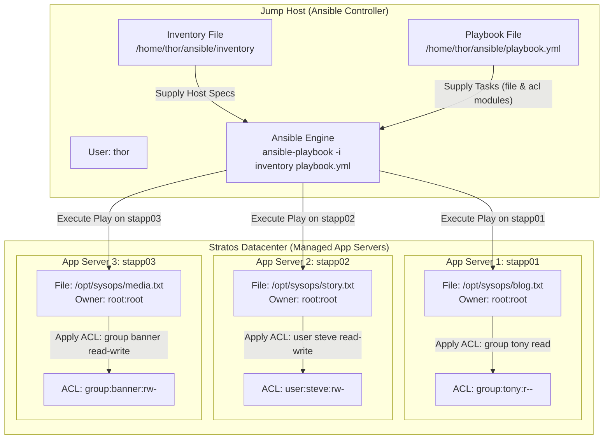

# Managing ACLs Using Ansible

## Technical Overview

### What are Linux Access Control Lists (ACLs)?

Traditional Linux filesystem security relies on standard **POSIX permission bits** (`owner`, `group`, and `others`) with read (`r`), write (`w`), and execute (`x`) modes. While standard permissions work well for simple authorization models, they cannot grant fine-grained permissions to multiple specific users or groups without altering main owner/group assignments or modifying global system group memberships.

**Access Control Lists (ACLs)** extend standard POSIX permissions by providing flexible, granular access controls per file or directory. Using ACLs, system administrators can:
* Grant a specific user (e.g., `steve`) read and write access to a file owned by `root:root`.
* Grant a specific secondary group (e.g., `tony` or `banner`) read-only or read-write access to isolated administrative scripts or documents without changing overall file ownership.

On Linux systems, command-line utilities `getfacl` (to view extended ACL entries) and `setfacl` (to modify extended ACL entries) interact directly with filesystem extended attributes (`xattr`).

### The Ansible `acl` Module (`ansible.posix.acl`)

Ansible provides the **`ansible.posix.acl`** module (or `acl` in standard distribution collections) to automate ACL management idempotently across remote managed nodes.

Key attributes of `ansible.posix.acl`:
1. **`path`:** Absolute path to the target file or directory on the remote node.
2. **`entity`:** The target username or group name to which permissions will be granted or revoked (e.g., `tony`, `steve`, `banner`).
3. **`etype`:** The entity type specification (`user` or `group`).
4. **`permissions`:** The exact permission string to enforce (`r`, `w`, `x`, `rw`, `rwx`).
5. **`state`:** Defines whether the entry should be enforced (`present`) or removed (`absent`). *Crucial Note:* If `state` is omitted, the `acl` module defaults to `query` mode, which checks existing ACLs without making changes. Always declare `state: present` when applying new ACLs.

### Non-Interactive Execution & Privilege Escalation

Modifying file extended attributes (`xattr`) and ACL permissions on root-owned system files requires root privileges. The playbook must define `become: yes` in the play header so Ansible elevates privileges via `sudo`.



---

## Core Concepts & Directives

### Playbook Structure (`playbook.yml`)

```yaml
---
- name: Manage Files and Extended ACLs on App Servers
  hosts: all
  become: yes
  tasks:
    - name: Ensure target directory /opt/sysops exists
      ansible.builtin.file:
        path: /opt/sysops
        state: directory
        owner: root
        group: root
        mode: '0755'

    # Tasks for App Server 1 (stapp01)
    - name: Create /opt/sysops/blog.txt on stapp01
      ansible.builtin.file:
        path: /opt/sysops/blog.txt
        state: touch
        owner: root
        group: root
        mode: '0644'
      when: inventory_hostname == 'stapp01'

    - name: Set ACL for group tony on stapp01 blog.txt
      ansible.posix.acl:
        path: /opt/sysops/blog.txt
        entity: tony
        etype: group
        permissions: r
        state: present
      when: inventory_hostname == 'stapp01'

    # Tasks for App Server 2 (stapp02)
    - name: Create /opt/sysops/story.txt on stapp02
      ansible.builtin.file:
        path: /opt/sysops/story.txt
        state: touch
        owner: root
        group: root
        mode: '0644'
      when: inventory_hostname == 'stapp02'

    - name: Set ACL for user steve on stapp02 story.txt
      ansible.posix.acl:
        path: /opt/sysops/story.txt
        entity: steve
        etype: user
        permissions: rw
        state: present
      when: inventory_hostname == 'stapp02'

    # Tasks for App Server 3 (stapp03)
    - name: Create /opt/sysops/media.txt on stapp03
      ansible.builtin.file:
        path: /opt/sysops/media.txt
        state: touch
        owner: root
        group: root
        mode: '0644'
      when: inventory_hostname == 'stapp03'

    - name: Set ACL for group banner on stapp03 media.txt
      ansible.posix.acl:
        path: /opt/sysops/media.txt
        entity: banner
        etype: group
        permissions: rw
        state: present
      when: inventory_hostname == 'stapp03'
```

### Module Parameter Reference (`ansible.posix.acl`)

| Parameter | Type | Required | Description |
| :--- | :--- | :--- | :--- |
| `path` | String | Yes | Absolute path to the file or directory being modified. |
| `entity` | String | Yes | Target user or group name to grant permissions to (`tony`, `steve`, `banner`). |
| `etype` | String | Yes | Type of entity: `user` for individual user accounts, `group` for system groups. |
| `permissions` | String | Yes | Granular ACL permission string: `r` (read-only), `rw` (read & write), `rwx` (full access). |
| `state` | String | Yes | Target state: `present` to apply/enforce ACL, `absent` to remove ACL rule. |

---

## Infrastructure & Configuration Requirements

### Server Inventory Matrix

| Host Role | Hostname / Alias | SSH User | SSH Password | Target File Path | Target Entity | Entity Type (`etype`) | ACL Permissions |
| :--- | :--- | :--- | :--- | :--- | :--- | :--- | :--- |
| **Ansible Controller** | `jump_host` | `thor` | Native | N/A | N/A | N/A | N/A |
| **App Server 1** | `stapp01` | `tony` | `Ir0nM@n` | `/opt/sysops/blog.txt` | `tony` | `group` | `r` |
| **App Server 2** | `stapp02` | `steve` | `Am3ric@` | `/opt/sysops/story.txt` | `steve` | `user` | `rw` |
| **App Server 3** | `stapp03` | `banner` | `BigGr33n` | `/opt/sysops/media.txt` | `banner` | `group` | `rw` |

### Requirements Checklist

* **Inventory Location:** `/home/thor/ansible/inventory`
* **Playbook Location:** `/home/thor/ansible/playbook.yml`
* **File Ownership:** All created files owned by `root:root`
* **stapp01 Target:** `/opt/sysops/blog.txt` with read (`r`) ACL granted to group `tony`
* **stapp02 Target:** `/opt/sysops/story.txt` with read-write (`rw`) ACL granted to user `steve`
* **stapp03 Target:** `/opt/sysops/media.txt` with read-write (`rw`) ACL granted to group `banner`
* **Validation Compatibility:** Must execute cleanly via non-interactive command:
  ```bash
  ansible-playbook -i inventory playbook.yml
  ```

---

## Step-by-Step Implementation

### Step 1: Connect to Jump Host

Log in to the Jump Host as user `thor`:

```bash
ssh thor@jump_host
```

---

### Step 2: Navigate to Working Directory

Change directory to `/home/thor/ansible`:

```bash
cd /home/thor/ansible
```

---

### Step 3: Inspect Inventory Configuration

Verify target hosts in `/home/thor/ansible/inventory`:

```bash
cat /home/thor/ansible/inventory
```

---

### Step 4: Verify Ansible Connectivity

Test SSH and Python availability across all app servers:

```bash
ansible -i inventory all -m ping
```

---

### Step 5: Create the Ansible Playbook

Create `/home/thor/ansible/playbook.yml` using `cat`:

```bash
cat << 'EOF' > /home/thor/ansible/playbook.yml
---
- name: Manage Files and Extended ACLs on App Servers
  hosts: all
  become: yes
  tasks:
    - name: Ensure target directory /opt/sysops exists
      ansible.builtin.file:
        path: /opt/sysops
        state: directory
        owner: root
        group: root
        mode: '0755'

    # Tasks for App Server 1 (stapp01)
    - name: Create /opt/sysops/blog.txt on stapp01
      ansible.builtin.file:
        path: /opt/sysops/blog.txt
        state: touch
        owner: root
        group: root
        mode: '0644'
      when: inventory_hostname == 'stapp01'

    - name: Set ACL for group tony on stapp01 blog.txt
      ansible.posix.acl:
        path: /opt/sysops/blog.txt
        entity: tony
        etype: group
        permissions: r
        state: present
      when: inventory_hostname == 'stapp01'

    # Tasks for App Server 2 (stapp02)
    - name: Create /opt/sysops/story.txt on stapp02
      ansible.builtin.file:
        path: /opt/sysops/story.txt
        state: touch
        owner: root
        group: root
        mode: '0644'
      when: inventory_hostname == 'stapp02'

    - name: Set ACL for user steve on stapp02 story.txt
      ansible.posix.acl:
        path: /opt/sysops/story.txt
        entity: steve
        etype: user
        permissions: rw
        state: present
      when: inventory_hostname == 'stapp02'

    # Tasks for App Server 3 (stapp03)
    - name: Create /opt/sysops/media.txt on stapp03
      ansible.builtin.file:
        path: /opt/sysops/media.txt
        state: touch
        owner: root
        group: root
        mode: '0644'
      when: inventory_hostname == 'stapp03'

    - name: Set ACL for group banner on stapp03 media.txt
      ansible.posix.acl:
        path: /opt/sysops/media.txt
        entity: banner
        etype: group
        permissions: rw
        state: present
      when: inventory_hostname == 'stapp03'
EOF
```

---

### Step 6: Validate Playbook Syntax

Perform a syntax check to verify YAML layout:

```bash
ansible-playbook -i inventory playbook.yml --syntax-check
```

---

### Step 7: Execute the Playbook

Run the playbook via the standard non-interactive command:

```bash
ansible-playbook -i inventory playbook.yml
```

---

## Verification & Validation

### 1. Playbook Execution Output

Verify that all file creation and ACL tasks complete successfully across all targeted hosts:

```text
PLAY [Manage Files and Extended ACLs on App Servers] ********************************************

TASK [Gathering Facts] ***************************************************************************
ok: [stapp01]
ok: [stapp02]
ok: [stapp03]

TASK [Ensure target directory /opt/sysops exists] ************************************************
ok: [stapp01]
ok: [stapp02]
ok: [stapp03]

TASK [Create /opt/sysops/blog.txt on stapp01] ****************************************************
changed: [stapp01]
skipping: [stapp02]
skipping: [stapp03]

TASK [Set ACL for group tony on stapp01 blog.txt] ************************************************
changed: [stapp01]
skipping: [stapp02]
skipping: [stapp03]

TASK [Create /opt/sysops/story.txt on stapp02] ***************************************************
skipping: [stapp01]
changed: [stapp02]
skipping: [stapp03]

TASK [Set ACL for user steve on stapp02 story.txt] ************************************************
skipping: [stapp01]
changed: [stapp02]
skipping: [stapp03]

TASK [Create /opt/sysops/media.txt on stapp03] ***************************************************
skipping: [stapp01]
skipping: [stapp02]
changed: [stapp03]

TASK [Set ACL for group banner on stapp03 media.txt] *********************************************
skipping: [stapp01]
skipping: [stapp02]
changed: [stapp03]

PLAY RECAP ***************************************************************************************
stapp01                    : ok=3    changed=2    unreachable=0    failed=0    skipped=5    rescued=0    ignored=0   
stapp02                    : ok=3    changed=2    unreachable=0    failed=0    skipped=5    rescued=0    ignored=0   
stapp03                    : ok=3    changed=2    unreachable=0    failed=0    skipped=5    rescued=0    ignored=0   
```

---

### 2. Verify ACL Extended Attributes using `getfacl`

Run ad-hoc Ansible shell commands to inspect applied ACL entries on managed servers:

#### On App Server 1 (`stapp01`):
```bash
ansible -i inventory stapp01 -m shell -a "getfacl /opt/sysops/blog.txt"
```
*Expected Output:*
```text
# file: opt/sysops/blog.txt
# owner: root
# group: root
user::rw-
group::r--
group:tony:r--
mask::r--
other::r--
```

#### On App Server 2 (`stapp02`):
```bash
ansible -i inventory stapp02 -m shell -a "getfacl /opt/sysops/story.txt"
```
*Expected Output:*
```text
# file: opt/sysops/story.txt
# owner: root
# group: root
user::rw-
user:steve:rw-
group::r--
mask::rw-
other::r--
```

#### On App Server 3 (`stapp03`):
```bash
ansible -i inventory stapp03 -m shell -a "getfacl /opt/sysops/media.txt"
```
*Expected Output:*
```text
# file: opt/sysops/media.txt
# owner: root
# group: root
user::rw-
group::r--
group:banner:rw-
mask::rw-
other::r--
```

---

## Troubleshooting & Common Pitfalls

| Symptom / Error | Root Cause | Solution |
| :--- | :--- | :--- |
| **ACL task does not apply changes** | `state: present` was omitted from `ansible.posix.acl` parameters (causing module to default to `query` mode). | Explicitly declare `state: present` in all `acl` module tasks. |
| **`etype: user` specified for group or vice versa** | Invalid entity type declaration (e.g., setting `etype: user` for group `tony`). | Match entity type: use `etype: group` for groups (`tony`, `banner`) and `etype: user` for users (`steve`). |
| **`No such file or directory`** | File creation task failed or directory `/opt/sysops` did not exist before executing `acl` task. | Use `ansible.builtin.file` to create `/opt/sysops` directory and target files *prior* to running `acl` tasks. |
| **`Operation not supported`** | The underlying target filesystem partition does not support extended attributes (`xattr` / ACLs). | Ensure target filesystem is mounted with `acl` options enabled (standard on modern XFS/ext4 RHEL installs). |

---

## Best Practices

1. **Explicit Module Collection Name:** Use `ansible.posix.acl` to avoid deprecation warnings and ensure standard collection compatibility.
2. **Pre-Create Files with Explicit Ownership:** Always use `ansible.builtin.file` to create target files with explicit `owner: root` and `group: root` before running `acl` modifications.
3. **Validate with `getfacl`:** Always run `getfacl` commands via Ansible ad-hoc tasks after playbook execution to verify active extended attributes on target files.
