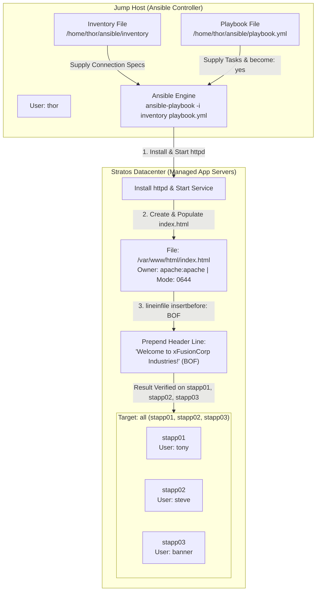

# Ansible lineinfile Module

## Technical Overview

### Single-Line File Manipulation in Ansible

In automated system administration and DevOps configuration management, modifying specific lines inside configuration files, web pages, or system environment files is a frequent requirement. Depending on the granularity needed, Ansible offers several modules for file manipulation:

| Module | Primary Use Case |
| :--- | :--- |
| **`ansible.builtin.copy`** | Overwrites or creates entire static files from a source file on the control node. |
| **`ansible.builtin.template`** | Generates complete dynamic configuration files using Jinja2 variables. |
| **`ansible.builtin.blockinfile`** | Inserts or updates multi-line blocks of text demarcated by marker comments (`# BEGIN/END ANSIBLE MANAGED BLOCK`). |
| **`ansible.builtin.lineinfile`** | Ensures a **single specific line** exists, is modified, prepended, appended, or removed within an existing or new file. |

### The `ansible.builtin.lineinfile` Module

The **`ansible.builtin.lineinfile`** module ensures a single line is present in a file or replaces an existing line matching a regular expression pattern (`regexp`).

Key parameters of `ansible.builtin.lineinfile`:
1. **`path`:** Absolute path to the remote target file (e.g., `/var/www/html/index.html`).
2. **`line`:** The exact text string that should be present in the file.
3. **`regexp`:** (Optional) A regular expression pattern to search for and replace existing matching lines.
4. **`insertbefore` / `insertafter`:** Positional anchors for inserting the line:
   * **`insertbefore: BOF`**: Inserts the line at the **Beginning of File (BOF)** if the line is not already present.
   * **`insertafter: EOF`**: Inserts the line at the **End of File (EOF)** (default behavior).
5. **`create: yes`**: Instructs Ansible to create the destination file if it does not exist.
6. **`owner`, `group`, `mode`**: Directly manages user ownership, group ownership, and numeric mode permissions on the target file.

### BOF (Beginning of File) & Idempotency

When `insertbefore: BOF` is specified, Ansible inspects the target file. If the exact `line` string is missing from the top of the file, Ansible prepends it at line 1. If the line already exists at the beginning of the file, Ansible recognizes the state is already satisfied and reports `changed: false`, ensuring complete playbook **idempotency**.

### Non-Interactive Execution & Privilege Escalation

Modifying web server documents under `/var/www/html/` and setting ownership to `apache:apache` requires root privileges. Defining `become: yes` in the play header allows Ansible to elevate permissions non-interactively via `sudo`.



---

## Core Concepts & Directives

### Playbook Syntax (`playbook.yml`)

```yaml
---
- name: Configure Web Servers and Manage index.html using lineinfile
  hosts: all
  become: yes
  tasks:
    - name: Install httpd package
      ansible.builtin.yum:
        name: httpd
        state: present

    - name: Start and enable httpd service
      ansible.builtin.service:
        name: httpd
        state: started
        enabled: yes

    - name: Ensure index.html exists with sample content
      ansible.builtin.lineinfile:
        path: /var/www/html/index.html
        line: "This is a Nautilus sample file, created using Ansible!"
        create: yes
        state: present

    - name: Prepend welcome header line to top of index.html
      ansible.builtin.lineinfile:
        path: /var/www/html/index.html
        line: "Welcome to xFusionCorp Industries!"
        insertbefore: BOF
        state: present

    - name: Set owner, group, and permissions for index.html
      ansible.builtin.file:
        path: /var/www/html/index.html
        owner: apache
        group: apache
        mode: '0644'
```

### Module Parameter Reference (`ansible.builtin.lineinfile`)

| Parameter | Type | Required | Value / Example | Function |
| :--- | :--- | :--- | :--- | :--- |
| `path` | String | Yes | `/var/www/html/index.html` | Absolute path to the target file. |
| `line` | String | Yes | `'Welcome to xFusionCorp Industries!'` | The exact string line to insert or maintain. |
| `insertbefore` | String | No | `BOF` | Inserts the line at the **Beginning of File**. |
| `insertafter` | String | No | `EOF` | Inserts the line at the **End of File** (default). |
| `create` | Boolean | No | `yes` | Creates the file if it does not already exist. |
| `state` | String | No | `present` | Ensures the line exists in the file (`present` vs `absent`). |

---

## Infrastructure & Configuration Requirements

<div style="overflow-x: auto;">

| Host Role | Hostname / Alias | SSH User | SSH Password | Web Server | Target File Path | Target File Owner | Target Permissions |
| :--- | :--- | :--- | :--- | :--- | :--- | :--- | :--- |
| **Ansible Controller** | `jump_host` | `thor` | Native | N/A | N/A | N/A | N/A |
| **App Server 1** | `stapp01` | `tony` | `Ir0nM@n` | `httpd` | `/var/www/html/index.html` | `apache:apache` | `0644` |
| **App Server 2** | `stapp02` | `steve` | `Am3ric@` | `httpd` | `/var/www/html/index.html` | `apache:apache` | `0644` |
| **App Server 3** | `stapp03` | `banner` | `BigGr33n` | `httpd` | `/var/www/html/index.html` | `apache:apache` | `0644` |

</div>

### Requirements Checklist

* **Inventory Location:** `/home/thor/ansible/inventory`
* **Playbook Location:** `/home/thor/ansible/playbook.yml`
* **Package Requirement:** `httpd` installed and service started/enabled
* **Target File:** `/var/www/html/index.html`
* **Top Line Content:** `Welcome to xFusionCorp Industries!` inserted before BOF
* **Sample Line Content:** `This is a Nautilus sample file, created using Ansible!`
* **File Metadata:** Owner `apache`, Group `apache`, Permissions `0644`
* **Validation Standard:** Must execute cleanly via non-interactive command:
  ```bash
  ansible-playbook -i inventory playbook.yml
  ```

---

## Step-by-Step Implementation

### Step 1: Connect to Jump Host

Log in to the Jump Host as user `thor`:

```bash
ssh thor@jump_host
```

---

### Step 2: Navigate to Working Directory

Change directory to `/home/thor/ansible`:

```bash
cd /home/thor/ansible
```

---

### Step 3: Inspect Inventory File

Verify target hosts in `/home/thor/ansible/inventory`:

```bash
cat /home/thor/ansible/inventory
```

*Sample Inventory Content:*
```ini
stapp01 ansible_host=stapp01 ansible_ssh_pass=Ir0nM@n ansible_user=tony
stapp02 ansible_host=stapp02 ansible_ssh_pass=Am3ric@ ansible_user=steve
stapp03 ansible_host=stapp03 ansible_ssh_pass=BigGr33n ansible_user=banner
```

---

### Step 4: Verify Ansible Connectivity

Test connectivity across all application servers using the Ansible `ping` module:

```bash
ansible -i inventory all -m ping
```

---

### Step 5: Create the Ansible Playbook

Create `/home/thor/ansible/playbook.yml` using `cat`:

```bash
cat << 'EOF' > /home/thor/ansible/playbook.yml
---
- name: Configure Web Servers and Manage index.html using lineinfile
  hosts: all
  become: yes
  tasks:
    - name: Install httpd package
      ansible.builtin.yum:
        name: httpd
        state: present

    - name: Start and enable httpd service
      ansible.builtin.service:
        name: httpd
        state: started
        enabled: yes

    - name: Ensure index.html exists with sample content
      ansible.builtin.lineinfile:
        path: /var/www/html/index.html
        line: "This is a Nautilus sample file, created using Ansible!"
        create: yes
        state: present

    - name: Prepend welcome header line to top of index.html
      ansible.builtin.lineinfile:
        path: /var/www/html/index.html
        line: "Welcome to xFusionCorp Industries!"
        insertbefore: BOF
        state: present

    - name: Set owner, group, and permissions for index.html
      ansible.builtin.file:
        path: /var/www/html/index.html
        owner: apache
        group: apache
        mode: '0644'
EOF
```

---

### Step 6: Validate Playbook Syntax

Perform a syntax check to verify YAML formatting:

```bash
ansible-playbook -i inventory playbook.yml --syntax-check
```

---

### Step 7: Execute the Playbook

Run the playbook using the standard non-interactive command:

```bash
ansible-playbook -i inventory playbook.yml
```

---

## Verification & Validation

### 1. Playbook Execution Output

Verify that all tasks complete successfully across all target app servers:

```text
PLAY [Configure Web Servers and Manage index.html using lineinfile] *****************************

TASK [Gathering Facts] ***************************************************************************
ok: [stapp01]
ok: [stapp02]
ok: [stapp03]

TASK [Install httpd package] *********************************************************************
changed: [stapp01]
changed: [stapp02]
changed: [stapp03]

TASK [Start and enable httpd service] ************************************************************
changed: [stapp01]
changed: [stapp02]
changed: [stapp03]

TASK [Ensure index.html exists with sample content] **********************************************
changed: [stapp01]
changed: [stapp02]
changed: [stapp03]

TASK [Prepend welcome header line to top of index.html] ******************************************
changed: [stapp01]
changed: [stapp02]
changed: [stapp03]

TASK [Set owner, group, and permissions for index.html] ******************************************
changed: [stapp01]
changed: [stapp02]
changed: [stapp03]

PLAY RECAP ***************************************************************************************
stapp01                    : ok=6    changed=5    unreachable=0    failed=0    skipped=0    rescued=0    ignored=0   
stapp02                    : ok=6    changed=5    unreachable=0    failed=0    skipped=0    rescued=0    ignored=0   
stapp03                    : ok=6    changed=5    unreachable=0    failed=0    skipped=0    rescued=0    ignored=0   
```

---

### 2. Verify File Content and Line Ordering

Run `curl` or inspect `/var/www/html/index.html` across all managed nodes to verify line ordering:

```bash
ansible -i inventory all -m shell -a "cat /var/www/html/index.html"
```

*Expected Content Output:*
```text
Welcome to xFusionCorp Industries!
This is a Nautilus sample file, created using Ansible!
```

---

### 3. Verify File Ownership and Permissions

Run an ad-hoc shell command to confirm file metadata:

```bash
ansible -i inventory all -m shell -a "ls -l /var/www/html/index.html"
```

*Expected Output:*
```text
stapp01 | CHANGED | rc=0 >>
-rw-r--r-- 1 apache apache 89 Aug  9 04:45 /var/www/html/index.html
stapp02 | CHANGED | rc=0 >>
-rw-r--r-- 1 apache apache 89 Aug  9 04:45 /var/www/html/index.html
stapp03 | CHANGED | rc=0 >>
-rw-r--r-- 1 apache apache 89 Aug  9 04:45 /var/www/html/index.html
```

---

## Troubleshooting & Common Pitfalls

| Symptom / Error | Cause | Solution |
| :--- | :--- | :--- |
| **Line added at bottom instead of top** | `insertbefore: BOF` was omitted (defaults to `insertafter: EOF`). | Explicitly add `insertbefore: BOF` parameter to the `lineinfile` task. |
| **`Destination file /var/www/html/index.html does not exist`** | `lineinfile` attempted to edit a non-existent file without `create: yes`. | Add `create: yes` to the initial `lineinfile` task or pre-create the file using `ansible.builtin.file`. |
| **`chown failed: group apache does not exist`** | File ownership task ran before `httpd` package installation. | Ensure `yum: name=httpd` task completes *before* setting ownership to `apache:apache`. |
| **Duplicate lines added on re-runs** | Line string in playbook differs slightly (spaces/casing) from actual text in file. | Ensure the `line:` string in `lineinfile` is exact, maintaining playbook idempotency. |

---

## Best Practices

1. **Use `insertbefore: BOF` for Headers:** When prepending banners, welcome headers, or environment variables at the top of a file, always specify `insertbefore: BOF`.
2. **Explicit Quoting of File Modes:** Always quote permission mode strings (`mode: '0644'`) to prevent YAML parser errors.
3. **Verify Idempotency:** Re-run `ansible-playbook -i inventory playbook.yml` to ensure `changed=0` is reported on all subsequent executions.
