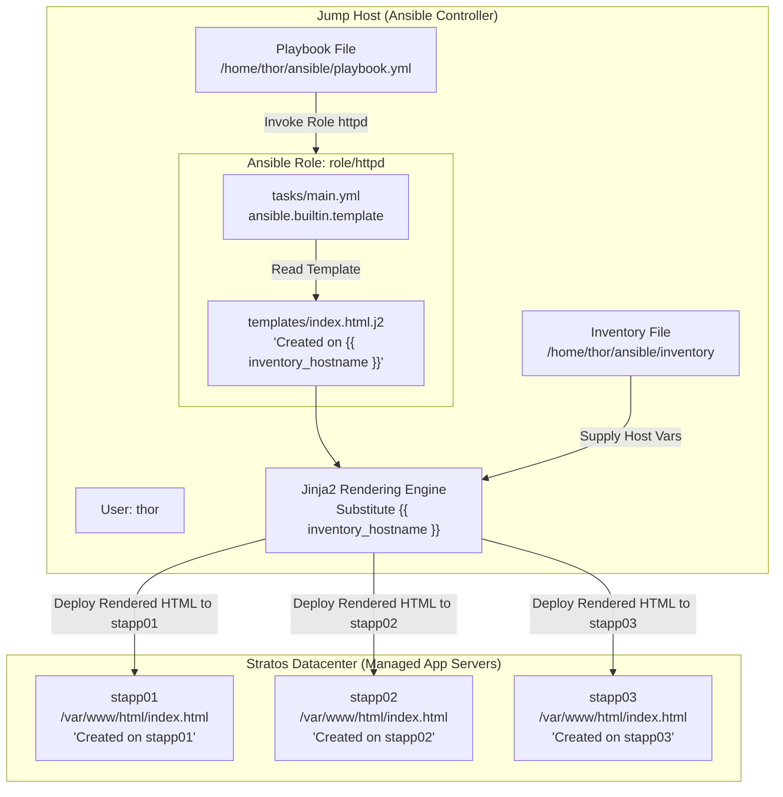

# Managing Jinja2 Templates Using Ansible

## Technical Overview

### What is Jinja2 Templating?

In modern infrastructure automation, static configuration files are rarely sufficient across multi-node environments. Production systems require dynamic configurations that adapt to target environment parameters, hostnames, IP addresses, memory limits, and custom inventory variables.

**Jinja2** is a fast, powerful, and full-featured template engine for Python. Ansible incorporates Jinja2 natively to enable dynamic generation of configuration files (e.g., `nginx.conf`, `httpd.conf`, `index.html`, `/etc/hosts`) before transferring them to remote managed nodes.

### Jinja2 Syntax & Core Features

Jinja2 templates use specific delimiters to distinguish between literal text and templating logic:

1. **Expressions & Variable Interpolation (`{{ ... }}`):**
   Evaluates a variable or expression and prints its value into the rendered file output.
   ```jinja2
   This file was created using Ansible on {{ inventory_hostname }}.
   ```
2. **Control Structures & Statements (``):**
   Executes programmatic logic such as conditional branching (`if`/`else`) or iterative loops (`for`).
   ```jinja2
   
   Listen 443 https
   
   Listen 80 http
   
   ```
3. **Comments (`{# ... #}`):**
   Contains inline template documentation that is completely stripped during rendering and never appears in the target output file.
   ```jinja2
   {# Generated automatically by Ansible - Do not edit manually #}
   ```
4. **Jinja2 Filters (`|`):**
   Transforms variable values inline before rendering.
   ```jinja2
   Server Name: {{ inventory_hostname | upper }}
   Default Port: {{ http_port | default(80) }}
   ```

### Useful Built-In Ansible Variables in Jinja2

Ansible automatically populates special magic variables and gathered facts during playbook execution that can be referenced inside Jinja2 templates:

* **`{{ inventory_hostname }}`:** The host alias or name of the target node currently being processed as defined in the Ansible inventory (e.g., `stapp01`, `stapp02`, `stapp03`).
* **`{{ ansible_facts['fqdn'] }}`:** The fully qualified domain name gathered from the remote machine.
* **`{{ ansible_facts['default_ipv4']['address'] }}`:** The primary IPv4 network address of the target node.
* **`{{ ansible_user }}`:** The SSH user used to connect to the managed node (e.g., `tony`, `steve`, `banner`).

### `ansible.builtin.copy` vs `ansible.builtin.template`

| Feature | `ansible.builtin.copy` | `ansible.builtin.template` |
| :--- | :--- | :--- |
| **Primary Function** | Transfers static files byte-for-byte from control node to remote hosts. | Renders dynamic templates through Jinja2 engine before transfer. |
| **Variable Evaluation** | No evaluation. Plaintext `{{ variable }}` remains unparsed in destination. | Full evaluation. `{{ inventory_hostname }}` resolves to host-specific values. |
| **File Extension** | Standard extensions (`.conf`, `.html`, `.sh`, `.txt`). | Template files conventionally end with `.j2` (`index.html.j2`). |

### Ansible Roles & Template Organization

When organizing Ansible projects into **Roles**, Jinja2 template files reside inside the `templates/` directory of the respective role:

```text
/home/thor/ansible/
├── inventory
├── playbook.yml
└── role/
    └── httpd/
        ├── tasks/
        │   └── main.yml
        └── templates/
            └── index.html.j2
```

When calling `ansible.builtin.template` from within `role/httpd/tasks/main.yml`, Ansible automatically looks inside `role/httpd/templates/` for the specified template file (`src: index.html.j2`), eliminating the need to supply absolute local source paths.



---

## Core Concepts & Directives

### Jinja2 Template Blueprint (`index.html.j2`)

```html
This file was created using Ansible on {{ inventory_hostname }}
```

### Role Tasks Definition (`role/httpd/tasks/main.yml`)

```yaml
---
- name: Install httpd package
  ansible.builtin.yum:
    name: httpd
    state: present

- name: Start and enable httpd service
  ansible.builtin.service:
    name: httpd
    state: started
    enabled: yes

- name: Deploy dynamic index.html from Jinja2 template
  ansible.builtin.template:
    src: index.html.j2
    dest: /var/www/html/index.html
    owner: "{{ ansible_user }}"
    group: "{{ ansible_user }}"
    mode: '0644'
```

### Master Playbook (`playbook.yml`)

```yaml
---
- name: Apply HTTPD Role with Jinja2 Templating
  hosts: all
  become: yes
  roles:
    - role/httpd
```

### Module Parameter Reference (`ansible.builtin.template`)

| Parameter | Type | Required | Value / Example | Function |
| :--- | :--- | :--- | :--- | :--- |
| `src` | String | Yes | `index.html.j2` | Path to the Jinja2 template file (relative to role's `templates/` folder). |
| `dest` | String | Yes | `/var/www/html/index.html` | Absolute destination path on the remote managed node. |
| `owner` | String | No | `{{ ansible_user }}` / `apache` | User ownership of the rendered destination file. |
| `group` | String | No | `{{ ansible_user }}` / `apache` | Group ownership of the rendered destination file. |
| `mode` | String | No | `'0644'` | Octal permissions string for the destination file. |

---

## Infrastructure & Configuration Requirements

### Server Inventory Matrix

<div style="overflow-x: auto;">

| Host Role | Hostname / Alias | SSH User | SSH Password | Web Server | Target Template Source | Destination File Path | Rendered Text Content |
| :--- | :--- | :--- | :--- | :--- | :--- | :--- | :--- |
| **Ansible Controller** | `jump_host` | `thor` | Native | N/A | `role/httpd/templates/index.html.j2` | N/A | N/A |
| **App Server 1** | `stapp01` | `tony` | `Ir0nM@n` | `httpd` | Rendered via Jinja2 | `/var/www/html/index.html` | `This file was created using Ansible on stapp01` |
| **App Server 2** | `stapp02` | `steve` | `Am3ric@` | `httpd` | Rendered via Jinja2 | `/var/www/html/index.html` | `This file was created using Ansible on stapp02` |
| **App Server 3** | `stapp03` | `banner` | `BigGr33n` | `httpd` | Rendered via Jinja2 | `/var/www/html/index.html` | `This file was created using Ansible on stapp03` |

</div>

### Requirements Checklist

* **Inventory Location:** `/home/thor/ansible/inventory`
* **Playbook Location:** `/home/thor/ansible/playbook.yml`
* **Role Location:** `/home/thor/ansible/role/httpd` (or `roles/httpd`)
* **Template File:** `/home/thor/ansible/role/httpd/templates/index.html.j2`
* **Dynamic Variable:** Uses `{{ inventory_hostname }}` to insert host name dynamically without hardcoding
* **Destination Path:** `/var/www/html/index.html` on target app servers
* **File Permissions & Ownership:** Mode set to `0644`; owner and group set to target server user (`ansible_user` / `tony`, `steve`, `banner`)
* **Validation Standard:** Must execute cleanly via non-interactive command:
  ```bash
  ansible-playbook -i inventory playbook.yml
  ```

---

## Step-by-Step Implementation

### Step 1: Connect to Jump Host

Log in to the Jump Host as user `thor`:

```bash
ssh thor@jump_host
```

---

### Step 2: Navigate to Ansible Directory

Change directory to `/home/thor/ansible`:

```bash
cd /home/thor/ansible
```

---

### Step 3: Inspect Role Directory Structure

Verify the existence of the `httpd` role directory structure:

```bash
ls -la role/httpd/
```

If the `templates` subdirectory inside the role does not exist yet, create it:

```bash
mkdir -p role/httpd/templates
```

---

### Step 4: Create the Jinja2 Template File

Create the template file `/home/thor/ansible/role/httpd/templates/index.html.j2`:

```bash
cat << 'EOF' > role/httpd/templates/index.html.j2
This file was created using Ansible on {{ inventory_hostname }}
EOF
```

---

### Step 5: Update Role Task Definition

Edit `/home/thor/ansible/role/httpd/tasks/main.yml` to include the `ansible.builtin.template` task:

```bash
cat << 'EOF' > role/httpd/tasks/main.yml
---
- name: Install httpd package
  ansible.builtin.yum:
    name: httpd
    state: present

- name: Start and enable httpd service
  ansible.builtin.service:
    name: httpd
    state: started
    enabled: yes

- name: Deploy index.html from Jinja2 template
  ansible.builtin.template:
    src: index.html.j2
    dest: /var/www/html/index.html
    owner: "{{ ansible_user }}"
    group: "{{ ansible_user }}"
    mode: '0644'
EOF
```

---

### Step 6: Configure the Master Playbook

Ensure `/home/thor/ansible/playbook.yml` executes the `role/httpd` role across target hosts:

```bash
cat << 'EOF' > playbook.yml
---
- name: Manage HTTPD Service and Templates
  hosts: all
  become: yes
  roles:
    - role/httpd
EOF
```

---

### Step 7: Perform Syntax Check

Validate playbook and role syntax:

```bash
ansible-playbook -i inventory playbook.yml --syntax-check
```

---

### Step 8: Execute the Playbook

Run the playbook via the standard non-interactive command:

```bash
ansible-playbook -i inventory playbook.yml
```

---

## Verification & Validation

### 1. Playbook Execution Recap

Verify that the template task runs and reports `changed` status across target hosts:

```text
PLAY [Manage HTTPD Service and Templates] *******************************************************

TASK [Gathering Facts] ***************************************************************************
ok: [stapp01]
ok: [stapp02]
ok: [stapp03]

TASK [role/httpd : Install httpd package] *******************************************************
ok: [stapp01]
ok: [stapp02]
ok: [stapp03]

TASK [role/httpd : Start and enable httpd service] **********************************************
ok: [stapp01]
ok: [stapp02]
ok: [stapp03]

TASK [role/httpd : Deploy index.html from Jinja2 template] **************************************
changed: [stapp01]
changed: [stapp02]
changed: [stapp03]

PLAY RECAP ***************************************************************************************
stapp01                    : ok=4    changed=1    unreachable=0    failed=0    skipped=0    rescued=0    ignored=0   
stapp02                    : ok=4    changed=1    unreachable=0    failed=0    skipped=0    rescued=0    ignored=0   
stapp03                    : ok=4    changed=1    unreachable=0    failed=0    skipped=0    rescued=0    ignored=0   
```

---

### 2. Verify Dynamic Jinja2 Variable Rendering via `curl`

Test HTTP responses from all target application servers to confirm dynamic replacement of `{{ inventory_hostname }}`:

```bash
ansible -i inventory all -m shell -a "curl -s http://localhost"
```

*Expected Output:*
```text
stapp01 | CHANGED | rc=0 >>
This file was created using Ansible on stapp01

stapp02 | CHANGED | rc=0 >>
This file was created using Ansible on stapp02

stapp03 | CHANGED | rc=0 >>
This file was created using Ansible on stapp03
```

---

### 3. Verify File Ownership and Mode Permissions

Inspect metadata of `/var/www/html/index.html` across all managed app servers:

```bash
ansible -i inventory all -m shell -a "ls -l /var/www/html/index.html"
```

*Expected Output:*
```text
stapp01 | CHANGED | rc=0 >>
-rw-r--r-- 1 tony tony 45 Aug  9 19:20 /var/www/html/index.html
stapp02 | CHANGED | rc=0 >>
-rw-r--r-- 1 steve steve 45 Aug  9 19:20 /var/www/html/index.html
stapp03 | CHANGED | rc=0 >>
-rw-r--r-- 1 banner banner 45 Aug  9 19:20 /var/www/html/index.html
```

---

## Troubleshooting & Common Pitfalls

| Symptom / Error | Root Cause | Solution |
| :--- | :--- | :--- |
| **Literal text `{{ inventory_hostname }}` appears in output** | The `copy` module was used instead of the `template` module. | Use `ansible.builtin.template` so the Jinja2 engine parses variables prior to transfer. |
| **`could not find src: index.html.j2`** | Template file placed outside `templates/` folder or relative role path incorrect. | Place `index.html.j2` in `role/httpd/templates/` directory relative to role tasks. |
| **Undefined variable error** | Typo in variable name (e.g., `{{ host }}` instead of `{{ inventory_hostname }}`). | Use standard built-in Ansible variable `{{ inventory_hostname }}`. |
| **Permission denied writing to `/var/www/html/`** | Missing privilege escalation when running playbook. | Ensure `become: yes` is declared in `playbook.yml`. |

---

## Best Practices

1. **Convention over Configuration:** Name Jinja2 template files with a `.j2` extension (e.g., `index.html.j2`, `nginx.conf.j2`).
2. **Use Role-Based Templates:** Store templates inside `roles/<role_name>/templates/` for maintainability and implicit path resolution.
3. **Avoid Hardcoding Host Names:** Always leverage `{{ inventory_hostname }}` or gathered facts (`ansible_facts`) to ensure playbooks remain reusable across staging and production clusters.
