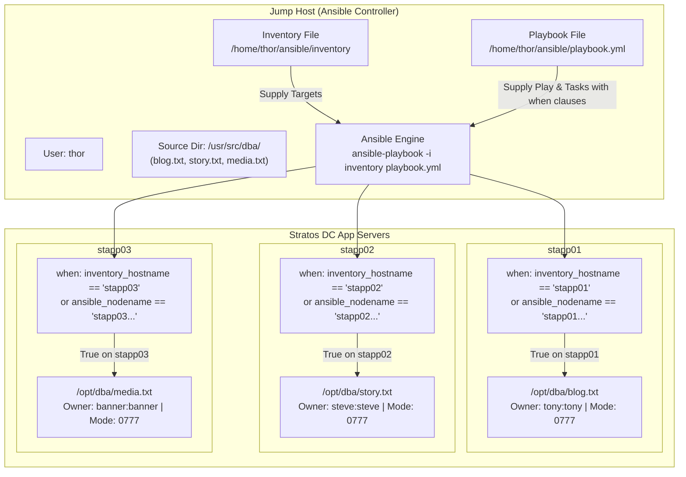

# Using Ansible Conditionals

## Technical Overview

### Dynamic Task Execution via Ansible Conditionals

In complex IT environments, infrastructure playbooks often target heterogeneous server fleets (such as web servers, database nodes, and cache clusters) or require host-specific configuration logic. Rather than writing separate playbook files for every individual host or service, Ansible provides **conditionals** to control task execution dynamically.

By applying conditional statements to tasks, plays, or roles, Ansible evaluates specified expressions at runtime against remote facts, host variables, or task results. If the expression evaluates to `true`, Ansible executes the task; if `false`, Ansible skips the task (`skipping`) and seamlessly moves to the next instruction without interrupting playbook flow.

---

### Detailed Guide: The Ansible `when` Condition

The **`when`** clause is Ansible's primary directive for conditional execution. It accepts raw Jinja2 boolean expressions evaluated against facts, inventory variables, or task outputs.

#### 1. Syntax Rules (Crucial Nuance)

When writing `when` statements, **do NOT enclose the expression in Jinja2 curly braces `{{ ... }}`**. In Ansible, the `when` directive automatically expects a Jinja2 expression string:

* **Incorrect:** `when: "{{ inventory_hostname == 'stapp01' }}"`
* **Correct:** `when: inventory_hostname == 'stapp01'`

#### 2. Logical Operators in `when` Statements

Ansible supports standard logical and comparison operators within `when` expressions:

* **Equality / Inequality:** `==`, `!=`
  ```yaml
  when: inventory_hostname == 'stapp01'
  ```
* **Logical AND (Conjunction):** Combine multiple conditions using `and` or passing a YAML list (all list items must evaluate to `true`).
  ```yaml
  # Using YAML list syntax (Recommended for readability)
  when:
    - inventory_hostname == 'stapp01'
    - ansible_facts['os_family'] == 'RedHat'

  # Inline equivalent
  when: inventory_hostname == 'stapp01' and ansible_facts['os_family'] == 'RedHat'
  ```
* **Logical OR (Disjunction):** Execute task if any condition evaluates to `true`.
  ```yaml
  when: inventory_hostname == 'stapp01' or inventory_hostname == 'stapp02'
  ```
* **Logical NOT (Negation):**
  ```yaml
  when: not (inventory_hostname == 'stapp03')
  ```
* **Membership Testing (`in` / `not in`):**
  ```yaml
  when: "'stapp' in inventory_hostname"
  ```
* **Variable Existence & Tests (`is defined` / `is undefined`):**
  ```yaml
  when: custom_var is defined
  ```

#### 3. Comparing `inventory_hostname` vs `ansible_facts['nodename']`

When targeting specific managed nodes inside a `when` clause, DevOps engineers frequently choose between two variables:

* **`inventory_hostname`:** The alias or hostname of the machine as explicitly defined in the Ansible inventory file (e.g., `stapp01`). It is statically known prior to fact gathering and runs fast.
* **`ansible_facts['nodename']` / `ansible_nodename`:** The network nodename/FQDN reported dynamically by the target operating system (e.g., `stapp01.stratos.xfusioncorp.com`). Requires fact gathering (`gather_facts: yes`).

---

### Challenge Objective

In this challenge, we construct a single unified playbook (`/home/thor/ansible/playbook.yml`) targeting `all` application servers. Using `when` conditionals, the playbook selectively deploys host-specific database files from `/usr/src/dba/` on the Jump Host to `/opt/dba/` on remote app servers while setting explicit file owners (`tony`, `steve`, `banner`) and permissions (`0777`).



---

## Core Concepts & Directives

### `when` Conditional Operators Cheat Sheet

| Operator / Test | Example Usage | Description |
| :--- | :--- | :--- |
| `==` | `when: inventory_hostname == 'stapp01'` | Returns true if strings/values match exactly. |
| `!=` | `when: inventory_hostname != 'stapp01'` | Returns true if values do not match. |
| `and` | `when: host == 'stapp01' and os == 'RedHat'` | Returns true only if both conditions are true. |
| `or` | `when: host == 'stapp01' or host == 'stapp02'` | Returns true if either condition is true. |
| `in` | `when: "'stapp01' in ansible_nodename"` | Returns true if substring exists inside string. |
| `is defined` | `when: my_var is defined` | Returns true if variable is defined in scope. |

### Playbook Structure (`playbook.yml`)

```yaml
---
- name: Copy DBA Files to App Servers using Conditionals
  hosts: all
  become: yes
  tasks:
    - name: Ensure target directory /opt/dba exists
      ansible.builtin.file:
        path: /opt/dba
        state: directory
        mode: '0755'

    - name: Copy blog.txt to App Server 1 (stapp01)
      ansible.builtin.copy:
        src: /usr/src/dba/blog.txt
        dest: /opt/dba/blog.txt
        owner: tony
        group: tony
        mode: '0777'
      when: inventory_hostname == 'stapp01' or 'stapp01' in ansible_nodename

    - name: Copy story.txt to App Server 2 (stapp02)
      ansible.builtin.copy:
        src: /usr/src/dba/story.txt
        dest: /opt/dba/story.txt
        owner: steve
        group: steve
        mode: '0777'
      when: inventory_hostname == 'stapp02' or 'stapp02' in ansible_nodename

    - name: Copy media.txt to App Server 3 (stapp03)
      ansible.builtin.copy:
        src: /usr/src/dba/media.txt
        dest: /opt/dba/media.txt
        owner: banner
        group: banner
        mode: '0777'
      when: inventory_hostname == 'stapp03' or 'stapp03' in ansible_nodename
```

---

## Infrastructure & Configuration Requirements

### Server Inventory Matrix

<div style="overflow-x: auto;">

| Host Role | Hostname / Alias | SSH User | SSH Password | Source File Path | Destination Path | Target Owner & Group | Target Mode | Condition Filter (`when`) |
| :--- | :--- | :--- | :--- | :--- | :--- | :--- | :--- | :--- |
| **Ansible Controller** | `jump_host` | `thor` | Native | `/usr/src/dba/*` | N/A | N/A | N/A | N/A |
| **App Server 1** | `stapp01` | `tony` | `Ir0nM@n` | `/usr/src/dba/blog.txt` | `/opt/dba/blog.txt` | `tony:tony` | `0777` | `inventory_hostname == 'stapp01'` |
| **App Server 2** | `stapp02` | `steve` | `Am3ric@` | `/usr/src/dba/story.txt` | `/opt/dba/story.txt` | `steve:steve` | `0777` | `inventory_hostname == 'stapp02'` |
| **App Server 3** | `stapp03` | `banner` | `BigGr33n` | `/usr/src/dba/media.txt` | `/opt/dba/media.txt` | `banner:banner` | `0777` | `inventory_hostname == 'stapp03'` |

</div>

### Requirements Checklist

* **Inventory Location:** `/home/thor/ansible/inventory`
* **Playbook Location:** `/home/thor/ansible/playbook.yml`
* **Source Directory:** `/usr/src/dba/` on `jump_host`
* **Destination Directory:** `/opt/dba/` on managed nodes
* **Conditional Directive:** Tasks filter host execution using `when` condition
* **Target Credentials & Permissions:**
  * `stapp01`: File `blog.txt`, Owner `tony:tony`, Mode `0777`
  * `stapp02`: File `story.txt`, Owner `steve:steve`, Mode `0777`
  * `stapp03`: File `media.txt`, Owner `banner:banner`, Mode `0777`
* **Validation Standard:** Must execute cleanly via non-interactive command:
  ```bash
  ansible-playbook -i inventory playbook.yml
  ```

---

## Step-by-Step Implementation

### Step 1: Connect to Jump Host

Log in to the Jump Host as user `thor`:

```bash
ssh thor@jump_host
```

---

### Step 2: Navigate to Ansible Working Directory

Change directory to `/home/thor/ansible`:

```bash
cd /home/thor/ansible
```

---

### Step 3: Inspect Source Files & Inventory

Verify source files exist on the Jump Host:

```bash
ls -l /usr/src/dba/
```

*Expected Files:* `blog.txt`, `story.txt`, `media.txt`.

Verify inventory configuration:

```bash
cat /home/thor/ansible/inventory
```

---

### Step 4: Test Connectivity

Verify Ansible connection across all target app servers:

```bash
ansible -i inventory all -m ping
```

---

### Step 5: Create the Ansible Playbook

Create `/home/thor/ansible/playbook.yml` with `when` conditionals using `cat`:

```bash
cat << 'EOF' > /home/thor/ansible/playbook.yml
---
- name: Copy DBA Files to App Servers using Conditionals
  hosts: all
  become: yes
  tasks:
    - name: Ensure target directory /opt/dba exists
      ansible.builtin.file:
        path: /opt/dba
        state: directory
        mode: '0755'

    - name: Copy blog.txt to App Server 1 (stapp01)
      ansible.builtin.copy:
        src: /usr/src/dba/blog.txt
        dest: /opt/dba/blog.txt
        owner: tony
        group: tony
        mode: '0777'
      when: inventory_hostname == 'stapp01' or 'stapp01' in ansible_nodename

    - name: Copy story.txt to App Server 2 (stapp02)
      ansible.builtin.copy:
        src: /usr/src/dba/story.txt
        dest: /opt/dba/story.txt
        owner: steve
        group: steve
        mode: '0777'
      when: inventory_hostname == 'stapp02' or 'stapp02' in ansible_nodename

    - name: Copy media.txt to App Server 3 (stapp03)
      ansible.builtin.copy:
        src: /usr/src/dba/media.txt
        dest: /opt/dba/media.txt
        owner: banner
        group: banner
        mode: '0777'
      when: inventory_hostname == 'stapp03' or 'stapp03' in ansible_nodename
EOF
```

---

### Step 6: Validate Playbook Syntax

Perform a syntax check to verify YAML layout:

```bash
ansible-playbook -i inventory playbook.yml --syntax-check
```

---

### Step 7: Execute the Playbook

Run the playbook via the standard non-interactive command:

```bash
ansible-playbook -i inventory playbook.yml
```

---

## Verification & Validation

### 1. Terminal Execution Output

Observe how Ansible evaluates the `when` condition: matching hosts report `changed` while non-matching hosts report `skipping`:

```text
PLAY [Copy DBA Files to App Servers using Conditionals] ****************************************

TASK [Gathering Facts] ***************************************************************************
ok: [stapp01]
ok: [stapp02]
ok: [stapp03]

TASK [Ensure target directory /opt/dba exists] ***************************************************
ok: [stapp01]
ok: [stapp02]
ok: [stapp03]

TASK [Copy blog.txt to App Server 1 (stapp01)] ***************************************************
changed: [stapp01]
skipping: [stapp02]
skipping: [stapp03]

TASK [Copy story.txt to App Server 2 (stapp02)] **************************************************
skipping: [stapp01]
changed: [stapp02]
skipping: [stapp03]

TASK [Copy media.txt to App Server 3 (stapp03)] **************************************************
skipping: [stapp01]
skipping: [stapp02]
changed: [stapp03]

PLAY RECAP ***************************************************************************************
stapp01                    : ok=3    changed=1    unreachable=0    failed=0    skipped=2    rescued=0    ignored=0   
stapp02                    : ok=3    changed=1    unreachable=0    failed=0    skipped=2    rescued=0    ignored=0   
stapp03                    : ok=3    changed=1    unreachable=0    failed=0    skipped=2    rescued=0    ignored=0   
```

---

### 2. Verify File Copy & Attributes Across Nodes

Run ad-hoc Ansible shell commands to inspect destination files:

```bash
ansible -i inventory all -m shell -a "ls -la /opt/dba/"
```

*Expected Output:*
```text
stapp01 | CHANGED | rc=0 >>
-rwxrwxrwx 1 tony tony 42 Aug  9 14:00 blog.txt

stapp02 | CHANGED | rc=0 >>
-rwxrwxrwx 1 steve steve 42 Aug  9 14:00 story.txt

stapp03 | CHANGED | rc=0 >>
-rwxrwxrwx 1 banner banner 42 Aug  9 14:00 media.txt
```

---

## Troubleshooting & Common Pitfalls

| Symptom / Error | Root Cause | Solution |
| :--- | :--- | :--- |
| **`Syntax Error: Conditional expression {{ ... }} is invalid`** | Enclosed `when` expression in Jinja2 curly braces `{{ ... }}`. | Remove `{{ }}` from `when` statements (e.g., `when: inventory_hostname == 'stapp01'`). |
| **Task skipped on all hosts (`skipping`)** | Mismatched hostname evaluation (e.g., `stapp01` vs `stapp01.stratos.xfusioncorp.com`). | Use flexible condition: `when: inventory_hostname == 'stapp01' or 'stapp01' in ansible_nodename`. |
| **`Destination directory /opt/dba does not exist`** | Copy task attempted before destination directory was created on remote host. | Pre-create directory `/opt/dba` using `ansible.builtin.file` with `state: directory`. |
| **`chown failed: invalid user`** | Target user account (`tony`, `steve`, `banner`) does not exist on managed node. | Ensure target user account exists or verify hostname routing. |

---

## Best Practices

1. **Omit Curly Braces in `when`:** Never use `{{ }}` inside `when` conditionals.
2. **Combine `inventory_hostname` & Nodename Checks:** Account for FQDN variations by checking both `inventory_hostname` and `ansible_nodename`.
3. **Pre-Create Destination Directories:** Always ensure target directory structures exist prior to executing conditional copy tasks.
