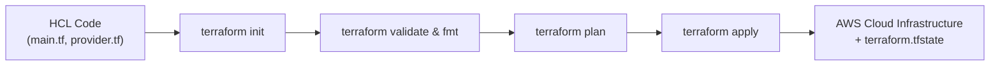
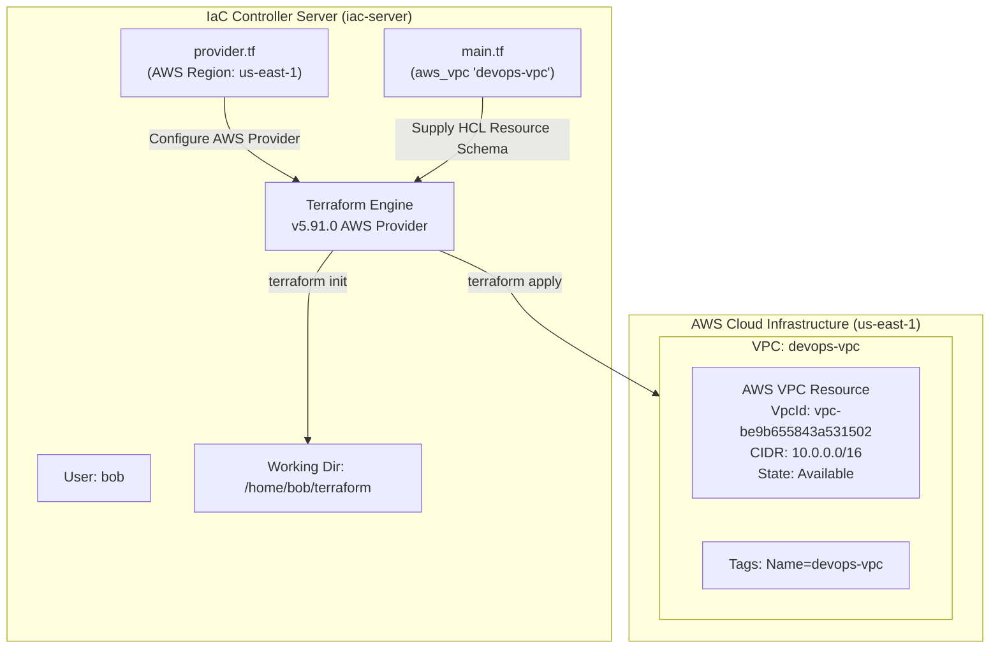

# Create VPC Using Terraform

## Technical Overview

### Infrastructure as Code (IaC) & Terraform Foundations

In modern cloud computing, manual provisioning of infrastructure via cloud provider web consoles (such as the AWS Management Console) introduces human error, configuration drift, lack of auditability, and non-reproducible environments. **Infrastructure as Code (IaC)** solves these challenges by defining compute, storage, networking, and security resources in machine-readable configuration files.

**Terraform** by HashiCorp is an industry-standard, open-source IaC tool that allows DevOps engineers to programmatically provision, update, and manage cloud infrastructure across public cloud platforms (AWS, GCP, Azure) and private environments (OpenStack, VMware).

Key architectural advantages of Terraform include:

1. **Declarative Syntax:** Engineers specify the *desired end state* of infrastructure in HashiCorp Configuration Language (HCL). Terraform handles ordering, dependencies, and state transitions automatically.
2. **Provider-Based Architecture:** Terraform uses modular plugins called **Providers** to translate HCL statements into target API requests (e.g., AWS EC2/VPC REST APIs).
3. **State Management:** Terraform maintains a `terraform.tfstate` file that maps declared HCL resource declarations to actual real-world cloud resource IDs, enabling accurate drift detection and dependency tracking.
4. **Execution Lifecycle:** Terraform enforces a safe, deterministic workflow: `init` (initialize dependencies) $\rightarrow$ `plan` (preview changes) $\rightarrow$ `apply` (execute API calls).

---

### Virtual Private Cloud (VPC) Deep Dive

A **Virtual Private Cloud (VPC)** is a logically isolated virtual network dedicated to your cloud infrastructure within an AWS region. It provides complete control over your cloud networking environment, including IP address selection, subnet creation, route table configuration, and network gateways.

```
       +-----------------------------------------------------------------------+
       | AWS Cloud Region: us-east-1                                           |
       |                                                                       |
       |  +-----------------------------------------------------------------+  |
       |  | Virtual Private Cloud (VPC): devops-vpc                          |  |
       |  | CIDR Block: 10.0.0.0/16 (65,536 IPv4 Addresses)                 |  |
       |  |                                                                 |  |
       |  |   +--------------------------+    +--------------------------+  |  |
       |  |   | Public Subnet (Optional) |    | Private Subnet (Optional)|  |  |
       |  |   | 10.0.1.0/24              |    | 10.0.2.0/24              |  |  |
       |  |   +--------------------------+    +--------------------------+  |  |
       |  |                                                                 |  |
       |  |   Default Route Table | Default Security Group | Network ACL    |  |
       |  +-----------------------------------------------------------------+  |
       +-----------------------------------------------------------------------+
```

#### Core Components of AWS Networking:

* **CIDR Block (Classless Inter-Domain Routing):** Defines the IPv4 address space allocated to the VPC. A `/16` CIDR block (e.g., `10.0.0.0/16`) yields $2^{(32-16)} = 65,536$ private IP addresses (`10.0.0.0` to `10.0.255.255`).
* **Subnets:** Sub-ranges of IP addresses within a VPC used to isolate resources (e.g., public-facing web servers vs. private database clusters).
* **Internet Gateway (IGW):** A VPC component that enables communication between instances in your VPC and the internet.
* **Route Tables:** A set of rules (routes) used to determine where network traffic from your subnet or gateway is directed.
* **Security Groups:** State-level virtual firewalls controlling inbound and outbound network traffic at the instance/resource level.

---

## Detailed Terraform Documentation

### 1. The Core Terraform CLI Workflow

Terraform commands follow a strict workflow lifecycle designed to validate syntax, preview infrastructure changes, and apply configurations safely.



| Command | Description & Purpose | Primary Use Case |
| :--- | :--- | :--- |
| **`terraform init`** | Prepares working directory by downloading required provider plugins and initializing backends. | Run once when creating a workspace or adding new providers. |
| **`terraform fmt`** | Rewrites Terraform configuration files to target canonical format and style conventions. | Ensures clean code formatting before committing to VCS. |
| **`terraform validate`** | Verifies syntactic and internal consistency of HCL code blocks without calling cloud APIs. | Catches typos, missing required attributes, or invalid block types. |
| **`terraform plan`** | Performs dry run; compares desired state in `.tf` files against `.tfstate` and generates execution plan. | Previews resource additions, modifications (`+`, `~`, `-`), and deletions. |
| **`terraform apply`** | Executes the plan against cloud APIs to provision or update infrastructure resources. | Deploys infrastructure; updates state file upon completion. |
| **`terraform state list`** | Displays names of all resources currently tracked in the `terraform.tfstate` state file. | Fast state inspection without retrieving full attribute JSON. |
| **`terraform show`** | Outputs human-readable view of state file or execution plan file. | Detailed verification of resource IDs, IP addresses, and tags. |
| **`terraform destroy`** | Terminates and cleans up all managed resources listed in the state file. | Environment teardown. |

---

### 2. HCL Language Fundamentals

HashiCorp Configuration Language (HCL) uses declarative blocks composed of labels, arguments, and expressions:

```hcl
# Block Type | Resource Type | Resource Label
resource "aws_vpc" "devops-vpc" {
  # Argument = Expression
  cidr_block = "10.0.0.0/16"

  # Map of Key-Value Tags
  tags = {
    Name = "devops-vpc"
  }
}
```

* **`resource` Block:** Instructs Terraform to manage a specific infrastructure object (e.g., `aws_vpc`, `aws_instance`, `aws_s3_bucket`).
* **Resource Type (`aws_vpc`):** Specifies the cloud resource schema provided by the HashiCorp AWS Provider.
* **Resource Label (`devops-vpc`):** An internal identifier used within Terraform code to reference this specific resource instance.
* **Arguments:** Configuration parameters required or supported by the resource schema (e.g., `cidr_block`).
* **Tags:** Key-value pairs attached to AWS resources for resource grouping, cost allocation, and environment identification.

---

### 3. AWS Provider & `aws_vpc` Resource Reference

#### The Provider Block (`provider.tf`)

The provider block configures the specific cloud API plugin. For AWS, it defines credentials, default tags, and target regions:

```hcl
provider "aws" {
  region = "us-east-1"
}
```

#### `aws_vpc` Arguments & Attribute Reference

| Argument / Parameter | Type | Required? | Default | Description |
| :--- | :--- | :--- | :--- | :--- |
| **`cidr_block`** | `string` | **Yes** | N/A | The IPv4 CIDR block for the VPC (e.g., `"10.0.0.0/16"`). |
| **`instance_tenancy`** | `string` | No | `"default"` | Tenancy option for instances launched into the VPC (`"default"` or `"dedicated"`). |
| **`enable_dns_support`** | `bool` | No | `true` | Indicates whether DNS resolution is supported through Amazon DNS server. |
| **`enable_dns_hostnames`** | `bool` | No | `false` | Indicates whether instances with public IPs receive matching public DNS hostnames. |
| **`tags`** | `map(string)` | No | `{}` | Map of tags to assign to the VPC resource (e.g., `{ Name = "devops-vpc" }`). |

#### Attributes Exported by `aws_vpc` (Readable via State/Outputs):

* **`id`:** The unique AWS identifier of the created VPC (e.g., `vpc-be9b655843a531502`).
* **`arn`:** The Amazon Resource Name of the VPC.
* **`default_route_table_id`:** ID of the default route table created automatically with the VPC.
* **`default_security_group_id`:** ID of the default security group associated with the VPC.
* **`main_route_table_id`:** ID of the main route table associated with this VPC.
* **`owner_id`:** The AWS account ID of the VPC owner.

---

## Challenge Objective

The Nautilus DevOps team is executing an incremental cloud migration to AWS. To maintain granular control, minimize risk, and optimize resource deployment, the team has broken the cloud foundation setup into phased tasks.

In this challenge, you are tasked with provisioning the core network layer by constructing an AWS VPC named `devops-vpc` in region `us-east-1` with a `/16` IPv4 CIDR block using Terraform in `/home/bob/terraform`.



---

## Infrastructure & Configuration Requirements

### Server & Environment Matrix

<div style="overflow-x: auto;">

| Host / Role | Working Directory | User | Target Cloud Provider | Target Region | Resource Type | Resource Label | Tag Name | Target CIDR Block |
| :--- | :--- | :--- | :--- | :--- | :--- | :--- | :--- | :--- |
| **`iac-server`** | `/home/bob/terraform` | `bob` | AWS (`hashicorp/aws v5.91.0`) | `us-east-1` | `aws_vpc` | `devops-vpc` | `devops-vpc` | `10.0.0.0/16` |

</div>

### Requirements Checklist

* **Working Directory:** `/home/bob/terraform`
* **File Naming Standard:** Must create `main.tf` in `/home/bob/terraform` (do not use alternative file names).
* **Resource Type:** `aws_vpc`
* **Terraform Resource Label:** `devops-vpc`
* **AWS Region:** `us-east-1` (defined in `provider.tf`)
* **CIDR Block:** Valid IPv4 block (e.g., `10.0.0.0/16`)
* **VPC Name Tag:** `tags = { Name = "devops-vpc" }`
* **Execution Standard:** Infrastructure must be initialized, planned, and applied clean using `terraform init` and `terraform apply`.

---

## Step-by-Step Implementation

### Step 1: Open Terminal & Navigate to Working Directory

Launch the terminal in the IDE and switch to the designated Terraform directory:

```bash
cd /home/bob/terraform
```

---

### Step 2: Inspect Existing Environment Files

Check the contents of `/home/bob/terraform` to review pre-configured files:

```bash
ls -la
```

*Terminal Output:*
```text
README.MD  provider.tf
```

Inspect `provider.tf` to verify AWS provider settings:

```bash
cat provider.tf
```

*Expected Contents:*
```hcl
terraform {
  required_providers {
    aws = {
      source  = "hashicorp/aws"
      version = "~> 5.0"
    }
  }
}

provider "aws" {
  region = "us-east-1"
}
```

---

### Step 3: Create the `main.tf` Configuration File

Create `main.tf` inside `/home/bob/terraform` defining the `aws_vpc` resource block using `cat`:

```bash
cat << 'EOF' > main.tf
resource "aws_vpc" "devops-vpc" {
  cidr_block = "10.0.0.0/16"
  tags = {
    Name = "devops-vpc"
  }
}
EOF
```

---

### Step 4: Initialize Terraform Directory

Initialize the workspace to download the required HashiCorp AWS provider plugins:

```bash
terraform init
```

*Terminal Output:*
```text
Initializing the backend...
Initializing provider plugins...
- Finding hashicorp/aws versions matching "5.91.0"...
- Installing hashicorp/aws v5.91.0...
- Installed hashicorp/aws v5.91.0 (signed by HashiCorp)

Terraform has created a lock file .terraform.lock.hcl to record the provider
selections it made above. Include this file in your version control repository
so that Terraform can guarantee to make the same selections by default when
you run "terraform init" in the future.

Terraform has been successfully initialized!
You may now begin working with Terraform. Try running "terraform plan" to see
any changes that are required for your infrastructure. All Terraform commands
should now work.
```

---

### Step 5: Validate and Format HCL Syntax

Ensure code compliance and proper formatting:

```bash
terraform fmt
terraform validate
```

*Expected Output:*
```text
Success! The configuration is valid.
```

---

### Step 6: Preview Changes with `terraform plan`

Perform a dry run to inspect the resource creation plan:

```bash
terraform plan
```

*Terminal Output:*
```text
Terraform used the selected providers to generate the following execution plan. Resource actions are indicated with the following symbols:
  + create

Terraform will perform the following actions:

  # aws_vpc.devops-vpc will be created
  + resource "aws_vpc" "devops-vpc" {
      + arn                                  = (known after apply)
      + cidr_block                           = "10.0.0.0/16"
      + default_network_acl_id               = (known after apply)
      + default_route_table_id               = (known after apply)
      + default_security_group_id            = (known after apply)
      + dhcp_options_id                      = (known after apply)
      + enable_dns_hostnames                 = (known after apply)
      + enable_dns_support                   = true
      + enable_network_address_usage_metrics = (known after apply)
      + id                                   = (known after apply)
      + instance_tenancy                     = "default"
      + ipv6_association_id                  = (known after apply)
      + ipv6_cidr_block                      = (known after apply)
      + ipv6_cidr_block_network_border_group = (known after apply)
      + main_route_table_id                  = (known after apply)
      + owner_id                             = (known after apply)
      + tags                                 = {
          + "Name" = "devops-vpc"
        }
      + tags_all                             = {
          + "Name" = "devops-vpc"
        }
    }

Plan: 1 to add, 0 to change, 0 to destroy.
```

---

### Step 7: Apply Configuration & Provision VPC

Deploy the VPC infrastructure by running `terraform apply` and responding `yes` when prompted:

```bash
terraform apply
```

*Terminal Output:*
```text
Do you want to perform these actions?
  Terraform will perform the actions described above.
  Only 'yes' will be accepted to approve.

  Enter a value: yes

aws_vpc.devops-vpc: Creating...
aws_vpc.devops-vpc: Creation complete after 1s [id=vpc-be9b655843a531502]

Apply complete! Resources: 1 added, 0 changed, 0 destroyed.
```

---

## Verification & Validation

### 1. Verify Terraform State File

List the state file contents to verify `aws_vpc.devops-vpc` is registered:

```bash
terraform state list
```

*Terminal Output:*
```text
aws_vpc.devops-vpc
```

Display detailed resource properties stored in state:

```bash
terraform show
```

*Terminal Output snippet:*
```text
# aws_vpc.devops-vpc:
resource "aws_vpc" "devops-vpc" {
    arn                  = "arn:aws:ec2:us-east-1:000000000000:vpc/vpc-be9b655843a531502"
    cidr_block           = "10.0.0.0/16"
    enable_dns_support   = true
    id                   = "vpc-be9b655843a531502"
    instance_tenancy     = "default"
    tags                 = {
        "Name" = "devops-vpc"
    }
    tags_all             = {
        "Name" = "devops-vpc"
    }
}
```

---

### 2. Verify via AWS CLI

Query the AWS EC2 API directly using AWS CLI filtering by `tag:Name=devops-vpc`:

```bash
aws ec2 describe-vpcs --filters "Name=tag:Name,Values=devops-vpc" --region us-east-1
```

*Terminal Output:*
```json
{
    "Vpcs": [
        {
            "OwnerId": "000000000000",
            "InstanceTenancy": "default",
            "Ipv6CidrBlockAssociationSet": [],
            "CidrBlockAssociationSet": [
                {
                    "AssociationId": "vpc-cidr-assoc-e16193f7e53b5ef1d",
                    "CidrBlock": "10.0.0.0/16",
                    "CidrBlockState": {
                        "State": "associated"
                    }
                }
            ],
            "IsDefault": false,
            "Tags": [
                {
                    "Key": "Name",
                    "Value": "devops-vpc"
                }
            ],
            "VpcId": "vpc-be9b655843a531502",
            "State": "available",
            "CidrBlock": "10.0.0.0/16",
            "DhcpOptionsId": "default"
        }
    ]
}
```

---

## Troubleshooting & Common Pitfalls

| Symptom / Error | Root Cause | Solution |
| :--- | :--- | :--- |
| **`Error: Could not load plugin` / Provider missing** | Skipped `terraform init` before running `plan` or `apply`. | Run `terraform init` to download provider plugins into `.terraform/`. |
| **`Error: Invalid CIDR block`** | Specified invalid network prefix (e.g., `10.0.0.0/33` or string typo). | Use valid standard IPv4 CIDR notation (e.g., `"10.0.0.0/16"`). |
| **`Error: No provider config found`** | `main.tf` created outside `/home/bob/terraform` or directory mismatch. | Ensure work is executed within `/home/bob/terraform` where `provider.tf` is located. |
| **`No file found: main.tf`** | Named file differently (e.g., `vpc.tf` or `app.tf`). | Requirements strictly mandate file name `main.tf`. Rename file via `mv vpc.tf main.tf`. |
| **`Error acquiring state lock`** | Previous process interrupted leaving `.terraform.tfstate.lock.info`. | Verify no other terraform process is running, then run `terraform force-unlock <LOCK-ID>`. |

---

## Best Practices

1. **Commit Provider Lock Files (`.terraform.lock.hcl`):** Always check in `.terraform.lock.hcl` to ensure deterministic provider plugin versioning across developer environments and CI/CD pipelines.
2. **Explicit Tagging:** Always tag cloud infrastructure resources (`Name`, `Environment`, `Owner`) to support compliance tracking and cost allocation.
3. **Run `terraform fmt` and `validate` in Pre-commit Hooks:** Automate code linting and formatting verification prior to pushing code to git repositories.
4. **Use Modular File Structures:** In production workspaces, separate logic into `main.tf` (resources), `variables.tf` (inputs), `outputs.tf` (exported data), and `provider.tf` (cloud credentials).
