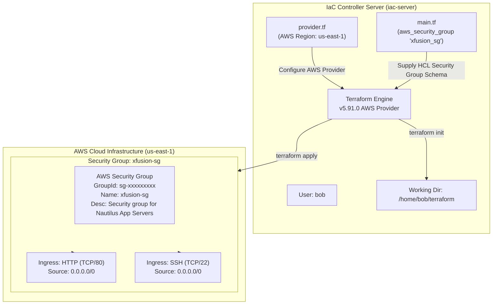

# Create Security Group Using Terraform

## Technical Overview

### AWS Security Groups & Stateful Firewalls

In Amazon Web Services (AWS), network security follows a **defense-in-depth** model. While Virtual Private Clouds (VPCs) establish isolated networking boundaries, individual compute instances and network interfaces must be protected against unauthorized access. An **AWS Security Group** serves as a stateful virtual firewall at the Elastic Network Interface (ENI) level, controlling both inbound (ingress) and outbound (egress) network traffic for attached resources.

```
                  +-------------------------------------------------------------+
                  | AWS Cloud Region: us-east-1                                 |
                  |                                                             |
                  |  Internet / Traffic Sources (0.0.0.0/0)                     |
                  |       |                                 |                   |
                  |       | HTTP (Port 80)                  | SSH (Port 22)     |
                  |       v                                 v                   |
                  |  +-------------------------------------------------------+  |
                  |  | AWS Security Group: xfusion-sg                        |  |
                  |  | Description: Security group for Nautilus App Servers  |  |
                  |  |                                                       |  |
                  |  |  Ingress Rule 1: Port 80 (TCP)  <-- ALLOW 0.0.0.0/0   |  |
                  |  |  Ingress Rule 2: Port 22 (TCP)  <-- ALLOW 0.0.0.0/0   |  |
                  |  +-------------------------------------------------------+  |
                  |       |                                 |                   |
                  |       +-----------------+---------------+                   |
                  |                         |                                   |
                  |                         v                                   |
                  |        +---------------------------------+                  |
                  |        | Nautilus App Server Instance    |                  |
                  |        +---------------------------------+                  |
                  +-------------------------------------------------------------+
```

#### Core Security Group Characteristics:

1. **Stateful Filtering:** If an inbound request is permitted by a Security Group rule, the return/outbound response traffic is automatically allowed regardless of outbound rules (and vice versa). Connection tracking tables handle response mapping automatically.
2. **Implicit Deny by Default:** By default, a newly created custom Security Group contains **no inbound rules**. All incoming traffic from external sources is denied until explicit ingress rules are added.
3. **Allow Rules Only:** Security Groups cannot evaluate explicit "Deny" rules. You cannot block a specific IP address while allowing the rest of a CIDR block using Security Groups (this requires Network ACLs).
4. **Security Group vs. Network ACL (NACL) Comparison:**

| Feature | AWS Security Group | AWS Network ACL (NACL) |
| :--- | :--- | :--- |
| **Enforcement Layer** | Instance / ENI Level | Subnet Boundary Level |
| **State Nature** | **Stateful** (Return traffic automatically allowed) | **Stateless** (Return traffic must be explicitly allowed) |
| **Rule Capabilities** | **Allow rules only** | **Allow and Deny rules** |
| **Rule Evaluation** | All rules evaluated simultaneously | Evaluated in sequential rule-number order |
| **Scope** | Applies to instances associated with SG | Applies to all instances within associated subnet |

---

## Detailed Terraform Documentation

### 1. The `aws_security_group` Terraform Resource

Terraform provisions AWS Security Groups using the `aws_security_group` resource schema. This resource enables declarative configuration of security group metadata and embedded inline rule sets.

```hcl
resource "aws_security_group" "xfusion_sg" {
  name        = "xfusion-sg"
  description = "Security group for Nautilus App Servers"

  ingress {
    from_port   = 80
    to_port     = 80
    protocol    = "tcp"
    cidr_blocks = ["0.0.0.0/0"]
  }

  ingress {
    from_port   = 22
    to_port     = 22
    protocol    = "tcp"
    cidr_blocks = ["0.0.0.0/0"]
  }
}
```

---

### 2. Parameter & Argument Reference

#### Security Group Resource Arguments (`aws_security_group`)

| Argument | Type | Required? | Default | Description |
| :--- | :--- | :--- | :--- | :--- |
| **`name`** | `string` | No | Random name | The name of the security group (e.g., `"xfusion-sg"`). Must be unique within VPC. |
| **`name_prefix`** | `string` | No | N/A | Creates a unique name beginning with the specified prefix. |
| **`description`** | `string` | No | `"Managed by Terraform"` | Security group description. **Note:** AWS does not permit editing description after creation without recreating SG. |
| **`vpc_id`** | `string` | No | Default VPC | The VPC ID where the security group will be created. |
| **`ingress`** | `block` | No | `[]` | Configuration block for inbound rules (can be specified multiple times). |
| **`egress`** | `block` | No | `[]` | Configuration block for outbound rules (can be specified multiple times). |
| **`tags`** | `map(string)` | No | `{}` | Key-value mapping of resource tags. |

#### Ingress / Egress Block Parameters

| Parameter | Type | Required? | Description |
| :--- | :--- | :--- | :--- |
| **`from_port`** | `number` | **Yes** | Start port of the rule range (e.g., `80`). Set to `0` for all ports if protocol is `-1`. |
| **`to_port`** | `number` | **Yes** | End port of the rule range (e.g., `80`). Set to `0` for all ports if protocol is `-1`. |
| **`protocol`** | `string` | **Yes** | Protocol type (`"tcp"`, `"udp"`, `"icmp"`, or `"-1"` / `"all"` for all protocols). |
| **`cidr_blocks`** | `list(string)`| No | List of IPv4 CIDR ranges allowed access (e.g., `["0.0.0.0/0"]`). |
| **`ipv6_cidr_blocks`** | `list(string)`| No | List of IPv6 CIDR ranges allowed access (e.g., `["::/0"]`). |
| **`security_groups`** | `list(string)`| No | List of source Security Group IDs allowed to access target instances. |
| **`self`** | `bool` | No | If `true`, allows traffic from instances assigned to this same security group. |

---

### 3. Inline Blocks vs. Standalone `aws_security_group_rule`

Terraform supports two distinct patterns for managing Security Group rules:

1. **Inline Blocks (Used in this challenge):** Ingress/egress rules are embedded directly inside the `aws_security_group` resource block using `ingress {}` and `egress {}` blocks.
2. **Standalone Rule Resources:** Rules are defined using separate `aws_security_group_rule` resources referencing the target security group ID.

> [!WARNING]
> **Crucial Pattern Constraint:** Do NOT mix inline `ingress`/`egress` blocks with separate `aws_security_group_rule` resources for the same security group. Doing so causes rule state conflicts, plan drift, and unexpected rule deletions during `terraform apply`.

---

### 4. Exported Attributes Reference

Upon provisioning, Terraform exports several key attributes from the `aws_security_group` resource:

* **`id`:** The Security Group ID generated by AWS (e.g., `sg-0a1b2c3d4e5f6g7h8`).
* **`arn`:** The Amazon Resource Name (ARN) of the security group.
* **`owner_id`:** The AWS Account ID owning the security group.
* **`name`:** The provisioned name of the security group.

---

## Challenge Objective

As part of the Nautilus DevOps team's incremental AWS infrastructure migration, you need to configure the network firewall rules for upcoming application servers.

In this challenge, you will write Terraform code in `/home/bob/terraform/main.tf` to provision an AWS Security Group named `xfusion-sg` in region `us-east-1` with specific inbound traffic rules allowing HTTP (port 80) and SSH (port 22) access from any IPv4 address (`0.0.0.0/0`).



---

## Infrastructure & Configuration Requirements

### Server & Rule Matrix

<div style="overflow-x: auto;">

| Host / Role | Working Directory | Resource Type | Resource Label | SG Name (`name`) | SG Description (`description`) | Rule Type | Protocol | Port Range | Source CIDR |
| :--- | :--- | :--- | :--- | :--- | :--- | :--- | :--- | :--- | :--- |
| **`iac-server`** | `/home/bob/terraform` | `aws_security_group` | `xfusion_sg` | `xfusion-sg` | `Security group for Nautilus App Servers` | Ingress | TCP | `80` | `0.0.0.0/0` |
| **`iac-server`** | `/home/bob/terraform` | `aws_security_group` | `xfusion_sg` | `xfusion-sg` | `Security group for Nautilus App Servers` | Ingress | TCP | `22` | `0.0.0.0/0` |

</div>

### Requirements Checklist

* **Working Directory:** `/home/bob/terraform`
* **Configuration File:** `main.tf` (do not create alternative `.tf` files).
* **Resource Type:** `aws_security_group`
* **Resource Label:** `xfusion_sg`
* **Security Group Name (`name`):** `xfusion-sg`
* **Description (`description`):** `Security group for Nautilus App Servers`
* **AWS Region:** `us-east-1` (defined in `provider.tf`)
* **Inbound (Ingress) Rule 1:** HTTP, port `80`, protocol `tcp`, CIDR `0.0.0.0/0`
* **Inbound (Ingress) Rule 2:** SSH, port `22`, protocol `tcp`, CIDR `0.0.0.0/0`
* **Execution Lifecycle:** Must run `terraform init`, `terraform plan`, and `terraform apply` cleanly.

---

## Step-by-Step Implementation

### Step 1: Open Terminal & Navigate to Working Directory

Open the integrated terminal in VS Code and change to the Terraform directory:

```bash
cd /home/bob/terraform
```

---

### Step 2: Inspect Existing Environment Files

Check existing files in `/home/bob/terraform`:

```bash
ls -la
```

*Terminal Output:*
```text
README.MD  provider.tf
```

Inspect `provider.tf` to verify AWS region settings:

```bash
cat provider.tf
```

*Expected Contents:*
```hcl
terraform {
  required_providers {
    aws = {
      source  = "hashicorp/aws"
      version = "~> 5.0"
    }
  }
}

provider "aws" {
  region = "us-east-1"
}
```

---

### Step 3: Create the `main.tf` Configuration File

Create `main.tf` in `/home/bob/terraform` containing the `aws_security_group` resource block:

```bash
cat << 'EOF' > main.tf
resource "aws_security_group" "xfusion_sg" {
  name        = "xfusion-sg"
  description = "Security group for Nautilus App Servers"

  ingress {
    from_port   = 80
    to_port     = 80
    protocol    = "tcp"
    cidr_blocks = ["0.0.0.0/0"]
  }

  ingress {
    from_port   = 22
    to_port     = 22
    protocol    = "tcp"
    cidr_blocks = ["0.0.0.0/0"]
  }
}
EOF
```

---

### Step 4: Initialize Terraform Directory

Initialize the workspace to download provider binaries and setup state locking:

```bash
terraform init
```

*Terminal Output:*
```text
Initializing the backend...
Initializing provider plugins...
- Finding hashicorp/aws versions matching "5.91.0"...
- Installing hashicorp/aws v5.91.0...
- Installed hashicorp/aws v5.91.0 (signed by HashiCorp)

Terraform has created a lock file .terraform.lock.hcl to record the provider
selections it made above. Include this file in your version control repository
so that Terraform can guarantee to make the same selections by default when
you run "terraform init" in the future.

Terraform has been successfully initialized!
```

---

### Step 5: Validate and Format HCL Syntax

Format and validate the HCL configuration file:

```bash
terraform fmt
terraform validate
```

*Expected Output:*
```text
Success! The configuration is valid.
```

---

### Step 6: Preview Execution Plan with `terraform plan`

Preview the infrastructure creation plan:

```bash
terraform plan
```

*Terminal Output:*
```text
Terraform used the selected providers to generate the following execution plan. Resource actions are indicated with the following symbols:
  + create

Terraform will perform the following actions:

  # aws_security_group.xfusion_sg will be created
  + resource "aws_security_group" "xfusion_sg" {
      + arn                    = (known after apply)
      + description            = "Security group for Nautilus App Servers"
      + egress                 = (known after apply)
      + id                     = (known after apply)
      + ingress                = [
          + {
              + cidr_blocks      = [
                  + "0.0.0.0/0",
                ]
              + from_port        = 22
              + ipv6_cidr_blocks = []
              + prefix_list_ids  = []
              + protocol         = "tcp"
              + security_groups  = []
              + self             = false
              + to_port          = 22
            },
          + {
              + cidr_blocks      = [
                  + "0.0.0.0/0",
                ]
              + from_port        = 80
              + ipv6_cidr_blocks = []
              + prefix_list_ids  = []
              + protocol         = "tcp"
              + security_groups  = []
              + self             = false
              + to_port          = 80
            },
        ]
      + name                   = "xfusion-sg"
      + name_prefix            = (known after apply)
      + owner_id               = (known after apply)
      + revoke_rules_on_delete = false
      + vpc_id                 = (known after apply)
    }

Plan: 1 to add, 0 to change, 0 to destroy.
```

---

### Step 7: Apply Configuration & Provision Security Group

Execute `terraform apply` to provision the security group in AWS:

```bash
terraform apply
```

*Terminal Output:*
```text
Do you want to perform these actions?
  Terraform will perform the actions described above.
  Only 'yes' will be accepted to approve.

  Enter a value: yes

aws_security_group.xfusion_sg: Creating...
aws_security_group.xfusion_sg: Creation complete after 2s [id=sg-0b8a1c9e8f7d6a5b4]

Apply complete! Resources: 1 added, 0 changed, 0 destroyed.
```

---

## Verification & Validation

### 1. Verify Terraform State File

List resources tracked in state:

```bash
terraform state list
```

*Terminal Output:*
```text
aws_security_group.xfusion_sg
```

Inspect resource properties recorded in state:

```bash
terraform show
```

*Terminal Output snippet:*
```text
# aws_security_group.xfusion_sg:
resource "aws_security_group" "xfusion_sg" {
    description = "Security group for Nautilus App Servers"
    id          = "sg-0b8a1c9e8f7d6a5b4"
    ingress     = [
        {
            cidr_blocks      = [
                "0.0.0.0/0",
            ]
            from_port        = 22
            protocol         = "tcp"
            to_port          = 22
        },
        {
            cidr_blocks      = [
                "0.0.0.0/0",
            ]
            from_port        = 80
            protocol         = "tcp"
            to_port          = 80
        },
    ]
    name        = "xfusion-sg"
}
```

---

### 2. Verify via AWS CLI

Query the AWS EC2 API using AWS CLI filtering by `group-name`:

```bash
aws ec2 describe-security-groups --filters "Name=group-name,Values=xfusion-sg" --region us-east-1
```

*Terminal Output:*
```json
{
    "SecurityGroups": [
        {
            "Description": "Security group for Nautilus App Servers",
            "GroupName": "xfusion-sg",
            "IpPermissions": [
                {
                    "FromPort": 80,
                    "IpProtocol": "tcp",
                    "IpRanges": [
                        {
                            "CidrIp": "0.0.0.0/0"
                        }
                    ],
                    "Ipv6Ranges": [],
                    "PrefixListIds": [],
                    "ToPort": 80,
                    "UserIdGroupPairs": []
                },
                {
                    "FromPort": 22,
                    "IpProtocol": "tcp",
                    "IpRanges": [
                        {
                            "CidrIp": "0.0.0.0/0"
                        }
                    ],
                    "Ipv6Ranges": [],
                    "PrefixListIds": [],
                    "ToPort": 22,
                    "UserIdGroupPairs": []
                }
            ],
            "OwnerId": "000000000000",
            "GroupId": "sg-0b8a1c9e8f7d6a5b4",
            "IpPermissionsEgress": [],
            "VpcId": "vpc-be9b655843a531502"
        }
    ]
}
```

---

## Troubleshooting & Common Pitfalls

| Symptom / Error | Root Cause | Solution |
| :--- | :--- | :--- |
| **`InvalidParameterValue: fromPort cannot be greater than toPort`** | Set `from_port = 80` and `to_port = 22` in a single ingress block. | Create two distinct `ingress {}` blocks for port 80 and port 22 respectively. |
| **`InvalidProtocol: The protocol tcp is invalid`** | Protocol parameter supplied in uppercase (e.g. `"TCP"`) or with spaces. | Use lowercase protocol string: `protocol = "tcp"`. |
| **`Error: Invalid CIDR address`** | Passed CIDR as a string instead of a list (e.g., `cidr_blocks = "0.0.0.0/0"`). | Enclose CIDR block inside array brackets: `cidr_blocks = ["0.0.0.0/0"]`. |
| **`Error: Security Group description updated`** | Modified `description` argument on an existing Security Group. | Note that AWS API requires destroying and recreating the Security Group to change `description`. |
| **State drift / Rules deleted on `apply`** | Mixed inline `ingress` blocks with standalone `aws_security_group_rule` resources. | Stick strictly to inline `ingress` blocks OR standalone rule resources across the workspace. |

---

## Best Practices

1. **Avoid `0.0.0.0/0` for SSH Port 22 in Production:** In production environments, restrict SSH access (`port 22`) to trusted bastion host IPs, office gateway CIDRs, or AWS Systems Manager (SSM) Session Manager instead of public `0.0.0.0/0`.
2. **Explicit Egress Rules:** Default custom Security Groups block all ingress but allow all egress when created via AWS Console. However, in Terraform, explicit `egress {}` blocks should be declared to avoid accidental outbound traffic restriction.
3. **Use Meaningful Descriptions:** Assign clear descriptions to both the security group resource and individual `ingress`/`egress` rule blocks for audit compliance.
4. **Group Security Rules by Function:** Create distinct dedicated Security Groups for web tier (HTTP/HTTPS), application tier (Internal API ports), and database tier (PostgreSQL/MySQL ports) to enforce micro-segmentation.
