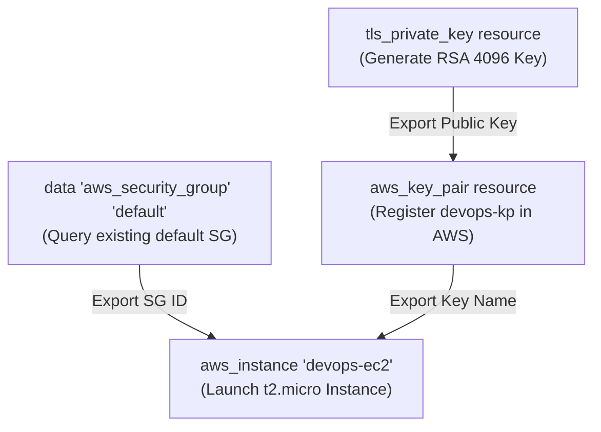
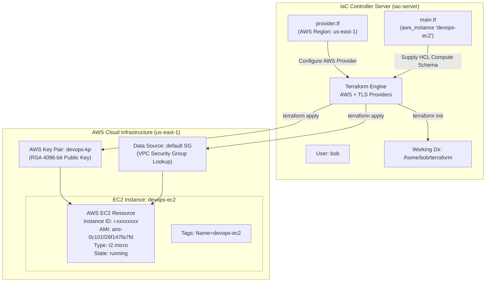

# Create EC2 Instance Using Terraform

## Technical Overview

### Amazon EC2 & Terraform Compute Provisioning

**Amazon Elastic Compute Cloud (EC2)** provides scalable, on-demand virtual computing capacity in the AWS cloud. Deploying compute instances manually through web interfaces poses consistency and maintenance challenges. Using **Terraform**, DevOps teams can declaratively model virtual server specifications—including compute family (`t2.micro`), machine images (AMI), cryptographic SSH authentication (`aws_key_pair`), and network security bindings (`vpc_security_group_ids`)—within version-controlled configuration files.

```
       +-----------------------------------------------------------------------------------+
       | AWS Cloud Region: us-east-1                                                       |
       |                                                                                   |
       |  +-----------------------------------------------------------------------------+  |
       |  | Target VPC (Default Network)                                                |  |
       |  |                                                                             |  |
       |  |   +----------------------------------------------------------------------+  |  |
       |  |   | Security Group: default                                              |  |  |
       |  |   | (Data Lookup: data "aws_security_group" "default")                   |  |  |
       |  |   +----------------------------------------------------------------------+  |  |
       |  |                                   |                                         |  |
       |  |                                   v                                         |  |
       |  |   +----------------------------------------------------------------------+  |  |
       |  |   | EC2 Instance: devops-ec2                                             |  |  |
       |  |   | AMI: ami-0c101f26f147fa7fd (Amazon Linux)                            |  |  |
       |  |   | Instance Type: t2.micro                                              |  |  |
       |  |   | SSH Key Pair: devops-kp (RSA 4096-bit)                               |  |  |
       |  |   | Tag: Name=devops-ec2                                                 |  |  |
       |  |   +----------------------------------------------------------------------+  |  |
       |  +-----------------------------------------------------------------------------+  |
       +-----------------------------------------------------------------------------------+
```

#### Core Components of EC2 Infrastructure:

1. **Amazon Machine Image (AMI):** A pre-configured template providing the OS, application server, and software packages required to launch an instance (e.g., `ami-0c101f26f147fa7fd` for Amazon Linux).
2. **Instance Type:** Defines the hardware allocation (CPU cores, RAM memory, storage architecture, network bandwidth). The `t2.micro` family provides 1 vCPU and 1 GiB RAM, ideal for general-purpose workloads.
3. **Key Pair Authentication:** Public-key cryptography mechanism used to authenticate SSH sessions. Terraform can generate RSA keys in-memory (`tls_private_key`) and upload the public key component to AWS (`aws_key_pair`).
4. **VPC Security Group Association:** Controls inbound/outbound network access for the compute instance. In VPC environments, security groups must be bound using `vpc_security_group_ids` (accepting SG IDs) rather than legacy EC2-Classic `security_groups` (accepting SG names).

---

## Detailed Terraform Documentation

### 1. Key Terraform Resources for Compute Management

Provisioning a secure EC2 instance requires coordinating three primary Terraform resource types and data sources:



---

### 2. Parameter & Argument Reference

#### Resource: `aws_instance`

| Argument | Type | Required? | Default | Description |
| :--- | :--- | :--- | :--- | :--- |
| **`ami`** | `string` | **Yes** | N/A | The AMI ID to use for the instance (e.g., `"ami-0c101f26f147fa7fd"`). |
| **`instance_type`** | `string` | **Yes** | N/A | The instance type to launch (e.g., `"t2.micro"`). |
| **`key_name`** | `string` | No | `null` | The key name of the SSH Key Pair to attach (e.g., `aws_key_pair.devops-kp.key_name`). |
| **`vpc_security_group_ids`** | `list(string)` | No | Default SG | List of Security Group IDs to associate with the instance within a VPC. |
| **`tags`** | `map(string)` | No | `{}` | Key-value mapping of resource tags (e.g., `{ Name = "devops-ec2" }`). |
| **`user_data`** | `string` | No | `null` | Shell script or cloud-init directives executed upon first boot. |
| **`subnet_id`** | `string` | No | VPC Default | VPC Subnet ID in which to launch the instance. |

#### Resource: `tls_private_key` & `aws_key_pair`

| Resource / Argument | Type | Required? | Description |
| :--- | :--- | :--- | :--- |
| **`tls_private_key.algorithm`** | `string` | **Yes** | Cryptographic algorithm name (`"RSA"`, `"ECDSA"`, `"ED25519"`). |
| **`tls_private_key.rsa_bits`** | `number` | No (`2048`) | Number of bits when using RSA algorithm (e.g., `4096`). |
| **`aws_key_pair.key_name`** | `string` | **Yes** | The name of the SSH key pair registered in AWS (e.g., `"devops-kp"`). |
| **`aws_key_pair.public_key`** | `string` | **Yes** | The OpenSSH formatted public key string (`tls_private_key.devops-kp.public_key_openssh`). |

#### Data Source: `data "aws_security_group"`

| Parameter | Type | Required? | Description |
| :--- | :--- | :--- | :--- |
| **`name`** | `string` | No | Name of the target security group to retrieve from AWS (e.g., `"default"`). |
| **`id`** | `string` | No | ID of the security group to query. |

---

### 3. Critical Nuance: `vpc_security_group_ids` vs `security_groups`

> [!IMPORTANT]
> **VPC vs. EC2-Classic Parameter Selection:**
> When launching an EC2 instance inside a Virtual Private Cloud (VPC), **always use `vpc_security_group_ids`** with Security Group IDs (e.g., `[data.aws_security_group.default.id]`).
>
> Using the legacy `security_groups` argument with group names causes `InvalidParameterValue` errors or forces instance re-creation when launching instances within default/custom VPC subnets.

---

### 4. Exported Attributes Reference

Upon provisioning, Terraform exports attributes from `aws_instance`:

* **`id`:** The AWS Instance ID (e.g., `i-0a1b2c3d4e5f6g7h8`).
* **`arn`:** The Amazon Resource Name of the instance.
* **`public_ip`:** Public IPv4 address assigned to the instance.
* **`private_ip`:** Private IPv4 address assigned to the instance within the VPC.
* **`public_dns`:** Public DNS hostname assigned to the instance.
* **`instance_state`:** Current operational state (`"running"`, `"pending"`).

---

## Challenge Objective

The Nautilus DevOps team is proceeding with its phased cloud migration strategy by setting up compute workloads in AWS.

In this challenge, you are required to create a single Terraform configuration file (`/home/bob/terraform/main.tf`) that launches an Amazon Linux EC2 instance named `devops-ec2` (`ami-0c101f26f147fa7fd`, `t2.micro`), registers a new RSA SSH key pair named `devops-kp`, and binds the instance to the `default` AWS security group in region `us-east-1`.



---

## Infrastructure & Configuration Requirements

### Server & Resource Specification Matrix

<div style="overflow-x: auto;">

| Host / Role | Working Directory | HCL File | Resource Type | Resource Label | Target Name Tag / Key Name | AMI ID | Instance Type | Security Group |
| :--- | :--- | :--- | :--- | :--- | :--- | :--- | :--- | :--- |
| **`iac-server`** | `/home/bob/terraform` | `main.tf` | `tls_private_key` | `devops-kp` | RSA 4096-bit | N/A | N/A | N/A |
| **`iac-server`** | `/home/bob/terraform` | `main.tf` | `aws_key_pair` | `devops-kp` | `devops-kp` | N/A | N/A | N/A |
| **`iac-server`** | `/home/bob/terraform` | `main.tf` | `data "aws_security_group"` | `default` | `default` | N/A | N/A | N/A |
| **`iac-server`** | `/home/bob/terraform` | `main.tf` | `aws_instance` | `devops-ec2` | `devops-ec2` | `ami-0c101f26f147fa7fd` | `t2.micro` | `default` (via ID) |

</div>

### Requirements Checklist

* **Working Directory:** `/home/bob/terraform`
* **Configuration File:** Must create `main.tf` (do not create separate `.tf` files).
* **AWS Region:** `us-east-1` (configured in existing `provider.tf`).
* **SSH Key Pair:** Create RSA 4096-bit key pair named `devops-kp`.
* **Security Group:** Attach default security group using `vpc_security_group_ids`.
* **EC2 AMI ID:** `ami-0c101f26f147fa7fd` (Amazon Linux).
* **EC2 Instance Type:** `t2.micro`.
* **Instance Tag:** `tags = { Name = "devops-ec2" }`.
* **Execution Standard:** Initialize and apply clean using `terraform init` and `terraform apply`.

---

## Step-by-Step Implementation

### Step 1: Open Terminal & Navigate to Working Directory

Open the integrated terminal in VS Code and change to `/home/bob/terraform`:

```bash
cd /home/bob/terraform
```

---

### Step 2: Inspect Existing Environment Files

Check existing files in `/home/bob/terraform`:

```bash
ls -la
```

*Terminal Output:*
```text
README.MD  provider.tf
```

Inspect `provider.tf` to verify provider configuration:

```bash
cat provider.tf
```

*Expected Contents:*
```hcl
terraform {
  required_providers {
    aws = {
      source  = "hashicorp/aws"
      version = "~> 5.0"
    }
  }
}

provider "aws" {
  region = "us-east-1"
}
```

---

### Step 3: Create the `main.tf` Configuration File

Create `main.tf` in `/home/bob/terraform` containing key pair generation, default security group data lookup, and `aws_instance` definition using `cat`:

```bash
cat << 'EOF' > main.tf
# 1. Generate RSA private key
resource "tls_private_key" "devops-kp" {
  algorithm = "RSA"
  rsa_bits  = 4096
}

# 2. Create AWS key pair using public key component
resource "aws_key_pair" "devops-kp" {
  key_name   = "devops-kp"
  public_key = tls_private_key.devops-kp.public_key_openssh
}

# 3. Data source to fetch default security group ID
data "aws_security_group" "default" {
  name = "default"
}

# 4. Launch the EC2 instance
resource "aws_instance" "devops-ec2" {
  ami                    = "ami-0c101f26f147fa7fd"
  instance_type          = "t2.micro"
  key_name               = aws_key_pair.devops-kp.key_name
  vpc_security_group_ids = [data.aws_security_group.default.id]

  tags = {
    Name = "devops-ec2"
  }
}
EOF
```

---

### Step 4: Initialize Terraform Directory

Initialize the working directory to download AWS and TLS provider plugins:

```bash
terraform init
```

*Terminal Output:*
```text
Initializing the backend...
Initializing provider plugins...
- Finding hashicorp/tls versions matching ">= 3.0.0"...
- Installing hashicorp/tls v4.0.6...
- Installed hashicorp/tls v4.0.6 (signed by HashiCorp)
- Finding hashicorp/aws versions matching "5.91.0"...
- Installing hashicorp/aws v5.91.0...
- Installed hashicorp/aws v5.91.0 (signed by HashiCorp)

Terraform has been successfully initialized!
```

---

### Step 5: Validate and Format HCL Syntax

Format and check configuration validity:

```bash
terraform fmt
terraform validate
```

*Expected Output:*
```text
Success! The configuration is valid.
```

---

### Step 6: Preview Execution Plan with `terraform plan`

Preview resource creation plan:

```bash
terraform plan
```

*Terminal Output:*
```text
Terraform used the selected providers to generate the following execution plan. Resource actions are indicated with the following symbols:
  + create
 <= read via data source

Terraform will perform the following actions:

  # data.aws_security_group.default will be read during apply
  # (config refers to values not yet known)
 <= data "aws_security_group" "default" {
      + arn                    = (known after apply)
      + description            = (known after apply)
      + id                     = (known after apply)
      + name                   = "default"
      + vpc_id                 = (known after apply)
    }

  # aws_instance.devops-ec2 will be created
  + resource "aws_instance" "devops-ec2" {
      + ami                                  = "ami-0c101f26f147fa7fd"
      + arn                                  = (known after apply)
      + instance_state                       = (known after apply)
      + instance_type                        = "t2.micro"
      + key_name                             = "devops-kp"
      + public_ip                            = (known after apply)
      + vpc_security_group_ids               = (known after apply)
      + tags                                 = {
          + "Name" = "devops-ec2"
        }
    }

  # aws_key_pair.devops-kp will be created
  + resource "aws_key_pair" "devops-kp" {
      + arn         = (known after apply)
      + id          = (known after apply)
      + key_name    = "devops-kp"
      + public_key  = (sensitive value)
    }

  # tls_private_key.devops-kp will be created
  + resource "tls_private_key" "devops-kp" {
      + algorithm                     = "RSA"
      + rsa_bits                      = 4096
    }

Plan: 3 to add, 0 to change, 0 to destroy.
```

---

### Step 7: Apply Configuration & Provision Infrastructure

Execute `terraform apply` and confirm execution with `yes`:

```bash
terraform apply
```

*Terminal Output:*
```text
Do you want to perform these actions?
  Terraform will perform the actions described above.
  Only 'yes' will be accepted to approve.

  Enter a value: yes

tls_private_key.devops-kp: Creating...
tls_private_key.devops-kp: Creation complete after 1s
aws_key_pair.devops-kp: Creating...
aws_key_pair.devops-kp: Creation complete after 1s [id=devops-kp]
aws_instance.devops-ec2: Creating...
aws_instance.devops-ec2: Still creating... [10s elapsed]
aws_instance.devops-ec2: Creation complete after 14s [id=i-0d7e6f5a4b3c2d1e0]

Apply complete! Resources: 3 added, 0 changed, 0 destroyed.
```

---

## Verification & Validation

### 1. Verify Terraform State File

List all provisioned resources in state:

```bash
terraform state list
```

*Terminal Output:*
```text
data.aws_security_group.default
aws_instance.devops-ec2
aws_key_pair.devops-kp
tls_private_key.devops-kp
```

Inspect instance details recorded in state:

```bash
terraform show
```

*Terminal Output snippet:*
```text
# aws_instance.devops-ec2:
resource "aws_instance" "devops-ec2" {
    ami                          = "ami-0c101f26f147fa7fd"
    arn                          = "arn:aws:ec2:us-east-1:000000000000:instance/i-0d7e6f5a4b3c2d1e0"
    id                           = "i-0d7e6f5a4b3c2d1e0"
    instance_state               = "running"
    instance_type                = "t2.micro"
    key_name                     = "devops-kp"
    tags                         = {
        "Name" = "devops-ec2"
    }
    vpc_security_group_ids       = [
        "sg-0123456789abcdef0",
    ]
}
```

---

### 2. Verify via AWS CLI

Query the AWS EC2 API directly using AWS CLI filtering by `tag:Name=devops-ec2`:

```bash
aws ec2 describe-instances --filters "Name=tag:Name,Values=devops-ec2" --region us-east-1
```

*Terminal Output:*
```json
{
    "Reservations": [
        {
            "Instances": [
                {
                    "InstanceId": "i-0d7e6f5a4b3c2d1e0",
                    "ImageId": "ami-0c101f26f147fa7fd",
                    "State": {
                        "Code": 16,
                        "Name": "running"
                    },
                    "InstanceType": "t2.micro",
                    "KeyName": "devops-kp",
                    "SecurityGroups": [
                        {
                            "GroupName": "default",
                            "GroupId": "sg-0123456789abcdef0"
                        }
                    ],
                    "Tags": [
                        {
                            "Key": "Name",
                            "Value": "devops-ec2"
                        }
                    ]
                }
            ]
        }
    ]
}
```

---

## Troubleshooting & Common Pitfalls

| Symptom / Error | Root Cause | Solution |
| :--- | :--- | :--- |
| **`Error: InvalidAMIID.NotFound`** | Specified AMI ID does not exist in target region (`us-east-1`). | Verify AMI availability in `us-east-1` or ensure matching region in `provider.tf`. |
| **`Error: InvalidParameterCombination` when attaching SG** | Used legacy `security_groups = ["default"]` instead of `vpc_security_group_ids`. | Use `vpc_security_group_ids = [data.aws_security_group.default.id]`. |
| **`Error: InvalidKeyPair.Duplicate`** | Key pair `devops-kp` already exists in AWS account. | Delete pre-existing AWS key pair via AWS CLI `aws ec2 delete-key-pair --key-name devops-kp` or import state. |
| **`Error loading provider plugin: tls`** | Forgot to execute `terraform init` after adding `tls_private_key` resource block. | Re-run `terraform init` to download `hashicorp/tls` provider binary. |

---

## Best Practices

1. **Secure Private Key Exports:** In production, private keys generated by `tls_private_key` reside in the unencrypted `terraform.tfstate` file. Always encrypt state backends (S3 with SSE-KMS, Terraform Cloud) or use external key management (AWS KMS / SSH key pairs uploaded out-of-band).
2. **Dynamic AMI Lookups (`data "aws_ami"`):** Rather than hardcoding static AMI string IDs (which get deprecated frequently), use `data "aws_ami"` blocks with filters (e.g. `most_recent = true`, owner `amazon`) to dynamically fetch the latest patched image.
3. **Use Explicit VPC Subnet Binding:** Pass `subnet_id` explicitly when deploying compute workloads into multi-tier architecture (Public vs. Private Subnets).
4. **Standardize Name Tagging:** Always tag compute resources with `Name`, `Environment`, and `ManagedBy = "Terraform"` tags.
