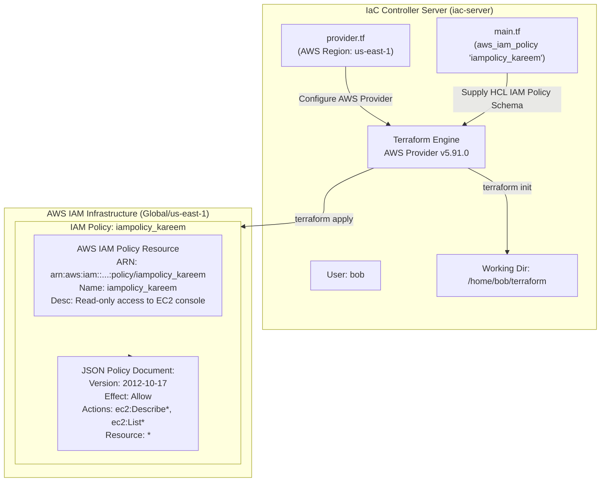

# Create IAM Policy Using Terraform

## Technical Overview

### AWS Identity & Access Management (IAM) & Policy Architecture

In AWS cloud governance, **Identity and Access Management (IAM)** controls *authentication* (who can log in) and *authorization* (what actions entities are permitted to execute on resources). IAM Policies serve as the foundational building block for defining granular permission boundaries.

An **IAM Policy** is a formal JSON document that defines permissions. When an IAM user, group, or role makes a request to an AWS service (such as EC2, S3, or DynamoDB), AWS evaluates the attached IAM policies to determine whether to authorize or deny the request.

```
       +-------------------------------------------------------------------------------------+
       | AWS IAM Policy Evaluation Engine                                                    |
       |                                                                                     |
       |  Incoming Request: "ec2:DescribeInstances" from User/Role                           |
       |                          |                                                          |
       |                          v                                                          |
       |  +-------------------------------------------------------------------------------+  |
       |  | Attached IAM Policy: iampolicy_kareem                                         |  |
       |  | Document Version: 2012-10-17                                                  |  |
       |  |                                                                               |  |
       |  |   Statement 1:                                                                |  |
       |  |     Effect:   ALLOW                                                           |  |
       |  |     Action:   ["ec2:Describe*", "ec2:List*"]                                  |  |
       |  |     Resource: "*"                                                             |  |
       |  +-------------------------------------------------------------------------------+  |
       |                          |                                                          |
       |                          v                                                          |
       |  Evaluation Decision: [ EXPLICIT ALLOW ] ---> Request Granted                       |
       +-------------------------------------------------------------------------------------+
```

#### Core Components of IAM Policy JSON Schema:

1. **`Version`:** Defines the language syntax version. The current recommended standard is `"2012-10-17"`.
2. **`Statement`:** A container block (or array of blocks) holding individual permission definitions.
3. **`Effect`:** Specifies whether the statement results in an `"Allow"` or an explicit `"Deny"`.
4. **`Action`:** List of specific API operations allowed or denied (e.g., `["ec2:Describe*", "ec2:List*"]`).
5. **`Resource`:** The target AWS resource(s) specified by Amazon Resource Name (ARN) or wildcard (`"*"`) to which the actions apply.
6. **`Condition` (Optional):** Specifies criteria under which the policy statement is active (e.g., source IP restrictions, MFA requirement, SSL requirement).

#### IAM Policy Evaluation Logic:

* **Default Deny:** All requests are implicitly denied by default.
* **Explicit Allow:** A request is permitted only if an applicable policy statement contains an explicit `"Effect": "Allow"`.
* **Explicit Deny Overrides All:** An explicit `"Effect": "Deny"` in any applicable policy overrides all explicit allows.

---

## Detailed Terraform Documentation

### 1. The `aws_iam_policy` Resource & `jsonencode()` Function

Terraform provisions customer-managed IAM policies using the `aws_iam_policy` resource. Rather than embedding raw JSON strings using heredoc syntax (which is prone to escaping errors and formatting bugs), HashiCorp recommends using Terraform's native **`jsonencode()`** function.

```hcl
resource "aws_iam_policy" "iampolicy_kareem" {
  name        = "iampolicy_kareem"
  description = "Read-only access to EC2 console"

  policy = jsonencode({
    Version = "2012-10-17"
    Statement = [
      {
        Action = [
          "ec2:Describe*",
          "ec2:List*"
        ]
        Effect   = "Allow"
        Resource = "*"
      }
    ]
  })
}
```

#### Why Use `jsonencode()` in HCL?

* **Native HCL Data Structures:** Allows defining policies using standard HCL map/list syntax.
* **Syntax Validation:** Terraform validates structural correctness during `terraform validate` rather than failing at AWS API runtime.
* **Dynamic Variable Injection:** Enables referencing Terraform local variables, resource attributes, or input variables directly within policy definitions without complex string concatenation.

---

### 2. Parameter & Argument Reference

#### Resource Arguments (`aws_iam_policy`)

| Argument | Type | Required? | Default | Description |
| :--- | :--- | :--- | :--- | :--- |
| **`name`** | `string` | No | Random name | The name of the policy (e.g., `"iampolicy_kareem"`). Must be unique within AWS account. |
| **`name_prefix`** | `string` | No | N/A | Creates a unique policy name beginning with the specified prefix. |
| **`path`** | `string` | No | `"/"` | Path in which to create the policy (e.g., `"/engineering/"` or `"/"`). |
| **`description`** | `string` | No | `null` | Description of the IAM policy (e.g., `"Read-only access to EC2 console"`). |
| **`policy`** | `string` | **Yes** | N/A | The policy document as a JSON formatted string (best generated via `jsonencode()`). |
| **`tags`** | `map(string)` | No | `{}` | Key-value mapping of resource tags. |

---

### 3. Alternative: `data "aws_iam_policy_document"`

For complex IAM policies featuring multiple conditional blocks or dynamic ARNs, Terraform provides the `aws_iam_policy_document` data source as an alternative to raw JSON encoding:

```hcl
data "aws_iam_policy_document" "ec2_readonly" {
  statement {
    effect = "Allow"
    actions = [
      "ec2:Describe*",
      "ec2:List*"
    ]
    resources = ["*"]
  }
}

resource "aws_iam_policy" "iampolicy_kareem" {
  name        = "iampolicy_kareem"
  description = "Read-only access to EC2 console"
  policy      = data.aws_iam_policy_document.ec2_readonly.json
}
```

---

### 4. Exported Attributes Reference

Upon provisioning, Terraform exports attributes from `aws_iam_policy`:

* **`id`:** The Amazon Resource Name (ARN) of the created policy.
* **`arn`:** The ARN assigned to the IAM policy (e.g., `arn:aws:iam::000000000000:policy/iampolicy_kareem`).
* **`name`:** The name of the policy.
* **`policy_id`:** The stable, unique policy ID assigned by AWS (e.g., `ANPA123456789EXAMPLE`).

---

## Challenge Objective

The Nautilus DevOps team is configuring access controls for platform engineers as part of their AWS cloud infrastructure migration.

In this challenge, you are tasked with creating a Terraform configuration in `/home/bob/terraform/main.tf` that provisions an AWS IAM Policy named `iampolicy_kareem`. The policy must grant read-only access to the EC2 service by allowing `ec2:Describe*` and `ec2:List*` actions across all resources (`"*"`) in region `us-east-1`.



---

## Infrastructure & Configuration Requirements

### Server & Policy Specification Matrix

<div style="overflow-x: auto;">

| Host / Role | Working Directory | HCL File | Resource Type | Resource Label | Policy Name (`name`) | Policy Description | Document Version | Allowed Actions | Target Resource Scope |
| :--- | :--- | :--- | :--- | :--- | :--- | :--- | :--- | :--- | :--- |
| **`iac-server`** | `/home/bob/terraform` | `main.tf` | `aws_iam_policy` | `iampolicy_kareem` | `iampolicy_kareem` | `Read-only access to EC2 console` | `2012-10-17` | `ec2:Describe*`, `ec2:List*` | `*` (All Resources) |

</div>

### Requirements Checklist

* **Working Directory:** `/home/bob/terraform`
* **Configuration File:** `main.tf` (do not create separate `.tf` files).
* **AWS Region:** `us-east-1` (configured in existing `provider.tf`).
* **Resource Type:** `aws_iam_policy`
* **Resource Label:** `iampolicy_kareem`
* **Policy Name (`name`):** `iampolicy_kareem`
* **Description:** `Read-only access to EC2 console`
* **JSON Policy Schema:**
  * `Version`: `"2012-10-17"`
  * `Effect`: `"Allow"`
  * `Action`: `["ec2:Describe*", "ec2:List*"]`
  * `Resource`: `"*"`
* **Execution Standard:** Initialize and apply clean using `terraform init` and `terraform apply`.

---

## Step-by-Step Implementation

### Step 1: Open Terminal & Navigate to Working Directory

Open the integrated terminal in VS Code and change to `/home/bob/terraform`:

```bash
cd /home/bob/terraform
```

---

### Step 2: Inspect Existing Environment Files

Check existing files in `/home/bob/terraform`:

```bash
ls -la
```

*Terminal Output:*
```text
README.MD  provider.tf
```

Inspect `provider.tf` to verify provider configuration:

```bash
cat provider.tf
```

*Expected Contents:*
```hcl
terraform {
  required_providers {
    aws = {
      source  = "hashicorp/aws"
      version = "~> 5.0"
    }
  }
}

provider "aws" {
  region = "us-east-1"
}
```

---

### Step 3: Create the `main.tf` Configuration File

Create `main.tf` in `/home/bob/terraform` containing the `aws_iam_policy` resource using `cat`:

```bash
cat << 'EOF' > main.tf
resource "aws_iam_policy" "iampolicy_kareem" {
  name        = "iampolicy_kareem"
  description = "Read-only access to EC2 console"

  policy = jsonencode({
    Version = "2012-10-17"
    Statement = [
      {
        Action = [
          "ec2:Describe*",
          "ec2:List*"
        ]
        Effect   = "Allow"
        Resource = "*"
      }
    ]
  })
}
EOF
```

---

### Step 4: Initialize Terraform Directory

Initialize the workspace to download AWS provider binaries:

```bash
terraform init
```

*Terminal Output:*
```text
Initializing the backend...
Initializing provider plugins...
- Finding hashicorp/aws versions matching "5.91.0"...
- Installing hashicorp/aws v5.91.0...
- Installed hashicorp/aws v5.91.0 (signed by HashiCorp)

Terraform has been successfully initialized!
```

---

### Step 5: Validate and Format HCL Syntax

Format and check code validity:

```bash
terraform fmt
terraform validate
```

*Expected Output:*
```text
Success! The configuration is valid.
```

---

### Step 6: Preview Execution Plan with `terraform plan`

Preview resource creation plan:

```bash
terraform plan
```

*Terminal Output:*
```text
Terraform used the selected providers to generate the following execution plan. Resource actions are indicated with the following symbols:
  + create

Terraform will perform the following actions:

  # aws_iam_policy.iampolicy_kareem will be created
  + resource "aws_iam_policy" "iampolicy_kareem" {
      + arn         = (known after apply)
      + description = "Read-only access to EC2 console"
      + id          = (known after apply)
      + name        = "iampolicy_kareem"
      + name_prefix = (known after apply)
      + path        = "/"
      + policy      = jsonencode(
            {
              + Statement = [
                  + {
                      + Action   = [
                          + "ec2:Describe*",
                          + "ec2:List*",
                        ]
                      + Effect   = "Allow"
                      + Resource = "*"
                    },
                ]
              + Version   = "2012-10-17"
            }
        )
      + policy_id   = (known after apply)
      + tags_all    = (known after apply)
    }

Plan: 1 to add, 0 to change, 0 to destroy.
```

---

### Step 7: Apply Configuration & Provision IAM Policy

Execute `terraform apply` and confirm execution with `yes`:

```bash
terraform apply
```

*Terminal Output:*
```text
Do you want to perform these actions?
  Terraform will perform the actions described above.
  Only 'yes' will be accepted to approve.

  Enter a value: yes

aws_iam_policy.iampolicy_kareem: Creating...
aws_iam_policy.iampolicy_kareem: Creation complete after 2s [id=arn:aws:iam::000000000000:policy/iampolicy_kareem]

Apply complete! Resources: 1 added, 0 changed, 0 destroyed.
```

---

## Verification & Validation

### 1. Verify Terraform State File

List provisioned policy resource in state:

```bash
terraform state list
```

*Terminal Output:*
```text
aws_iam_policy.iampolicy_kareem
```

Inspect details recorded in state:

```bash
terraform show
```

*Terminal Output snippet:*
```text
# aws_iam_policy.iampolicy_kareem:
resource "aws_iam_policy" "iampolicy_kareem" {
    arn         = "arn:aws:iam::000000000000:policy/iampolicy_kareem"
    description = "Read-only access to EC2 console"
    id          = "arn:aws:iam::000000000000:policy/iampolicy_kareem"
    name        = "iampolicy_kareem"
    path        = "/"
    policy      = jsonencode(
        {
            Statement = [
                {
                    Action   = [
                        "ec2:Describe*",
                        "ec2:List*",
                    ]
                    Effect   = "Allow"
                    Resource = "*"
                },
            ]
            Version   = "2012-10-17"
        }
    )
    policy_id   = "ANPAEXAMPLEPOLICYID"
}
```

---

### 2. Verify via AWS CLI

Query the AWS IAM API using AWS CLI filtering by policy scope:

```bash
aws iam list-policies --scope Local --query "Policies[?PolicyName=='iampolicy_kareem']"
```

*Terminal Output:*
```json
[
    {
        "PolicyName": "iampolicy_kareem",
        "PolicyId": "ANPAEXAMPLEPOLICYID",
        "Arn": "arn:aws:iam::000000000000:policy/iampolicy_kareem",
        "Path": "/",
        "DefaultVersionId": "v1",
        "AttachmentCount": 0,
        "IsAttachable": true,
        "CreateDate": "2026-08-11T17:29:00Z",
        "UpdateDate": "2026-08-11T17:29:00Z"
    }
]
```

Retrieve policy document version:

```bash
aws iam get-policy-version --policy-arn "arn:aws:iam::000000000000:policy/iampolicy_kareem" --version-id "v1"
```

---

## Troubleshooting & Common Pitfalls

| Symptom / Error | Root Cause | Solution |
| :--- | :--- | :--- |
| **`Error: MalformedPolicyDocument`** | Missing required `"Version": "2012-10-17"` or JSON syntax error in policy definition. | Use `jsonencode()` function in `main.tf` to ensure automatic valid JSON output. |
| **`EntityAlreadyExists: Policy ... already exists`** | An IAM policy named `iampolicy_kareem` already exists in AWS account. | Delete existing policy via AWS CLI `aws iam delete-policy` or use unique policy name. |
| **Heredoc JSON Escaping Error (`<<EOF`)** | Escaped quotes or variables incorrectly parsed in raw string heredoc. | Replace raw string heredoc with `jsonencode({...})`. |
| **`Error: InvalidPrincipal`** | Specified `Principal` key inside identity-based policy. | Identity-based policies (`aws_iam_policy`) attached to users/roles do NOT include `Principal`. Only Resource-based or Trust policies require `Principal`. |

---

## Best Practices

1. **Enforce Principle of Least Privilege (PoLP):** Avoid using wildcards (`"*"`) for actions or resources in production policies. Scope actions strictly to necessary API calls (e.g. `ec2:DescribeInstances` rather than `ec2:*`).
2. **Use `jsonencode()` or `aws_iam_policy_document`:** Always construct policy documents using `jsonencode()` or the `aws_iam_policy_document` data source to catch formatting bugs during static validation.
3. **Use Policy Paths for Hierarchy:** Organize policies logically using paths (e.g., `/security/` or `/finance/`) to simplify IAM policy administration in large organizations.
4. **Avoid Hardcoding Account IDs:** Reference dynamic data sources like `data "aws_caller_identity"` to inject account IDs into resource ARNs.
