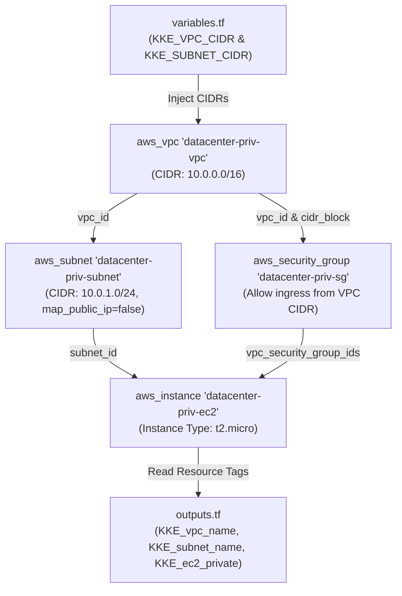
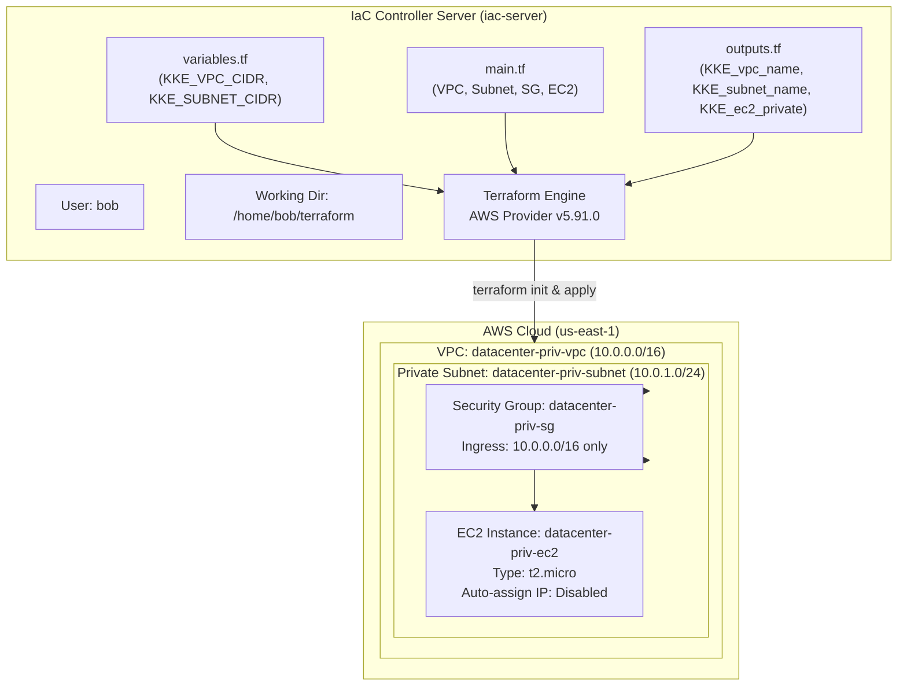

# Create Private VPC, Subnet and EC2 Instance Using Terraform

## Technical Overview

### Private Cloud Networking & Terraform Provisioning Architecture

In modern enterprise cloud architectures, securing sensitive workloads requires isolating network resources from direct internet access. A **Virtual Private Cloud (VPC)** provides a logically isolated virtual network dedicated to an AWS account. Within a VPC, **Private Subnets** ensure that compute instances hosted inside them are assigned only internal IP addresses and do not automatically receive public IPv4 addresses, preventing direct external access.

**Terraform** allows infrastructure teams to declaratively model complex multi-tier cloud environments—combining networking primitives (VPC, Subnets), access control mechanics (Security Groups), and compute capacity (EC2 instances)—into version-controlled configuration files.

```
       +-----------------------------------------------------------------------------------+
       | AWS Cloud Region: us-east-1                                                       |
       |                                                                                   |
       |  +-----------------------------------------------------------------------------+  |
       |  | Virtual Private Cloud (VPC): datacenter-priv-vpc                            |  |
       |  | CIDR Block: 10.0.0.0/16 (var.KKE_VPC_CIDR)                                  |  |
       |  |                                                                             |  |
       |  |   +---------------------------------------------------------------------+   |  |
       |  |   | Private Subnet: datacenter-priv-subnet                              |   |  |
       |  |   | CIDR Block: 10.0.1.0/24 (var.KKE_SUBNET_CIDR)                        |   |  |
       |  |   | map_public_ip_on_launch = false                                     |   |  |
       |  |   |                                                                     |   |  |
       |  |   |   +-------------------------------------------------------------+   |   |  |
       |  |   |   | Security Group: datacenter-priv-sg                          |   |   |  |
       |  |   |   | Ingress Rule: Allow traffic ONLY from 10.0.0.0/16           |   |   |  |
       |  |   |   +-------------------------------------------------------------+   |   |  |
       |  |   |                                 |                                   |   |  |
       |  |   |                                 v                                   |   |  |
       |  |   |   +-------------------------------------------------------------+   |   |  |
       |  |   |   | EC2 Instance: datacenter-priv-ec2                           |   |   |  |
       |  |   |   | AMI: ami-0c101f26f147fa7fd (Amazon Linux)                   |   |   |  |
       |  |   |   | Instance Type: t2.micro                                     |   |   |  |
       |  |   |   | Private IP Only (No Public IP)                              |   |   |  |
       |  |   |   +-------------------------------------------------------------+   |   |  |
       |  |   +---------------------------------------------------------------------+   |  |
       |  +-----------------------------------------------------------------------------+  |
       +-----------------------------------------------------------------------------------+
```

#### Core Components of Isolated Compute Infrastructure:

1. **Virtual Private Cloud (VPC):** An isolated network boundary defined by a CIDR block (`10.0.0.0/16` via `KKE_VPC_CIDR`).
2. **Private Subnet:** A specific subset of the VPC IP space (`10.0.1.0/24` via `KKE_SUBNET_CIDR`) configured with `map_public_ip_on_launch = false` so launched resources do not receive public IPv4 addresses.
3. **Internal Security Group:** A stateful network firewall bound to the VPC that strictly limits ingress traffic to origin addresses within the VPC CIDR block (`10.0.0.0/16`), blocking external incoming requests.
4. **Private EC2 Instance:** Compute instance (`t2.micro`) provisioned inside the private subnet, reachable only from within the internal network.

---

## Detailed Terraform Documentation

### 1. Resource Dependency Flow

Provisioning an EC2 instance in a private VPC requires explicit dependency mapping across multiple Terraform resources:



---

### 2. Parameter & Argument Reference

#### Resource: `aws_vpc`

| Argument | Type | Required? | Default | Description |
| :--- | :--- | :--- | :--- | :--- |
| **`cidr_block`** | `string` | **Yes** | N/A | IPv4 CIDR block for the VPC (e.g., `var.KKE_VPC_CIDR`). |
| **`enable_dns_hostnames`** | `bool` | No | `false` | Enables DNS hostnames for instances in the VPC. |
| **`enable_dns_support`** | `bool` | No | `true` | Enables DNS resolution through Amazon DNS server. |
| **`tags`** | `map(string)` | No | `{}` | Key-value tags, e.g., `{ Name = "datacenter-priv-vpc" }`. |

#### Resource: `aws_subnet`

| Argument | Type | Required? | Default | Description |
| :--- | :--- | :--- | :--- | :--- |
| **`vpc_id`** | `string` | **Yes** | N/A | ID of the parent VPC (`aws_vpc.datacenter-priv-vpc.id`). |
| **`cidr_block`** | `string` | **Yes** | N/A | Subnet IPv4 CIDR block (e.g., `var.KKE_SUBNET_CIDR`). |
| **`map_public_ip_on_launch`** | `bool` | No | `false` | Must be explicitly `false` to disable auto-assigning public IP addresses. |
| **`tags`** | `map(string)` | No | `{}` | Key-value tags, e.g., `{ Name = "datacenter-priv-subnet" }`. |

#### Resource: `aws_security_group`

| Argument / Block | Type | Required? | Description |
| :--- | :--- | :--- | :--- |
| **`name`** | `string` | No | Name of the security group (e.g., `"datacenter-priv-sg"`). |
| **`vpc_id`** | `string` | **Yes** | ID of the VPC where the SG is created. |
| **`ingress.cidr_blocks`** | `list(string)` | **Yes** | Network sources allowed inbound (`[var.KKE_VPC_CIDR]`). |
| **`ingress.from_port` / `to_port`** | `number` | **Yes** | Port range (`0` for all ports). |
| **`ingress.protocol`** | `string` | **Yes** | Protocol (`"-1"` for all protocols). |

#### Resource: `aws_instance`

| Argument | Type | Required? | Default | Description |
| :--- | :--- | :--- | :--- | :--- |
| **`ami`** | `string` | **Yes** | N/A | AMI ID to launch (e.g., `"ami-0c101f26f147fa7fd"`). |
| **`instance_type`** | `string` | **Yes** | N/A | Compute sizing family (e.g., `"t2.micro"`). |
| **`subnet_id`** | `string` | No | Default Subnet | Subnet ID to deploy into (`aws_subnet.datacenter-priv-subnet.id`). |
| **`vpc_security_group_ids`** | `list(string)` | No | Default SG | Security group IDs (`[aws_security_group.datacenter-priv-sg.id]`). |
| **`tags`** | `map(string)` | No | `{}` | Key-value tags, e.g., `{ Name = "datacenter-priv-ec2" }`. |

---

### 3. Key HCL Features (`variables.tf` and `outputs.tf`)

#### Input Variables (`variables.tf`)
Variables parameterize Terraform configurations, making CIDRs and settings adaptable across environments:

```hcl
variable "KKE_VPC_CIDR" {
  type        = string
  description = "CIDR block for the private VPC"
  default     = "10.0.0.0/16"
}

variable "KKE_SUBNET_CIDR" {
  type        = string
  description = "CIDR block for the private subnet"
  default     = "10.0.1.0/24"
}
```

#### Output Values (`outputs.tf`)
Outputs expose resource attributes post-apply to external scripts or state consumers:

```hcl
output "KKE_vpc_name" {
  description = "Name of the VPC"
  value       = aws_vpc.datacenter-priv-vpc.tags["Name"]
}

output "KKE_subnet_name" {
  description = "Name of the Subnet"
  value       = aws_subnet.datacenter-priv-subnet.tags["Name"]
}

output "KKE_ec2_private" {
  description = "Name of the EC2 Instance"
  value       = aws_instance.datacenter-priv-ec2.tags["Name"]
}
```

---

## Challenge Objective

The Nautilus DevOps team is expanding their AWS infrastructure and requires the setup of a private Virtual Private Cloud (VPC) along with a private subnet. This VPC and subnet configuration will ensure that resources deployed within them remain isolated from external networks and can only communicate within the VPC. Additionally, the team needs to provision an EC2 instance under the newly created private VPC. This instance should be accessible only from within the VPC, allowing for secure communication and resource management within the AWS environment.

In this challenge, you must navigate to `/home/bob/terraform` and construct the full IaC module across `variables.tf`, `main.tf`, and `outputs.tf`.



---

## Infrastructure & Configuration Requirements

### Server & Resource Specification Matrix

<div style="overflow-x: auto;">

| Host / Role | Working Directory | Target File | Resource Type / Concept | Name / Label | Required Value / Configuration |
| :--- | :--- | :--- | :--- | :--- | :--- |
| **`iac-server`** | `/home/bob/terraform` | `variables.tf` | `variable` | `KKE_VPC_CIDR` | Default: `"10.0.0.0/16"` |
| **`iac-server`** | `/home/bob/terraform` | `variables.tf` | `variable` | `KKE_SUBNET_CIDR` | Default: `"10.0.1.0/24"` |
| **`iac-server`** | `/home/bob/terraform` | `main.tf` | `aws_vpc` | `datacenter-priv-vpc` | `cidr_block = var.KKE_VPC_CIDR`, Name Tag: `datacenter-priv-vpc` |
| **`iac-server`** | `/home/bob/terraform` | `main.tf` | `aws_subnet` | `datacenter-priv-subnet` | `cidr_block = var.KKE_SUBNET_CIDR`, `map_public_ip_on_launch = false` |
| **`iac-server`** | `/home/bob/terraform` | `main.tf` | `aws_security_group` | `datacenter-priv-sg` | Ingress CIDR: `[var.KKE_VPC_CIDR]` (`10.0.0.0/16`) |
| **`iac-server`** | `/home/bob/terraform` | `main.tf` | `aws_instance` | `datacenter-priv-ec2` | `instance_type = "t2.micro"`, Name Tag: `datacenter-priv-ec2` |
| **`iac-server`** | `/home/bob/terraform` | `outputs.tf` | `output` | `KKE_vpc_name` | `aws_vpc.datacenter-priv-vpc.tags["Name"]` |
| **`iac-server`** | `/home/bob/terraform` | `outputs.tf` | `output` | `KKE_subnet_name` | `aws_subnet.datacenter-priv-subnet.tags["Name"]` |
| **`iac-server`** | `/home/bob/terraform` | `outputs.tf` | `output` | `KKE_ec2_private` | `aws_instance.datacenter-priv-ec2.tags["Name"]` |

</div>

### Requirements Checklist

* **Working Directory:** `/home/bob/terraform`
* **VPC:** Named `datacenter-priv-vpc` with CIDR `10.0.0.0/16` via `KKE_VPC_CIDR`.
* **Subnet:** Named `datacenter-priv-subnet` inside VPC with CIDR `10.0.1.0/24` via `KKE_SUBNET_CIDR`, `map_public_ip_on_launch = false`.
* **Security Group:** Restricts access strictly to VPC's CIDR block (`10.0.0.0/16`).
* **EC2 Instance:** Named `datacenter-priv-ec2` inside the subnet with instance type `t2.micro`.
* **Main Configuration:** `main.tf` provisions VPC, subnet, security group, and EC2 instance (no separate resource .tf files).
* **Variables File:** `variables.tf` declaring `KKE_VPC_CIDR` and `KKE_SUBNET_CIDR`.
* **Outputs File:** `outputs.tf` declaring `KKE_vpc_name`, `KKE_subnet_name`, and `KKE_ec2_private`.
* **Execution Standard:** `terraform plan` must return `No changes. Your infrastructure matches the configuration.` before submitting.

---

## Step-by-Step Implementation

### Step 1: Open Terminal & Navigate to Working Directory

Open the integrated terminal in VS Code and switch to `/home/bob/terraform`:

```bash
cd /home/bob/terraform
```

---

### Step 2: Inspect Existing Workspace Files

Check existing files in `/home/bob/terraform`:

```bash
ls -la
```

*Terminal Output:*
```text
README.MD  provider.tf
```

Inspect `provider.tf`:

```bash
cat provider.tf
```

*Expected Contents:*
```hcl
terraform {
  required_providers {
    aws = {
      source  = "hashicorp/aws"
      version = "~> 5.0"
    }
  }
}

provider "aws" {
  region = "us-east-1"
}
```

---

### Step 3: Create the `variables.tf` File

Create `variables.tf` declaring input variables for the VPC and Subnet CIDRs:

```bash
cat << 'EOF' > variables.tf
variable "KKE_VPC_CIDR" {
  type        = string
  description = "VPC CIDR block"
  default     = "10.0.0.0/16"
}

variable "KKE_SUBNET_CIDR" {
  type        = string
  description = "Subnet CIDR block"
  default     = "10.0.1.0/24"
}
EOF
```

---

### Step 4: Create the `main.tf` Configuration File

Create `main.tf` defining the VPC, private subnet, security group restricting ingress to VPC CIDR, and EC2 instance:

```bash
cat << 'EOF' > main.tf
# 1. Create Private VPC
resource "aws_vpc" "datacenter-priv-vpc" {
  cidr_block = var.KKE_VPC_CIDR

  tags = {
    Name = "datacenter-priv-vpc"
  }
}

# 2. Create Private Subnet with auto-assign IP disabled
resource "aws_subnet" "datacenter-priv-subnet" {
  vpc_id                  = aws_vpc.datacenter-priv-vpc.id
  cidr_block              = var.KKE_SUBNET_CIDR
  map_public_ip_on_launch = false

  tags = {
    Name = "datacenter-priv-subnet"
  }
}

# 3. Create Security Group allowing ingress only from within the VPC CIDR
resource "aws_security_group" "datacenter-priv-sg" {
  name        = "datacenter-priv-sg"
  description = "Allow access only from within VPC CIDR block"
  vpc_id      = aws_vpc.datacenter-priv-vpc.id

  ingress {
    from_port   = 0
    to_port     = 0
    protocol    = "-1"
    cidr_blocks = [var.KKE_VPC_CIDR]
  }

  egress {
    from_port   = 0
    to_port     = 0
    protocol    = "-1"
    cidr_blocks = ["0.0.0.0/0"]
  }

  tags = {
    Name = "datacenter-priv-sg"
  }
}

# 4. Launch Private EC2 Instance
resource "aws_instance" "datacenter-priv-ec2" {
  ami                    = "ami-0c101f26f147fa7fd"
  instance_type          = "t2.micro"
  subnet_id              = aws_subnet.datacenter-priv-subnet.id
  vpc_security_group_ids = [aws_security_group.datacenter-priv-sg.id]

  tags = {
    Name = "datacenter-priv-ec2"
  }
}
EOF
```

---

### Step 5: Create the `outputs.tf` File

Create `outputs.tf` declaring the required outputs:

```bash
cat << 'EOF' > outputs.tf
output "KKE_vpc_name" {
  description = "Name of the VPC"
  value       = aws_vpc.datacenter-priv-vpc.tags["Name"]
}

output "KKE_subnet_name" {
  description = "Name of the Subnet"
  value       = aws_subnet.datacenter-priv-subnet.tags["Name"]
}

output "KKE_ec2_private" {
  description = "Name of the EC2 Instance"
  value       = aws_instance.datacenter-priv-ec2.tags["Name"]
}
EOF
```

---

### Step 6: Initialize Terraform Working Directory

Initialize the project directory to install necessary provider plugins:

```bash
terraform init
```

*Terminal Output:*
```text
Initializing the backend...
Initializing provider plugins...
- Finding hashicorp/aws versions matching "5.91.0"...
- Installing hashicorp/aws v5.91.0...
- Installed hashicorp/aws v5.91.0 (signed by HashiCorp)

Terraform has been successfully initialized!
```

---

### Step 7: Validate and Format HCL Syntax

Format and check code syntax:

```bash
terraform fmt
terraform validate
```

*Expected Output:*
```text
Success! The configuration is valid.
```

---

### Step 8: Generate Execution Plan

Preview resource provisioning:

```bash
terraform plan
```

*Terminal Output:*
```text
Terraform used the selected providers to generate the following execution plan. Resource actions are indicated with the following symbols:
  + create

Terraform will perform the following actions:

  # aws_instance.datacenter-priv-ec2 will be created
  + resource "aws_instance" "datacenter-priv-ec2" {
      + ami                          = "ami-0c101f26f147fa7fd"
      + instance_type                = "t2.micro"
      + subnet_id                    = (known after apply)
      + vpc_security_group_ids       = (known after apply)
      + tags                         = {
          + "Name" = "datacenter-priv-ec2"
        }
    }

  # aws_security_group.datacenter-priv-sg will be created
  + resource "aws_security_group" "datacenter-priv-sg" {
      + description = "Allow access only from within VPC CIDR block"
      + egress      = [
          + {
              + cidr_blocks      = [
                  + "0.0.0.0/0",
                ]
              + from_port        = 0
              + protocol         = "-1"
              + to_port          = 0
            },
        ]
      + ingress     = [
          + {
              + cidr_blocks      = [
                  + "10.0.0.0/16",
                ]
              + from_port        = 0
              + protocol         = "-1"
              + to_port          = 0
            },
        ]
      + vpc_id      = (known after apply)
    }

  # aws_subnet.datacenter-priv-subnet will be created
  + resource "aws_subnet" "datacenter-priv-subnet" {
      + cidr_block                      = "10.0.1.0/24"
      + map_public_ip_on_launch         = false
      + vpc_id                          = (known after apply)
      + tags                            = {
          + "Name" = "datacenter-priv-subnet"
        }
    }

  # aws_vpc.datacenter-priv-vpc will be created
  + resource "aws_vpc" "datacenter-priv-vpc" {
      + cidr_block                       = "10.0.0.0/16"
      + tags                             = {
          + "Name" = "datacenter-priv-vpc"
        }
    }

Plan: 4 to add, 0 to change, 0 to destroy.

Changes to Outputs:
  + KKE_ec2_private = "datacenter-priv-ec2"
  + KKE_subnet_name = "datacenter-priv-subnet"
  + KKE_vpc_name    = "datacenter-priv-vpc"
```

---

### Step 9: Provision Infrastructure

Apply the configuration to create the infrastructure:

```bash
terraform apply -auto-approve
```

*Terminal Output:*
```text
aws_vpc.datacenter-priv-vpc: Creating...
aws_vpc.datacenter-priv-vpc: Creation complete after 2s [id=vpc-0a1b2c3d4e5f6g7h8]
aws_subnet.datacenter-priv-subnet: Creating...
aws_security_group.datacenter-priv-sg: Creating...
aws_subnet.datacenter-priv-subnet: Creation complete after 1s [id=subnet-0a1b2c3d4e5f6g7h8]
aws_security_group.datacenter-priv-sg: Creation complete after 2s [id=sg-0a1b2c3d4e5f6g7h8]
aws_instance.datacenter-priv-ec2: Creating...
aws_instance.datacenter-priv-ec2: Creation complete after 12s [id=i-0a1b2c3d4e5f6g7h8]

Apply complete! Resources: 4 added, 0 changed, 0 destroyed.

Outputs:

KKE_ec2_private = "datacenter-priv-ec2"
KKE_subnet_name = "datacenter-priv-subnet"
KKE_vpc_name = "datacenter-priv-vpc"
```

---

### Step 10: Verify Zero Drift (`No changes`)

Run `terraform plan` to verify state alignment:

```bash
terraform plan
```

*Terminal Output:*
```text
aws_vpc.datacenter-priv-vpc: Refreshing state... [id=vpc-0a1b2c3d4e5f6g7h8]
aws_subnet.datacenter-priv-subnet: Refreshing state... [id=subnet-0a1b2c3d4e5f6g7h8]
aws_security_group.datacenter-priv-sg: Refreshing state... [id=sg-0a1b2c3d4e5f6g7h8]
aws_instance.datacenter-priv-ec2: Refreshing state... [id=i-0a1b2c3d4e5f6g7h8]

No changes. Your infrastructure matches the configuration.
```

---

## Verification & Troubleshooting Guide

### Verification Commands

| Command | Purpose | Expected Result |
| :--- | :--- | :--- |
| `terraform state list` | List tracked state resources | Shows `aws_vpc`, `aws_subnet`, `aws_security_group`, `aws_instance`. |
| `terraform output` | Display configuration outputs | Shows `KKE_vpc_name`, `KKE_subnet_name`, `KKE_ec2_private`. |
| `terraform plan` | Final drift check | Returns `No changes. Your infrastructure matches the configuration.` |

---

### Troubleshooting Common Errors

> [!WARNING]
> **1. Variable Name Mismatches:**
> Ensure exact variable names (`KKE_VPC_CIDR` and `KKE_SUBNET_CIDR`) in `variables.tf` and output names (`KKE_vpc_name`, `KKE_subnet_name`, `KKE_ec2_private`) in `outputs.tf`. Case sensitivity matters.

> [!CAUTION]
> **2. Auto-Assign IP Enabled:**
> Ensure `map_public_ip_on_launch = false` is explicitly set on `aws_subnet.datacenter-priv-subnet`. If omitted or set to `true`, the subnet will assign public IPv4 addresses, breaking private subnet requirements.

> [!IMPORTANT]
> **3. Security Group CIDR Scope:**
> Ensure ingress `cidr_blocks` is set to `[var.KKE_VPC_CIDR]` (`10.0.0.0/16`). Allowing `0.0.0.0/0` violates private access restrictions.

---

## Best Practices & Production Considerations

1. **Strict Private Subnetting:** Never assign public IPs to instances hosted in private subnets (`map_public_ip_on_launch = false`). Use NAT Gateways or VPC Endpoints for required outbound connectivity.
2. **Least Privilege Ingress:** Security groups attached to internal instances should restrict ingress traffic strictly to authorized internal VPC networks (`10.0.0.0/16`) or dedicated bastion security groups.
3. **Modular HCL Files:** Splitting configurations across `main.tf`, `variables.tf`, and `outputs.tf` improves maintainability and reusability.
