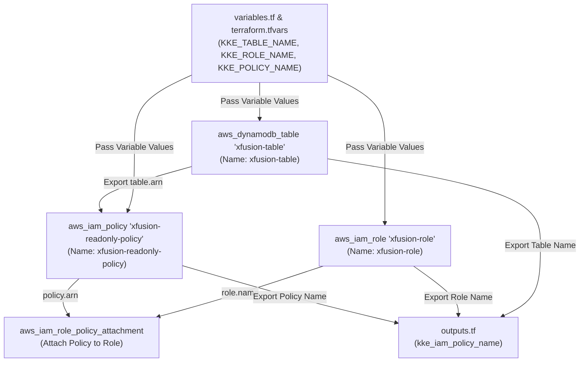
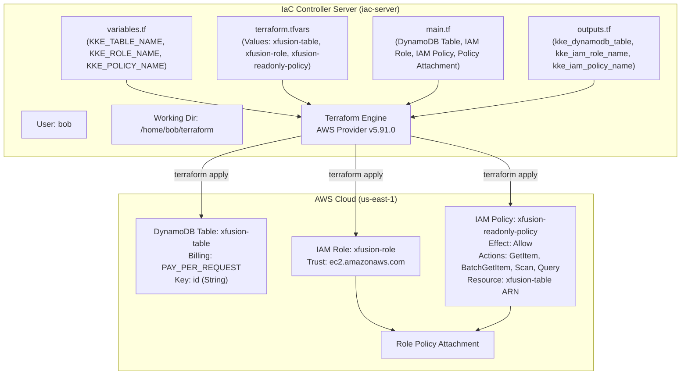

# Create DynamoDB Table, IAM Role, and Read-Only Policy Using Terraform

## Technical Overview

### Amazon DynamoDB & IAM Fine-Grained Access Control

**Amazon DynamoDB** is a fully managed NoSQL database service that provides fast, predictable performance with seamless scalability. In enterprise cloud architecture, database tables should never be exposed to public networks or granted unconstrained permissions. Instead, security teams enforce access control using **AWS Identity and Access Management (IAM)** roles and fine-grained policies.

By leveraging **Infrastructure as Code (IaC)** via **Terraform**, DevOps engineers can declaratively define NoSQL tables alongside the exact IAM roles and policies required to consume them. This pattern ensures that application compute workloads (such as EC2 or Lambda) obtain read access strictly limited to designated DynamoDB tables and specific API actions (`dynamodb:GetItem`, `dynamodb:Scan`, `dynamodb:Query`).

```
       +---------------------------------------------------------------------------------------+
       | AWS Cloud Region: us-east-1                                                           |
       |                                                                                       |
       |  +---------------------------------------------------------------------------------+  |
       |  | IAM Role: xfusion-role                                                          |  |
       |  | (Trust Policy: sts:AssumeRole for ec2.amazonaws.com)                           |  |
       |  +---------------------------------------------------------------------------------+  |
       |                                          |                                            |
       |                                          | Attached via                               |
       |                                          | aws_iam_role_policy_attachment             |
       |                                          v                                            |
       |  +---------------------------------------------------------------------------------+  |
       |  | IAM Policy: xfusion-readonly-policy                                             |  |
       |  | Effect: Allow                                                                   |  |
       |  | Actions: ["dynamodb:GetItem", "dynamodb:BatchGetItem",                          |  |
       |  |           "dynamodb:Scan", "dynamodb:Query"]                                    |  |
       |  | Resource: arn:aws:dynamodb:us-east-1:*:table/xfusion-table                      |  |
       |  +---------------------------------------------------------------------------------+  |
       |                                          |                                            |
       |                                          | Grants Read-Only Access To                   |
       |                                          v                                            |
       |  +---------------------------------------------------------------------------------+  |
       |  | Amazon DynamoDB Table: xfusion-table                                            |  |
       |  | Billing Mode: PAY_PER_REQUEST (On-Demand)                                       |  |
       |  | Primary Key: id (Type: String)                                                  |  |
       |  +---------------------------------------------------------------------------------+  |
       +---------------------------------------------------------------------------------------+
```

#### Core Components of DynamoDB Access Control:

1. **DynamoDB Table (`aws_dynamodb_table`):** A schemaless NoSQL data store identified by `xfusion-table`. The `PAY_PER_REQUEST` billing mode provides auto-scaling capacity without manual provisioned throughput settings.
2. **IAM Trust Role (`aws_iam_role`):** An identity named `xfusion-role` with trust credentials (`assume_role_policy`) enabling trusted compute services to temporarily assume credentials.
3. **Read-Only IAM Policy (`aws_iam_policy`):** A customer-managed policy named `xfusion-readonly-policy` restricting permissions exclusively to `GetItem`, `BatchGetItem`, `Scan`, and `Query` actions bound strictly to the ARN of `xfusion-table`.
4. **Policy Attachment (`aws_iam_role_policy_attachment`):** Binds the read-only policy to `xfusion-role`.

---

## Detailed Terraform Documentation

### 1. Resource Dependency Flow

Provisioning secure database infrastructure requires establishing explicit resource dependencies in HashiCorp Configuration Language (HCL):



---

### 2. Parameter & Argument Reference

#### Resource: `aws_dynamodb_table`

| Argument | Type | Required? | Default | Description |
| :--- | :--- | :--- | :--- | :--- |
| **`name`** | `string` | **Yes** | N/A | Unique name of the DynamoDB table (e.g., `var.KKE_TABLE_NAME`). |
| **`billing_mode`** | `string` | No | `"PROVISIONED"` | Controls billing throughput (`"PROVISIONED"` or `"PAY_PER_REQUEST"`). |
| **`hash_key`** | `string` | **Yes** | N/A | Attribute name used as the primary partition key (e.g., `"id"`). |
| **`attribute`** | `block` | **Yes** | N/A | Defines schema attributes (`name` and `type`: `"S"`, `"N"`, `"B"`). |
| **`tags`** | `map(string)` | No | `{}` | Key-value resource tags (e.g., `{ Name = var.KKE_TABLE_NAME }`). |

#### Resource: `aws_iam_role`

| Argument | Type | Required? | Default | Description |
| :--- | :--- | :--- | :--- | :--- |
| **`name`** | `string` | **Yes** | N/A | Name of the IAM role (e.g., `var.KKE_ROLE_NAME`). |
| **`assume_role_policy`** | `string` | **Yes** | N/A | JSON policy granting entity permission to assume role (`sts:AssumeRole`). |
| **`description`** | `string` | No | `null` | Description of the IAM role. |
| **`tags`** | `map(string)` | No | `{}` | Key-value resource tags. |

#### Resource: `aws_iam_policy`

| Argument | Type | Required? | Default | Description |
| :--- | :--- | :--- | :--- | :--- |
| **`name`** | `string` | **Yes** | N/A | Name of the IAM policy (e.g., `var.KKE_POLICY_NAME`). |
| **`policy`** | `string` | **Yes** | N/A | Policy document formatted as JSON (generated using `jsonencode()`). |
| **`description`** | `string` | No | `null` | Detailed description of permissions granted. |

#### Resource: `aws_iam_role_policy_attachment`

| Argument | Type | Required? | Description |
| :--- | :--- | :--- | :--- |
| **`role`** | `string` | **Yes** | Name of the target IAM role (`aws_iam_role.xfusion-role.name`). |
| **`policy_arn`** | `string` | **Yes** | ARN of the target policy (`aws_iam_policy.xfusion-readonly-policy.arn`). |

---

### 3. HCL Workspace Files (`variables.tf`, `terraform.tfvars`, `outputs.tf`)

#### Input Variables Declaration (`variables.tf`)
Defines variable names and data types expected by the workspace:

```hcl
variable "KKE_TABLE_NAME" {
  type        = string
  description = "Name of the DynamoDB table"
}

variable "KKE_ROLE_NAME" {
  type        = string
  description = "Name of the IAM role"
}

variable "KKE_POLICY_NAME" {
  type        = string
  description = "Name of the IAM policy"
}
```

#### Variable Definition File (`terraform.tfvars`)
Supplies explicit runtime string values for declared variables:

```hcl
KKE_TABLE_NAME  = "xfusion-table"
KKE_ROLE_NAME   = "xfusion-role"
KKE_POLICY_NAME = "xfusion-readonly-policy"
```

#### Output Values (`outputs.tf`)
Exposes provisioned resource identifiers using lowercase output variable names:

```hcl
output "kke_dynamodb_table" {
  description = "Name of the DynamoDB table"
  value       = aws_dynamodb_table.xfusion-table.name
}

output "kke_iam_role_name" {
  description = "Name of the IAM role"
  value       = aws_iam_role.xfusion-role.name
}

output "kke_iam_policy_name" {
  description = "Name of the IAM policy"
  value       = aws_iam_policy.xfusion-readonly-policy.name
}
```

---

## Challenge Objective

The Nautilus DevOps team is configuring a secure database infrastructure for their microservices migration. You are tasked with using Terraform to provision an Amazon DynamoDB table named `xfusion-table`, an IAM role named `xfusion-role`, and a custom read-only IAM policy named `xfusion-readonly-policy` attached to the role.

In this challenge, you will operate in `/home/bob/terraform` and implement the configuration using `variables.tf`, `terraform.tfvars`, `main.tf`, and `outputs.tf`.



---

## Infrastructure & Configuration Requirements

### Server & Resource Specification Matrix

<div style="overflow-x: auto;">

| Host / Role | Working Directory | Target File | Resource Type | Label / Name | Required Value / Policy Details |
| :--- | :--- | :--- | :--- | :--- | :--- |
| **`iac-server`** | `/home/bob/terraform` | `variables.tf` | `variable` | `KKE_TABLE_NAME` | Type: `string` |
| **`iac-server`** | `/home/bob/terraform` | `variables.tf` | `variable` | `KKE_ROLE_NAME` | Type: `string` |
| **`iac-server`** | `/home/bob/terraform` | `variables.tf` | `variable` | `KKE_POLICY_NAME` | Type: `string` |
| **`iac-server`** | `/home/bob/terraform` | `terraform.tfvars` | N/A | N/A | `KKE_TABLE_NAME = "xfusion-table"`<br/>`KKE_ROLE_NAME = "xfusion-role"`<br/>`KKE_POLICY_NAME = "xfusion-readonly-policy"` |
| **`iac-server`** | `/home/bob/terraform` | `main.tf` | `aws_dynamodb_table` | `xfusion-table` | `name = var.KKE_TABLE_NAME`, `billing_mode = "PAY_PER_REQUEST"` |
| **`iac-server`** | `/home/bob/terraform` | `main.tf` | `aws_iam_role` | `xfusion-role` | `name = var.KKE_ROLE_NAME`, AssumeRole trust policy for `ec2.amazonaws.com` |
| **`iac-server`** | `/home/bob/terraform` | `main.tf` | `aws_iam_policy` | `xfusion-readonly-policy` | Actions: `GetItem`, `BatchGetItem`, `Scan`, `Query`<br/>Resource: `aws_dynamodb_table.xfusion-table.arn` |
| **`iac-server`** | `/home/bob/terraform` | `main.tf` | `aws_iam_role_policy_attachment` | `xfusion-attach` | Role: `aws_iam_role.xfusion-role.name`<br/>Policy ARN: `aws_iam_policy.xfusion-readonly-policy.arn` |
| **`iac-server`** | `/home/bob/terraform` | `outputs.tf` | `output` | `kke_dynamodb_table` | Value: `aws_dynamodb_table.xfusion-table.name` |
| **`iac-server`** | `/home/bob/terraform` | `outputs.tf` | `output` | `kke_iam_role_name` | Value: `aws_iam_role.xfusion-role.name` |
| **`iac-server`** | `/home/bob/terraform` | `outputs.tf` | `output` | `kke_iam_policy_name` | Value: `aws_iam_policy.xfusion-readonly-policy.name` |

</div>

### Requirements Checklist

* **Working Directory:** `/home/bob/terraform`
* **DynamoDB Table:** Named `xfusion-table` with minimal configuration (`PAY_PER_REQUEST` billing mode, `id` hash key).
* **IAM Role:** Named `xfusion-role` with trust policy enabling access.
* **IAM Policy:** Named `xfusion-readonly-policy` granting read-only actions (`dynamodb:GetItem`, `dynamodb:BatchGetItem`, `dynamodb:Scan`, `dynamodb:Query`) restricted specifically to `xfusion-table`.
* **Policy Attachment:** Attach `xfusion-readonly-policy` to `xfusion-role`.
* **Main File (`main.tf`):** Single resource file provisioning table, role, policy, and attachment (no separate resource `.tf` files).
* **Variables File (`variables.tf`):** Declares `KKE_TABLE_NAME`, `KKE_ROLE_NAME`, and `KKE_POLICY_NAME`.
* **TFVars File (`terraform.tfvars`):** Contains actual variable assignment strings.
* **Outputs File (`outputs.tf`):** Declares `kke_dynamodb_table`, `kke_iam_role_name`, and `kke_iam_policy_name`.
* **Execution Standard:** `terraform plan` must return `No changes. Your infrastructure matches the configuration.` before submission.

---

## Step-by-Step Implementation

### Step 1: Open Terminal & Navigate to Working Directory

Open the integrated terminal in VS Code and change to `/home/bob/terraform`:

```bash
cd /home/bob/terraform
```

---

### Step 2: Inspect Existing Workspace Files

Check existing files in `/home/bob/terraform`:

```bash
ls -la
```

*Terminal Output:*
```text
README.MD  provider.tf
```

Inspect `provider.tf`:

```bash
cat provider.tf
```

*Expected Contents:*
```hcl
terraform {
  required_providers {
    aws = {
      source  = "hashicorp/aws"
      version = "~> 5.0"
    }
  }
}

provider "aws" {
  region = "us-east-1"
}
```

---

### Step 3: Create the `variables.tf` File

Create `variables.tf` declaring input variables for table, role, and policy names:

```bash
cat << 'EOF' > variables.tf
variable "KKE_TABLE_NAME" {
  type        = string
  description = "Name of the DynamoDB table"
}

variable "KKE_ROLE_NAME" {
  type        = string
  description = "Name of the IAM role"
}

variable "KKE_POLICY_NAME" {
  type        = string
  description = "Name of the IAM policy"
}
EOF
```

---

### Step 4: Create the `terraform.tfvars` File

Create `terraform.tfvars` containing actual string assignments:

```bash
cat << 'EOF' > terraform.tfvars
KKE_TABLE_NAME  = "xfusion-table"
KKE_ROLE_NAME   = "xfusion-role"
KKE_POLICY_NAME = "xfusion-readonly-policy"
EOF
```

---

### Step 5: Create the `main.tf` Configuration File

Create `main.tf` provisioning DynamoDB table, IAM role, IAM policy, and policy attachment:

```bash
cat << 'EOF' > main.tf
# 1. Create DynamoDB Table with minimal configuration
resource "aws_dynamodb_table" "xfusion-table" {
  name         = var.KKE_TABLE_NAME
  billing_mode = "PAY_PER_REQUEST"
  hash_key     = "id"

  attribute {
    name = "id"
    type = "S"
  }

  tags = {
    Name = var.KKE_TABLE_NAME
  }
}

# 2. Create IAM Role for trusted service access
resource "aws_iam_role" "xfusion-role" {
  name = var.KKE_ROLE_NAME

  assume_role_policy = jsonencode({
    Version = "2012-10-17"
    Statement = [
      {
        Action = "sts:AssumeRole"
        Effect = "Allow"
        Principal = {
          Service = "ec2.amazonaws.com"
        }
      }
    ]
  })

  tags = {
    Name = var.KKE_ROLE_NAME
  }
}

# 3. Create Read-Only IAM Policy restricted to xfusion-table
resource "aws_iam_policy" "xfusion-readonly-policy" {
  name        = var.KKE_POLICY_NAME
  description = "Read-only access to xfusion-table DynamoDB table"

  policy = jsonencode({
    Version = "2012-10-17"
    Statement = [
      {
        Effect = "Allow"
        Action = [
          "dynamodb:GetItem",
          "dynamodb:BatchGetItem",
          "dynamodb:Scan",
          "dynamodb:Query"
        ]
        Resource = [
          aws_dynamodb_table.xfusion-table.arn,
          "${aws_dynamodb_table.xfusion-table.arn}/*"
        ]
      }
    ]
  })
}

# 4. Attach Policy to IAM Role
resource "aws_iam_role_policy_attachment" "xfusion-role-policy-attach" {
  role       = aws_iam_role.xfusion-role.name
  policy_arn = aws_iam_policy.xfusion-readonly-policy.arn
}
EOF
```

---

### Step 6: Create the `outputs.tf` File

Create `outputs.tf` exporting provisioned resource identifiers:

```bash
cat << 'EOF' > outputs.tf
output "kke_dynamodb_table" {
  description = "Name of the DynamoDB table"
  value       = aws_dynamodb_table.xfusion-table.name
}

output "kke_iam_role_name" {
  description = "Name of the IAM role"
  value       = aws_iam_role.xfusion-role.name
}

output "kke_iam_policy_name" {
  description = "Name of the IAM policy"
  value       = aws_iam_policy.xfusion-readonly-policy.name
}
EOF
```

---

### Step 7: Initialize Terraform Working Directory

Initialize the directory to download provider plugins:

```bash
terraform init
```

*Terminal Output:*
```text
Initializing the backend...
Initializing provider plugins...
- Finding hashicorp/aws versions matching "5.91.0"...
- Installing hashicorp/aws v5.91.0...
- Installed hashicorp/aws v5.91.0 (signed by HashiCorp)

Terraform has been successfully initialized!
```

---

### Step 8: Validate and Format HCL Syntax

Format and check configuration validity:

```bash
terraform fmt
terraform validate
```

*Expected Output:*
```text
Success! The configuration is valid.
```

---

### Step 9: Generate Execution Plan

Preview resource creation:

```bash
terraform plan
```

*Terminal Output:*
```text
Terraform used the selected providers to generate the following execution plan. Resource actions are indicated with the following symbols:
  + create

Terraform will perform the following actions:

  # aws_dynamodb_table.xfusion-table will be created
  + resource "aws_dynamodb_table" "xfusion-table" {
      + arn              = (known after apply)
      + billing_mode     = "PAY_PER_REQUEST"
      + hash_key         = "id"
      + id               = (known after apply)
      + name             = "xfusion-table"
      + attribute {
          + name = "id"
          + type = "S"
        }
    }

  # aws_iam_policy.xfusion-readonly-policy will be created
  + resource "aws_iam_policy" "xfusion-readonly-policy" {
      + arn         = (known after apply)
      + id          = (known after apply)
      + name        = "xfusion-readonly-policy"
      + policy      = (known after apply)
    }

  # aws_iam_role.xfusion-role will be created
  + resource "aws_iam_role" "xfusion-role" {
      + arn                   = (known after apply)
      + assume_role_policy    = jsonencode(
            {
              + Statement = [
                  + {
                      + Action    = "sts:AssumeRole"
                      + Effect    = "Allow"
                      + Principal = {
                          + Service = "ec2.amazonaws.com"
                        }
                    },
                ]
              + Version   = "2012-10-17"
            }
        )
      + id                    = (known after apply)
      + name                  = "xfusion-role"
    }

  # aws_iam_role_policy_attachment.xfusion-role-policy-attach will be created
  + resource "aws_iam_role_policy_attachment" "xfusion-role-policy-attach" {
      + id         = (known after apply)
      + policy_arn = (known after apply)
      + role       = "xfusion-role"
    }

Plan: 4 to add, 0 to change, 0 to destroy.

Changes to Outputs:
  + kke_dynamodb_table = "xfusion-table"
  + kke_iam_policy_name = "xfusion-readonly-policy"
  + kke_iam_role_name   = "xfusion-role"
```

---

### Step 10: Provision Infrastructure

Apply the configuration:

```bash
terraform apply -auto-approve
```

*Terminal Output:*
```text
aws_dynamodb_table.xfusion-table: Creating...
aws_iam_role.xfusion-role: Creating...
aws_iam_role.xfusion-role: Creation complete after 2s [id=xfusion-role]
aws_dynamodb_table.xfusion-table: Creation complete after 6s [id=xfusion-table]
aws_iam_policy.xfusion-readonly-policy: Creating...
aws_iam_policy.xfusion-readonly-policy: Creation complete after 2s [id=arn:aws:iam::123456789012:policy/xfusion-readonly-policy]
aws_iam_role_policy_attachment.xfusion-role-policy-attach: Creating...
aws_iam_role_policy_attachment.xfusion-role-policy-attach: Creation complete after 1s [id=xfusion-role-202608121810001]

Apply complete! Resources: 4 added, 0 changed, 0 destroyed.

Outputs:

kke_dynamodb_table = "xfusion-table"
kke_iam_policy_name = "xfusion-readonly-policy"
kke_iam_role_name = "xfusion-role"
```

---

### Step 11: Verify Zero Drift (`No changes`)

Verify configuration state:

```bash
terraform plan
```

*Terminal Output:*
```text
aws_dynamodb_table.xfusion-table: Refreshing state... [id=xfusion-table]
aws_iam_role.xfusion-role: Refreshing state... [id=xfusion-role]
aws_iam_policy.xfusion-readonly-policy: Refreshing state... [id=arn:aws:iam::123456789012:policy/xfusion-readonly-policy]
aws_iam_role_policy_attachment.xfusion-role-policy-attach: Refreshing state... [id=xfusion-role-202608121810001]

No changes. Your infrastructure matches the configuration.
```

---

## Verification & Troubleshooting Guide

### Verification Commands

| Command | Purpose | Expected Result |
| :--- | :--- | :--- |
| `terraform state list` | List tracked state resources | Shows `aws_dynamodb_table`, `aws_iam_role`, `aws_iam_policy`, `aws_iam_role_policy_attachment`. |
| `terraform output` | Print configuration outputs | Displays `kke_dynamodb_table`, `kke_iam_role_name`, `kke_iam_policy_name`. |
| `terraform plan` | Verify zero configuration drift | Returns `No changes. Your infrastructure matches the configuration.` |

---

### Troubleshooting Common Errors

> [!IMPORTANT]
> **1. Variable Case Sensitivity Difference:**
> Notice that input variables (`variables.tf` and `terraform.tfvars`) use UPPERCASE prefixes (`KKE_TABLE_NAME`, `KKE_ROLE_NAME`, `KKE_POLICY_NAME`), whereas output variable names (`outputs.tf`) use LOWERCASE prefixes (`kke_dynamodb_table`, `kke_iam_role_name`, `kke_iam_policy_name`). Mismatched casing will fail validation scripts.

> [!CAUTION]
> **2. Fine-Grained Policy Scope:**
> Ensure the IAM policy resource block restricts `Resource` strictly to `aws_dynamodb_table.xfusion-table.arn` (and optionally `"${aws_dynamodb_table.xfusion-table.arn}/*"`). Using `"*"` grants global access across all tables, violating access restriction criteria.

> [!WARNING]
> **3. DynamoDB Hash Key Attribute Definition:**
> DynamoDB tables require defining key attributes. Ensure `hash_key = "id"` matches an explicit `attribute` block containing `name = "id"` and `type = "S"`.

---

## Best Practices & Production Considerations

1. **Least-Privilege Resource ARNs:** Always scope IAM policies to specific resource ARNs rather than wildcard `"*"` statements to prevent unauthorized cross-table actions.
2. **On-Demand Capacity Sizing:** Utilizing `billing_mode = "PAY_PER_REQUEST"` prevents over-provisioning cost overhead for variable development workloads.
3. **Variable Management:** Defining variables in `variables.tf` and populating values in `terraform.tfvars` cleanly separates configuration logic from environment secrets and parameterization.
